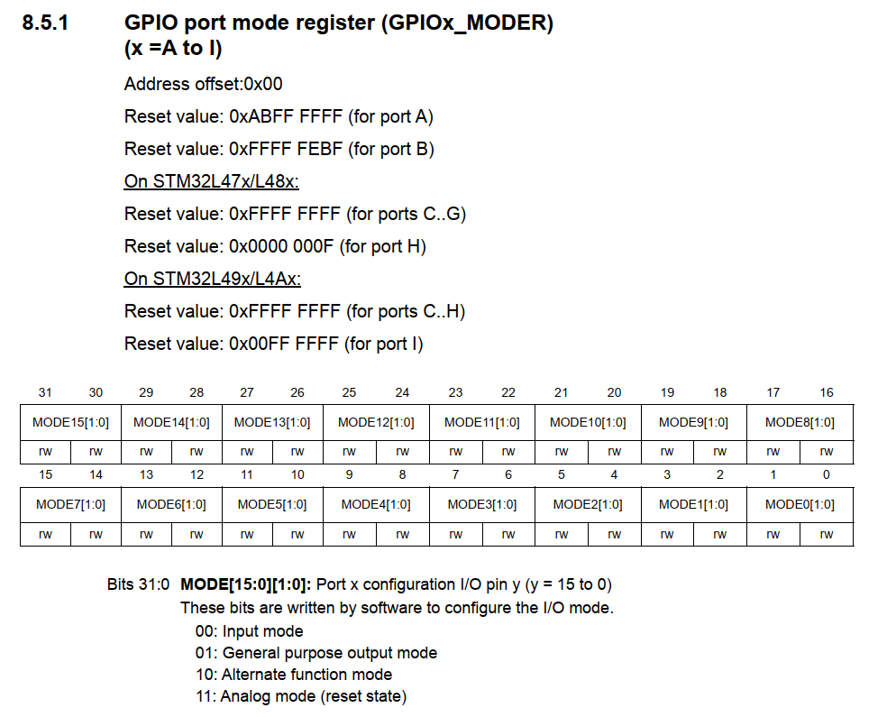

# Bài 1: Setup chương trình đầu tiên trên KeilC

## I. Setup IDE
### 1. Cài đặt KeilC
- Vào trang web https://www.keil.arm.com/mdk-community/
- Tải KeilC uVision về cài vào máy

### 2. Cài đặt CMSIS Packs cho STM32L4xx
- Vào trang web https://www.keil.arm.com/packs/stm32l4xx_dfp-keil/devices/
- Vào mục Version history và tải về Version 2.7.0: March 27, 2024 vì Version 3.0.0 bắt buộc phải cài STM32CubeMX để cấu hình thiết bị.
- Sau khi tải về CMISIS Packs, mở KeilC lên, vào mục Pack Installer để import CMSIS Packs vào KeilC


### 3. Khởi tạo project trên KeilC
- Vào menu Project -> New uVision project
- Đặt tên và chon thư muc lưu project
- Chọn Device là STM32L476RGTx

 

- Ở mục Manage Run-Time Environment, chọn Device -> Startup rồi bấm Resolve ở góc dưới cùng bên trái cửa sổ rồi bấm OK


- Bấm chuột phải vào Source Group 1 -> Add new item to Group 'Source Group 1'
- Chọn C File (.c), dăt tên là main rồi bấm OK

# Bài 1: Setup chương trình đầu tiên trên KeilC

## II. Projects
### 1. Blink LED
Để thực hiện việc nháy LED trên NUCLEO-L476RG, cần cấu hình chân GPIO nối tới LD2 (PA5) trên board NUCLEO. Việc này bao gồm các bước sau:
- Bước 1: Cấu hình cấp xung cho chân PA5
Theo STM32L476xx block diagram, GPIO Port A được nối với bus AHB2, nên chúng ta cần cấu hình chấp xung cho bus AHB2.


Chúng ta tìm RCC_AHB2ENR trong datasheet, tại đây, để cấp xung cho GPIO Port A thì ta cần set GPIOAEN tại bit số 0 của thanh ghi RCC_AHB2ENR


```c
    RCC->AHB2ENR |= RCC_AHB2ENR_GPIOAEN;
```

- Bước 2: Cấu hình chân PA5 thành output
Chúng ta set GPIO port mode register (GPIOx_MODER) với chân GPIO tương ứng để cấu hình input hoặc output cho chân
Với chân PA5 thì chúng ta cần set bit 11 và bit 10 tương ứng là 01 để cấu hình nó thành chân output



```c
    GPIOA->MODER &= ~GPIO_MODER_MODE5_Msk;
    GPIOA->MODER |= GPIO_MODER_MODE5_0;
```

- Bước 3: Xuất tín hiệu cho chân PA5
Chúng ta sử dụng thanh ghi GPIO port output data register (GPIOx_ODR) để xuất tín hiệu cho chân PA5. Sử dụng vòng lặp vô hạn để chạy chương trình và hàm delay để đèn LED nhấp nháy với tốc độ mà mắt ta có thể kịp lưu ảnh


```c
    while (1)
	{
		// bat den LD2 tai PA5
		GPIOA->ODR |= GPIO_ODR_OD5;
		//delay
		delay(100000);
		// tat den LD2 tai PA5
		GPIOA->ODR &= ~GPIO_ODR_OD5;
		//delay
		delay(100000);
	}
```

Hàm delay được viết như sau:

```c
    void delay(__IO uint32_t timedelay){ 
        for(uint32_t i=0; i < timedelay; i++){}
    }
```

Lưu ý sử dụng __IO trước uint32_t timedelay để compiler không optimize code của chúng ta.

### 2. Tương tác với nút bấm và LED
Trên NUCLEO-L476RG, nút nhấn được nối với chấn PC13. Tương tự như project Blink LED, chúng ta cần cấu hình cấp xung clock cho PC13

```c
	// Cau hinh clock cho GPIO C (PC13 la nut bam)
	RCC->AHB2ENR |= RCC_AHB2ENR_GPIOCEN;
```

Chúng ta cũng sử dụng GPIO port mode register (GPIOx_MODER) với chân PC13, nhưng là để cấu hình cho chân PC13 thành input, tức là set bit 27 và 26 của GPIOx_MODER thành 00.

```c
	// Cau hinh input cho PC13
	GPIOC->MODER &= ~GPIO_MODER_MODE13_Msk;
```

Tiếp theo, ta cần cấu hình chế độ chân cho PC13, tương ứng là kéo lên ngưồn (Pull-up) hay kéo xuống đất (Pull-down)
- Với Pull-up, khi nút nhấn, tín hiệu đọc được ở chân PC13 là LOW
- Với Pull-down, khi nút nhấn, tín hiệu đọc được ở chân PC13 là HIGH


Để cấu hình chế độ chân, ta dùng thanh ghi GPIO port pull-up/pull-down register (GPIOx_PUPDR). Với chân PC13, ta sẽ dùng chế độ pull-up, tức là set bit 27 và 26 tương ứng thành 01


```c
	// cau hinh pull up cho PC13 (01)
	GPIOC->PUPDR &= ~GPIO_PUPDR_PUPD13_Msk;
	GPIOC->PUPDR |= GPIO_PUPDR_PUPD13_0;
```

Chúng ta viết thêm một hàm toggle() để thay đổi trạng thái LED khi nút bấm. Nếu LED đang bật, ta bấm nút thì LED tắt, và ngược lại

```c
void toggle(void)
{
	if (GPIOA->ODR & GPIO_ODR_OD5) 
	{
		GPIOA->ODR &= ~GPIO_ODR_OD5;
	}
	else
	{
		GPIOA->ODR |= GPIO_ODR_OD5;
	}
}
```

Để đọc được tín hiệu từ chân input (tức PC13), ta cần đọc thanh ghi GPIO port input data register (GPIOx_IDR) với GPIOC và bit số 13


```c
while (1)
{
	if ((GPIOC->IDR & (1<<13)) == 0)
	{
		while ((GPIOC->IDR & (1<<13)) == 0);
		toggle();
	}
}
```
