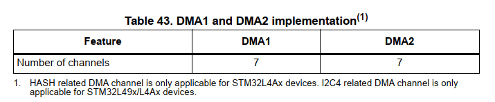
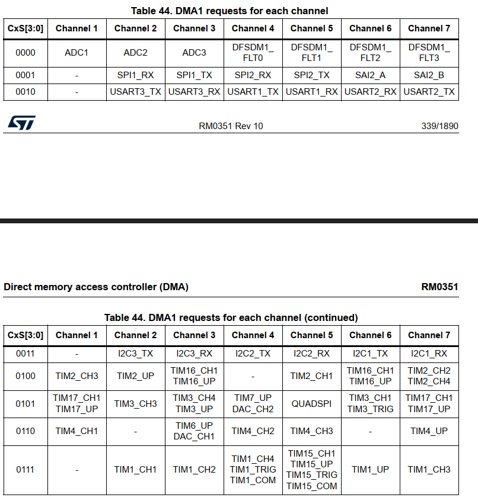
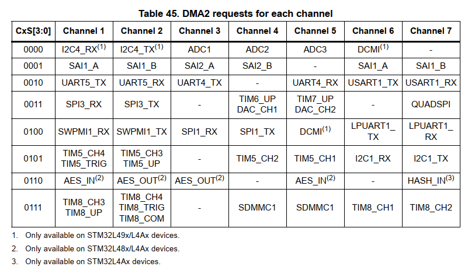
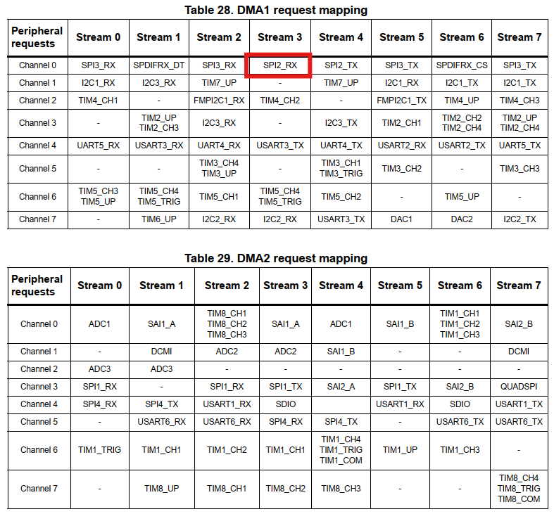

# Bài 10 - DMA

### 1. Khái niệm
DMA (Direct Memory Access) là một cơ chế cho phép các thiết bị ngoại vi (ví dụ: ADC, SPI, UART, etc.) hoặc bộ nhớ trong hệ thống (RAM, Flash) truyền hoặc nhận dữ liệu mà không cần sự can thiệp trực tiếp từ CPU. Điều này giúp giảm tải cho CPU, tăng hiệu suất hệ thống, và tối ưu hóa thời gian xử lý.

Trong các hệ thống không sử dụng DMA, khi có một yêu cầu truyền hoặc nhận dữ liệu (ví dụ: từ một cảm biến qua SPI hoặc UART), CPU sẽ phải đọc hoặc ghi từng byte dữ liệu từ bộ nhớ vào thanh ghi của thiết bị ngoại vi hoặc ngược lại. Điều này rất tốn thời gian, đặc biệt khi lượng dữ liệu lớn.

Với DMA, CPU chỉ cần thiết lập cấu hình DMA (chọn bộ nhớ nguồn, bộ nhớ đích, kích thước dữ liệu, v.v.). Sau đó, DMA sẽ tự động quản lý việc truyền dữ liệu giữa bộ nhớ và các thiết bị ngoại vi mà không cần CPU can thiệp. CPU có thể tiếp tục thực hiện các công việc khác trong khi DMA xử lý việc truyền dữ liệu.

Trên vi điều khiển STM32, DMA hoạt động với các thành phần chính sau:
- DMA Stream: Là các luồng DMA, mỗi luồng có thể truyền một loại dữ liệu cụ thể (ví dụ: truyền từ bộ nhớ đến một thiết bị ngoại vi hoặc ngược lại).
- DMA Channel: Một kênh DMA cụ thể sẽ liên kết với một thiết bị ngoại vi (ví dụ: SPI, USART).
- DMA Controller (DMA1, DMA2): Điều khiển tất cả các luồng DMA.
- DMA Interrupt: DMA có thể tạo interrupt (ngắt) khi hoàn thành một công việc, giúp CPU biết khi nào dữ liệu đã được truyền xong.

Ưu điểm của DMA:
- Tiết kiệm thời gian và tài nguyên CPU: CPU không phải can thiệp vào mỗi thao tác truyền dữ liệu.
- Tăng hiệu suất hệ thống: Thao tác truyền dữ liệu có thể được thực hiện song song với các tác vụ khác của CPU.
- Giảm độ trễ: Dữ liệu có thể được truyền nhanh chóng và hiệu quả hơn.

DMA trên STM32 có thể hoạt động trong các chế độ sau:
- Normal Mode: DMA truyền một khối dữ liệu và dừng lại.
- Circular Mode: DMA liên tục truyền dữ liệu giữa bộ nhớ và thiết bị ngoại vi, thích hợp cho các ứng dụng cần truyền dữ liệu liên tục (ví dụ: truyền tín hiệu âm thanh).
- Memory-to-Memory Mode: DMA truyền dữ liệu giữa hai vùng bộ nhớ mà không cần thiết bị ngoại vi.

Thiết bị STM32L476 có 2 DMA: DMA1 và DMA2.\
Mỗi kênh được dành riêng để quản lý các yêu cầu truy cập bộ nhớ từ một hoặc nhiều thiết bị ngoại vi. Hai bộ điều khiển DMA có tổng cộng 14 kênh. Mỗi kênh được dành riêng để quản lý các yêu cầu truy cập bộ nhớ từ một hoặc nhiều thiết bị ngoại vi. Mỗi kênh có một trọng tài để xử lý mức độ ưu tiên giữa các yêu cầu DMA.







### 2. Các bước cấu hình DMA trên STM32
#### Bước 1: Kích hoạt Clock DMA
Trước khi sử dụng DMA, cần kích hoạt đồng hồ cho bộ điều khiển DMA và các thiết bị ngoại vi sẽ sử dụng DMA.
#### Bước 2: Cấu hình DMA Stream
- Chọn kênh DMA và stream DMA phù hợp với thiết bị ngoại vi.
- Cấu hình các thông số như địa chỉ nguồn, địa chỉ đích, kích thước dữ liệu (byte, word).
- Cấu hình chế độ DMA (ví dụ: chế độ truyền từ bộ nhớ đến thiết bị, hoặc từ thiết bị đến bộ nhớ).
#### Bước 3: Kích hoạt DMA cho thiết bị ngoại vi
Nếu sử dụng DMA để truyền dữ liệu từ một thiết bị ngoại vi (ví dụ: SPI, ADC), cần cấu hình thiết bị ngoại vi để yêu cầu DMA (ví dụ: kích hoạt yêu cầu DMA RX/TX).
#### Bước 4: Kích hoạt DMA và xử lý ngắt (nếu cần)
Kích hoạt DMA và, nếu cần, bật interrupt để thông báo khi truyền dữ liệu hoàn tất.

### 3. Project
Project sử dụng STM32L476 làm master để đọc tín hiệu từ biển trở, sau đó dùng SPI để gửi tín hiệu sang cho slave. Slave là STM32F446 sẽ đọc tín hiệu từ master, rồi điều khiển servo với góc quay tương ứng. Sơ đồ chân được vẽ như sau:
```
+------------------------+                   +------------------------+
|                        |                   |                        |
| STM32L476 (Master)     |                   | STM32F446 (Slave)      |
|                        |                   |                        |
+------------------------+                   +------------------------+
          |                                     |
   +------|------+\                          +--|-----+
   |             | \                         |        |
  PC0 (ADC1) <-> 10k Potentiometer           |        |
   |             |                           |        |
   |      +------+----+            +---------|--------+
   |      |      |    |            |         |        |
   |   SPI2 (Master)  |            |     SPI2 (Slave) |
   |      |      |    |            |         |        |
   |      |      |    |            |         |        |
   |    PC3 (MOSI)----|---<-->-----|----PC2 (MISO)    |
   |      |      |    |            |         |        |
   |      |      |    |            |         |        |
   |    PB10 (SCK)----|---<-->-----|----PB10 (SCK)    |
   |      |      |    |            |         |        |
   |      |      |    |            |         |        |
   |    PB12 (NSS)--------<--------|----PB12 (NSS)    |
   |      |      |    |            |         |        |
   +------+------+\   |            |         |        |
          |      |   \|/           |         |        |
          |      |                 +---------|--------+
          |      |                 |         |        |
          |    PA0 (PWM)           |     PA0 (PWM)    |
          |    (Servo)             |     (Servo)      |
          |------------------------|------------------|
```

#### a. STM32L476 (Master)
Trên SPI master, ta cấu hình sử dụng SPI2 và ADC1 tương tự như [Bài 9](/../EmbeddedInAutomotive/Bai9-ADC/).

**ADC1 Init**
```c
static void MX_ADC1_Init(void)
{

  /* USER CODE BEGIN ADC1_Init 0 */

  /* USER CODE END ADC1_Init 0 */

  LL_ADC_InitTypeDef ADC_InitStruct = {0};
  LL_ADC_REG_InitTypeDef ADC_REG_InitStruct = {0};
  LL_ADC_CommonInitTypeDef ADC_CommonInitStruct = {0};

  LL_GPIO_InitTypeDef GPIO_InitStruct = {0};

  LL_RCC_SetADCClockSource(LL_RCC_ADC_CLKSOURCE_PLLSAI1);

  /* Peripheral clock enable */
  LL_AHB2_GRP1_EnableClock(LL_AHB2_GRP1_PERIPH_ADC);

  LL_AHB2_GRP1_EnableClock(LL_AHB2_GRP1_PERIPH_GPIOC);
  /**ADC1 GPIO Configuration
  PC0   ------> ADC1_IN1
  */
  GPIO_InitStruct.Pin = LL_GPIO_PIN_0;
  GPIO_InitStruct.Mode = LL_GPIO_MODE_ANALOG;
  GPIO_InitStruct.Pull = LL_GPIO_PULL_NO;
  LL_GPIO_Init(GPIOC, &GPIO_InitStruct);

  LL_GPIO_EnablePinAnalogControl(GPIOC, LL_GPIO_PIN_0);

  /* USER CODE BEGIN ADC1_Init 1 */

  /* USER CODE END ADC1_Init 1 */

  /** Common config
  */
  ADC_InitStruct.Resolution = LL_ADC_RESOLUTION_12B;
  ADC_InitStruct.DataAlignment = LL_ADC_DATA_ALIGN_RIGHT;
  ADC_InitStruct.LowPowerMode = LL_ADC_LP_MODE_NONE;
  LL_ADC_Init(ADC1, &ADC_InitStruct);
  ADC_REG_InitStruct.TriggerSource = LL_ADC_REG_TRIG_SOFTWARE;
  ADC_REG_InitStruct.SequencerLength = LL_ADC_REG_SEQ_SCAN_DISABLE;
  ADC_REG_InitStruct.SequencerDiscont = LL_ADC_REG_SEQ_DISCONT_DISABLE;
  ADC_REG_InitStruct.ContinuousMode = LL_ADC_REG_CONV_CONTINUOUS;
  ADC_REG_InitStruct.DMATransfer = LL_ADC_REG_DMA_TRANSFER_NONE;
  ADC_REG_InitStruct.Overrun = LL_ADC_REG_OVR_DATA_OVERWRITTEN;
  LL_ADC_REG_Init(ADC1, &ADC_REG_InitStruct);
  LL_ADC_SetOverSamplingScope(ADC1, LL_ADC_OVS_DISABLE);
  ADC_CommonInitStruct.CommonClock = LL_ADC_CLOCK_ASYNC_DIV1;
  ADC_CommonInitStruct.Multimode = LL_ADC_MULTI_INDEPENDENT;
  LL_ADC_CommonInit(__LL_ADC_COMMON_INSTANCE(ADC1), &ADC_CommonInitStruct);
  LL_ADC_SetCommonPathInternalCh(__LL_ADC_COMMON_INSTANCE(ADC1), LL_ADC_PATH_INTERNAL_NONE);

  /* Disable ADC deep power down (enabled by default after reset state) */
  LL_ADC_DisableDeepPowerDown(ADC1);
  /* Enable ADC internal voltage regulator */
  LL_ADC_EnableInternalRegulator(ADC1);
  /* Delay for ADC internal voltage regulator stabilization. */
  /* Compute number of CPU cycles to wait for, from delay in us. */
  /* Note: Variable divided by 2 to compensate partially */
  /* CPU processing cycles (depends on compilation optimization). */
  /* Note: If system core clock frequency is below 200kHz, wait time */
  /* is only a few CPU processing cycles. */
  uint32_t wait_loop_index;
  wait_loop_index = ((LL_ADC_DELAY_INTERNAL_REGUL_STAB_US * (SystemCoreClock / (100000 * 2))) / 10);
  while(wait_loop_index != 0)
  {
    wait_loop_index--;
  }

  /** Configure Regular Channel
  */
  LL_ADC_REG_SetSequencerRanks(ADC1, LL_ADC_REG_RANK_1, LL_ADC_CHANNEL_1);
  LL_ADC_SetChannelSamplingTime(ADC1, LL_ADC_CHANNEL_1, LL_ADC_SAMPLINGTIME_92CYCLES_5);
  LL_ADC_SetChannelSingleDiff(ADC1, LL_ADC_CHANNEL_1, LL_ADC_SINGLE_ENDED);
  /* USER CODE BEGIN ADC1_Init 2 */
	LL_ADC_StartCalibration(ADC1, LL_ADC_SINGLE_ENDED);
	while (LL_ADC_IsCalibrationOnGoing(ADC1) != 0){}
	LL_ADC_Enable(ADC1);
  while (!LL_ADC_IsEnabled(ADC1));
	while (LL_ADC_IsActiveFlag_ADRDY(ADC1) == 0){}
  /* USER CODE END ADC1_Init 2 */

}
```

**SPI2 Init**
```c
static void MX_SPI2_Init(void)
{

  /* USER CODE BEGIN SPI2_Init 0 */

  /* USER CODE END SPI2_Init 0 */

  LL_SPI_InitTypeDef SPI_InitStruct = {0};

  LL_GPIO_InitTypeDef GPIO_InitStruct = {0};

  /* Peripheral clock enable */
  LL_APB1_GRP1_EnableClock(LL_APB1_GRP1_PERIPH_SPI2);

  LL_AHB2_GRP1_EnableClock(LL_AHB2_GRP1_PERIPH_GPIOC);
  LL_AHB2_GRP1_EnableClock(LL_AHB2_GRP1_PERIPH_GPIOB);
  /**SPI2 GPIO Configuration
  PC3   ------> SPI2_MOSI
  PB10   ------> SPI2_SCK
  PB12   ------> SPI2_NSS
  */
  GPIO_InitStruct.Pin = LL_GPIO_PIN_3;
  GPIO_InitStruct.Mode = LL_GPIO_MODE_ALTERNATE;
  GPIO_InitStruct.Speed = LL_GPIO_SPEED_FREQ_VERY_HIGH;
  GPIO_InitStruct.OutputType = LL_GPIO_OUTPUT_PUSHPULL;
  GPIO_InitStruct.Pull = LL_GPIO_PULL_NO;
  GPIO_InitStruct.Alternate = LL_GPIO_AF_5;
  LL_GPIO_Init(GPIOC, &GPIO_InitStruct);

  GPIO_InitStruct.Pin = LL_GPIO_PIN_10|LL_GPIO_PIN_12;
  GPIO_InitStruct.Mode = LL_GPIO_MODE_ALTERNATE;
  GPIO_InitStruct.Speed = LL_GPIO_SPEED_FREQ_VERY_HIGH;
  GPIO_InitStruct.OutputType = LL_GPIO_OUTPUT_PUSHPULL;
  GPIO_InitStruct.Pull = LL_GPIO_PULL_NO;
  GPIO_InitStruct.Alternate = LL_GPIO_AF_5;
  LL_GPIO_Init(GPIOB, &GPIO_InitStruct);

  /* USER CODE BEGIN SPI2_Init 1 */

  /* USER CODE END SPI2_Init 1 */
  /* SPI2 parameter configuration*/
  SPI_InitStruct.TransferDirection = LL_SPI_HALF_DUPLEX_TX;
  SPI_InitStruct.Mode = LL_SPI_MODE_MASTER;
  SPI_InitStruct.DataWidth = LL_SPI_DATAWIDTH_8BIT;
  SPI_InitStruct.ClockPolarity = LL_SPI_POLARITY_LOW;
  SPI_InitStruct.ClockPhase = LL_SPI_PHASE_1EDGE;
  SPI_InitStruct.NSS = LL_SPI_NSS_HARD_OUTPUT;
  SPI_InitStruct.BaudRate = LL_SPI_BAUDRATEPRESCALER_DIV32;
  SPI_InitStruct.BitOrder = LL_SPI_MSB_FIRST;
  SPI_InitStruct.CRCCalculation = LL_SPI_CRCCALCULATION_DISABLE;
  SPI_InitStruct.CRCPoly = 7;
  LL_SPI_Init(SPI2, &SPI_InitStruct);
  LL_SPI_SetStandard(SPI2, LL_SPI_PROTOCOL_MOTOROLA);
  LL_SPI_EnableNSSPulseMgt(SPI2);
  /* USER CODE BEGIN SPI2_Init 2 */
	LL_SPI_Enable(SPI2);
  /* USER CODE END SPI2_Init 2 */

}

```

Trong hàm main, quy đổi các giá trị nhận được, dùng Kalman để lọc giá trị ADC và gửi qua SPI2.
```c
int main(void)
{
  /* Initialize all configured peripherals */
  MX_GPIO_Init();
  MX_ADC1_Init();
  MX_SPI2_Init();
  MX_TIM2_Init();
  /* USER CODE BEGIN 2 */
	SimpleKalmanFilter(0.1, 0.01, 1);
	LL_ADC_REG_StartConversion(ADC1);
	while (!LL_ADC_IsActiveFlag_EOC(ADC1)){}
	LL_ADC_ClearFlag_EOC(ADC1);	
	adcValue = LL_ADC_REG_ReadConversionData12(ADC1);
	adcFinal = (uint16_t)updateEstimate((float)adcValue);
	dataTransfer = map(adcFinal, 0, 4095, 0, 180);
	old_dataTransfer = dataTransfer;
  /* USER CODE END 2 */

  /* Infinite loop */
  /* USER CODE BEGIN WHILE */
  while (1)
  {
    /* USER CODE END WHILE */
		
		while (old_dataTransfer == dataTransfer)
		{
			adcValue = LL_ADC_REG_ReadConversionData12(ADC1);
			adcFinal = (uint16_t)updateEstimate((float)adcValue);
			dataTransfer = map(adcFinal, 0, 4095, 0, 180);
		}
		SPI2_TransmitByte((uint8_t)dataTransfer);
		old_dataTransfer = dataTransfer;
		delay_ms(1);
		
    /* USER CODE BEGIN 3 */
  }
  /* USER CODE END 3 */
}
```

#### b. STM32F446 (Slave)
Ở slave, ta cần cấu hình SPI2 sử dụng DMA và PWM. Với STM32F446 thì DMA có sự khác biệt với STM32L476.



SPI2RX nằm trên Channel 0, stream 3 của DMA1.
```c
static void MX_SPI2_Init(void)
{

  /* USER CODE BEGIN SPI2_Init 0 */

  /* USER CODE END SPI2_Init 0 */

  LL_SPI_InitTypeDef SPI_InitStruct = {0};

  LL_GPIO_InitTypeDef GPIO_InitStruct = {0};

  /* Peripheral clock enable */
  LL_APB1_GRP1_EnableClock(LL_APB1_GRP1_PERIPH_SPI2);

  LL_AHB1_GRP1_EnableClock(LL_AHB1_GRP1_PERIPH_GPIOC);
  LL_AHB1_GRP1_EnableClock(LL_AHB1_GRP1_PERIPH_GPIOB);
  /**SPI2 GPIO Configuration
  PC2   ------> SPI2_MISO
  PB10   ------> SPI2_SCK
  PB12   ------> SPI2_NSS
  */
  GPIO_InitStruct.Pin = LL_GPIO_PIN_2;
  GPIO_InitStruct.Mode = LL_GPIO_MODE_ALTERNATE;
  GPIO_InitStruct.Speed = LL_GPIO_SPEED_FREQ_VERY_HIGH;
  GPIO_InitStruct.OutputType = LL_GPIO_OUTPUT_PUSHPULL;
  GPIO_InitStruct.Pull = LL_GPIO_PULL_NO;
  GPIO_InitStruct.Alternate = LL_GPIO_AF_5;
  LL_GPIO_Init(GPIOC, &GPIO_InitStruct);

  GPIO_InitStruct.Pin = LL_GPIO_PIN_10|LL_GPIO_PIN_12;
  GPIO_InitStruct.Mode = LL_GPIO_MODE_ALTERNATE;
  GPIO_InitStruct.Speed = LL_GPIO_SPEED_FREQ_VERY_HIGH;
  GPIO_InitStruct.OutputType = LL_GPIO_OUTPUT_PUSHPULL;
  GPIO_InitStruct.Pull = LL_GPIO_PULL_NO;
  GPIO_InitStruct.Alternate = LL_GPIO_AF_5;
  LL_GPIO_Init(GPIOB, &GPIO_InitStruct);

  /* SPI2 DMA Init */

  /* SPI2_RX Init */
  LL_DMA_SetChannelSelection(DMA1, LL_DMA_STREAM_3, LL_DMA_CHANNEL_0);

  LL_DMA_SetDataTransferDirection(DMA1, LL_DMA_STREAM_3, LL_DMA_DIRECTION_PERIPH_TO_MEMORY);

  LL_DMA_SetStreamPriorityLevel(DMA1, LL_DMA_STREAM_3, LL_DMA_PRIORITY_HIGH);

  LL_DMA_SetMode(DMA1, LL_DMA_STREAM_3, LL_DMA_MODE_CIRCULAR);

  LL_DMA_SetPeriphIncMode(DMA1, LL_DMA_STREAM_3, LL_DMA_PERIPH_NOINCREMENT);

  LL_DMA_SetMemoryIncMode(DMA1, LL_DMA_STREAM_3, LL_DMA_MEMORY_INCREMENT);

  LL_DMA_SetPeriphSize(DMA1, LL_DMA_STREAM_3, LL_DMA_PDATAALIGN_BYTE);

  LL_DMA_SetMemorySize(DMA1, LL_DMA_STREAM_3, LL_DMA_MDATAALIGN_BYTE);

  LL_DMA_DisableFifoMode(DMA1, LL_DMA_STREAM_3);

  /* USER CODE BEGIN SPI2_Init 1 */
	LL_DMA_SetPeriphAddress(DMA1, LL_DMA_STREAM_3, (uint32_t)&SPI2->DR);
	
  LL_DMA_SetMemoryAddress(DMA1, LL_DMA_STREAM_3, (uint32_t)&spi_rx_buffer);
	
	LL_DMA_SetDataLength(DMA1, LL_DMA_STREAM_3, 1);
  /* USER CODE END SPI2_Init 1 */
  /* SPI2 parameter configuration*/
  SPI_InitStruct.TransferDirection = LL_SPI_HALF_DUPLEX_RX;
  SPI_InitStruct.Mode = LL_SPI_MODE_SLAVE;
  SPI_InitStruct.DataWidth = LL_SPI_DATAWIDTH_8BIT;
  SPI_InitStruct.ClockPolarity = LL_SPI_POLARITY_LOW;
  SPI_InitStruct.ClockPhase = LL_SPI_PHASE_1EDGE;
  SPI_InitStruct.NSS = LL_SPI_NSS_HARD_INPUT;
  SPI_InitStruct.BitOrder = LL_SPI_MSB_FIRST;
  SPI_InitStruct.CRCCalculation = LL_SPI_CRCCALCULATION_DISABLE;
  SPI_InitStruct.CRCPoly = 10;
  LL_SPI_Init(SPI2, &SPI_InitStruct);
  LL_SPI_SetStandard(SPI2, LL_SPI_PROTOCOL_MOTOROLA);
  /* USER CODE BEGIN SPI2_Init 2 */
	LL_SPI_Enable(SPI2);
  /* USER CODE END SPI2_Init 2 */
}
```

- ```LL_DMA_SetChannelSelection(DMA1, LL_DMA_STREAM_3, LL_DMA_CHANNEL_0)```: thiết lập DMA Stream 3 với Channel 0, vì SPI2_RX liên kết với kênh DMA này.
- ```LL_DMA_SetDataTransferDirection(DMA1, LL_DMA_STREAM_3, LL_DMA_DIRECTION_PERIPH_TO_MEMORY)```: Dữ liệu sẽ được truyền từ SPI2 (Peripheral) đến bộ nhớ (RAM), vì SPI2 hoạt động như Slave (RX) trong trường hợp này.
- ```LL_DMA_SetStreamPriorityLevel(DMA1, LL_DMA_STREAM_3, LL_DMA_PRIORITY_HIGH)```: Thiết lập mức ưu tiên của DMA stream này là cao, điều này giúp đảm bảo rằng việc truyền nhận dữ liệu qua DMA sẽ được ưu tiên cao.
- ```LL_DMA_SetMode(DMA1, LL_DMA_STREAM_3, LL_DMA_MODE_CIRCULAR)```: thiết lập chế độ Circular, chế độ này cho phép DMA lặp lại chu trình truyền dữ liệu liên tục từ SPI2 vào bộ nhớ mà không cần phải lập lại thiết lập DMA.
```
LL_DMA_SetPeriphIncMode(DMA1, LL_DMA_STREAM_3, LL_DMA_PERIPH_NOINCREMENT);
LL_DMA_SetMemoryIncMode(DMA1, LL_DMA_STREAM_3, LL_DMA_MEMORY_INCREMENT;
```
Cấu hình DMA cho việc tăng chỉ số bộ nhớ và không tăng chỉ số của thiết bị. Không tăng chỉ số của thiết bị (Peripheral Increment Mode) vì SPI2 truyền dữ liệu theo dạng một byte tại mỗi lần truyền. Tăng chỉ số bộ nhớ (Memory Increment Mode) để DMA tự động tăng chỉ số bộ nhớ khi lưu dữ liệu vào bộ nhớ.
```
LL_DMA_SetPeriphSize(DMA1, LL_DMA_STREAM_3, LL_DMA_PDATAALIGN_BYTE);
LL_DMA_SetMemorySize(DMA1, LL_DMA_STREAM_3, LL_DMA_MDATAALIGN_BYTE);
```
Kích thước dữ liệu bộ nhớ và thiết bị: Đặt là byte (1 byte) vì mỗi lần truyền dữ liệu qua SPI chỉ là một byte (8 bit).
- ```LL_DMA_DisableFifoMode(DMA1, LL_DMA_STREAM_3)```: FIFO (First In First Out) không được sử dụng, giúp tăng tốc độ truyền trực tiếp từ thiết bị đến bộ nhớ.

Tiếp đó chúng ta cấu hình Timer2 để xuất tín hiệu PWM trên chân PA0
```c
static void MX_TIM2_Init(void)
{

  /* USER CODE BEGIN TIM2_Init 0 */

  /* USER CODE END TIM2_Init 0 */

  LL_TIM_InitTypeDef TIM_InitStruct = {0};
  LL_TIM_OC_InitTypeDef TIM_OC_InitStruct = {0};

  LL_GPIO_InitTypeDef GPIO_InitStruct = {0};

  /* Peripheral clock enable */
  LL_APB1_GRP1_EnableClock(LL_APB1_GRP1_PERIPH_TIM2);

  /* USER CODE BEGIN TIM2_Init 1 */

  /* USER CODE END TIM2_Init 1 */
  TIM_InitStruct.Prescaler = 159;
  TIM_InitStruct.CounterMode = LL_TIM_COUNTERMODE_UP;
  TIM_InitStruct.Autoreload = 1999;
  TIM_InitStruct.ClockDivision = LL_TIM_CLOCKDIVISION_DIV1;
  LL_TIM_Init(TIM2, &TIM_InitStruct);
  LL_TIM_DisableARRPreload(TIM2);
  LL_TIM_OC_EnablePreload(TIM2, LL_TIM_CHANNEL_CH1);
  TIM_OC_InitStruct.OCMode = LL_TIM_OCMODE_PWM1;
  TIM_OC_InitStruct.OCState = LL_TIM_OCSTATE_DISABLE;
  TIM_OC_InitStruct.OCNState = LL_TIM_OCSTATE_DISABLE;
  TIM_OC_InitStruct.CompareValue = 150;
  TIM_OC_InitStruct.OCPolarity = LL_TIM_OCPOLARITY_HIGH;
  LL_TIM_OC_Init(TIM2, LL_TIM_CHANNEL_CH1, &TIM_OC_InitStruct);
  LL_TIM_OC_DisableFast(TIM2, LL_TIM_CHANNEL_CH1);
  LL_TIM_SetTriggerOutput(TIM2, LL_TIM_TRGO_RESET);
  LL_TIM_DisableMasterSlaveMode(TIM2);
  /* USER CODE BEGIN TIM2_Init 2 */

  /* USER CODE END TIM2_Init 2 */
  LL_AHB1_GRP1_EnableClock(LL_AHB1_GRP1_PERIPH_GPIOA);
  /**TIM2 GPIO Configuration
  PA0-WKUP   ------> TIM2_CH1
  */
  GPIO_InitStruct.Pin = LL_GPIO_PIN_0;
  GPIO_InitStruct.Mode = LL_GPIO_MODE_ALTERNATE;
  GPIO_InitStruct.Speed = LL_GPIO_SPEED_FREQ_LOW;
  GPIO_InitStruct.OutputType = LL_GPIO_OUTPUT_PUSHPULL;
  GPIO_InitStruct.Pull = LL_GPIO_PULL_NO;
  GPIO_InitStruct.Alternate = LL_GPIO_AF_1;
  LL_GPIO_Init(GPIOA, &GPIO_InitStruct);

}
```
- ```LL_TIM_OC_EnablePreload(TIM2, LL_TIM_CHANNEL_CH1)```: Bật tính năng preload cho Channel 1. Điều này cho phép giá trị so sánh của PWM được tải vào tự động vào mỗi chu kỳ.
- ```OCMode = LL_TIM_OCMODE_PWM1```: Thiết lập chế độ PWM cho Channel 1 của Timer. Chế độ PWM1 là chế độ phổ biến, trong đó tín hiệu sẽ bật (high) khi giá trị của bộ đếm nhỏ hơn giá trị CompareValue và tắt (low) khi lớn hơn giá trị này.
- ```OCState = LL_TIM_OCSTATE_DISABLE```: Tắt trạng thái của chân output (không sử dụng chế độ output ngay lập tức).
- ```OCNState = LL_TIM_OCSTATE_DISABLE```: Tắt trạng thái của chân output trong chế độ kết hợp (chế độ dùng cho các ứng dụng có sử dụng cả chân output và chân bổ sung cho tín hiệu đối xứng).
- ```CompareValue = 150```: Đây là giá trị so sánh (giới hạn so sánh).

Với prescaler là 159 và xung clock là 16MHz, tần số vào của timer là:
$${16000000 \over {159+1}} = {16000000 \over 160} = 100000Hz=100kHz$$

Autoreload = 1999: Đây là giá trị tối đa mà Timer sẽ đếm đến. Khi giá trị bộ đếm đạt 1999, Timer sẽ reset về 0. Tần số của PWM (tần số chu kỳ) sẽ được xác định bởi giá trị này. Với tần số vào của Timer là 100 kHz, chu kỳ của Timer sẽ là:
$${{1999+1} \over 100000} = 0.02s = 20ms$$

Vậy tần số của PWM là:
$${1 \over 20ms} = 50Hz$$

- ```LL_TIM_OC_EnablePreload(TIM2, LL_TIM_CHANNEL_CH1)```: Kích hoạt tính năng preload cho chế độ Output Compare (PWM) của Channel 1. Điều này giúp nạp giá trị CompareValue vào bộ đếm trước mỗi chu kỳ của Timer, đảm bảo giá trị này được cập nhật chính xác.
- ```OCMode = LL_TIM_OCMODE_PWM1```: Cấu hình chế độ Output Compare là PWM1, một trong các chế độ phổ biến để tạo ra tín hiệu PWM. Khi bộ đếm nhỏ hơn CompareValue, chân tín hiệu sẽ ở mức high; khi bộ đếm lớn hơn CompareValue, chân tín hiệu sẽ ở mức low.
- ```OCState = LL_TIM_OCSTATE_DISABLE```: Chân của Channel 1 sẽ không phát tín hiệu ngay lập tức. Tín hiệu chỉ được tạo ra khi giá trị bộ đếm so với CompareValue.
- ```OCNState = LL_TIM_OCSTATE_DISABLE```: Tắt chế độ OCN (Output Compare Negation), không sử dụng chế độ này trong trường hợp của PWM.
- ```CompareValue = 150```: Giá trị so sánh (tức là giá trị mà bộ đếm phải đạt để chuyển trạng thái tín hiệu). Khi bộ đếm nhỏ hơn 150, chân PWM sẽ ở mức high, và khi bộ đếm lớn hơn hoặc bằng 150, chân PWM sẽ ở mức low. Với Autoreload = 1999 và CompareValue = 150, tỷ lệ Duty Cycle của PWM là:
$$DutyCycle={150 \over 1999}=7.5\%$$

- ```OCPolarity = LL_TIM_OCPOLARITY_HIGH```: Chân PWM sẽ có mức high khi bộ đếm nhỏ hơn CompareValue và mức low khi bộ đếm lớn hơn CompareValue.
- ```LL_TIM_OC_DisableFast(TIM2, LL_TIM_CHANNEL_CH1)```: Tắt chế độ Fast Output Compare cho Channel 1, chế độ này không được sử dụng trong trường hợp này.

#### Điều khiển động cơ servo
Động cơ servo thường được điều khiển bằng tín hiệu PWM (Pulse Width Modulation) để xác định góc quay của trục servo. Tín hiệu PWM có tần số cố định (thường là 50 Hz), và Duty Cycle (chu kỳ làm việc) của tín hiệu PWM sẽ quyết định vị trí của servo.

- Động cơ servo có một mạch điều khiển tích hợp, cho phép điều khiển vị trí góc của trục.
- Tín hiệu PWM gửi đến servo sẽ quy định góc quay của trục. Tín hiệu PWM có một tần số cố định, nhưng độ rộng của xung trong mỗi chu kỳ sẽ thay đổi để điều khiển vị trí của servo.
- Đối với nhiều loại servo, tín hiệu PWM có tần số 50 Hz (chu kỳ 20 ms), và độ rộng của xung PWM quyết định vị trí góc:
  - Xung 1 ms (1/20 của chu kỳ) thường tương ứng với góc 0°.
  - Xung 1.5 ms (1.5/20 của chu kỳ) tương ứng với góc 90° (vị trí trung tâm).
  - Xung 2 ms (2/20 của chu kỳ) tương ứng với góc 180°.

Với Duty Cycle là 7.5%, thời gian xung ở mức high là:
$$ThoiGianHigh={20ms \times 7.5\%}=1.5ms$$

Xung này có độ rộng 1.5 ms, tương ứng với góc quay 90° (vị trí trung tâm của servo).

- Để điều khiển servo ta cần gọi hàm ```LL_TIM_EnableCounter(TIM2)``` để bật bộ đếm của Timer 2. Timer 2 sẽ bắt đầu đếm từ giá trị 0 đến giá trị đặt trong Autoreload (ở đây là 1999). Sau khi đếm đến giá trị này, Timer sẽ tự động quay lại giá trị 0 và tiếp tục đếm (theo chế độ đếm lên). 
- Sau đó cần kích hoạt kênh Capture/Compare 1 (CH1) của Timer 2 bằng dòng code ```LL_TIM_CC_EnableChannel(TIM2, LL_TIM_CHANNEL_CH1)```. Timer 2 có nhiều kênh Capture/Compare, mỗi kênh có thể được sử dụng để tạo ra tín hiệu PWM. Khi bạn bật kênh CH1, Timer 2 sẽ bắt đầu xuất tín hiệu PWM trên chân được cấu hình (trong trường hợp này là PA0).
- ```LL_TIM_EnableAllOutputs(TIM2)```: bật tất cả các đầu ra của Timer 2.
- ```LL_SPI_EnableDMAReq_RX(SPI2)```: Khi SPI2 nhận được dữ liệu (trong chế độ slave), yêu cầu DMA sẽ được kích hoạt để truyền dữ liệu từ thanh ghi dữ liệu (Data Register) của SPI2 sang bộ nhớ mà không cần sự can thiệp của CPU.
- ```LL_DMA_EnableStream(DMA1, LL_DMA_STREAM_3)```: DMA (Direct Memory Access) có thể có nhiều stream hoạt động độc lập để truyền dữ liệu giữa ngoại vi và bộ nhớ. Khi bật stream này, DMA sẽ bắt đầu truyền dữ liệu từ thanh ghi dữ liệu của SPI2 vào vùng nhớ được chỉ định (ở đây là spi_rx_buffer).
- ```servo_pulse_value = 50 + ((spi_rx_buffer * (250 - 50)) / 180)```:
  - spi_rx_buffer chứa dữ liệu góc từ 0° đến 180°.
  - Giá trị servo_pulse_value được tính toán để ánh xạ góc từ 0° đến 180° thành giá trị PWM phù hợp (từ 50 đến 250 ticks).
  - (250 - 50) là phạm vi mà giá trị PWM có thể thay đổi, từ 50 (tương ứng với 1ms) đến 250 (tương ứng với 2ms).
- ```LL_TIM_OC_SetCompareCH1(TIM2, servo_pulse_value)```: Cập nhật xung PWM để thay đổi góc của động cơ servo, điều khiển nó dựa trên góc yêu cầu nhận được từ SPI.

