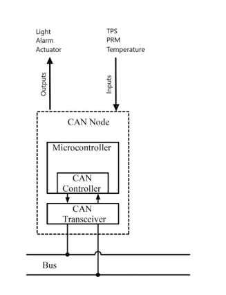
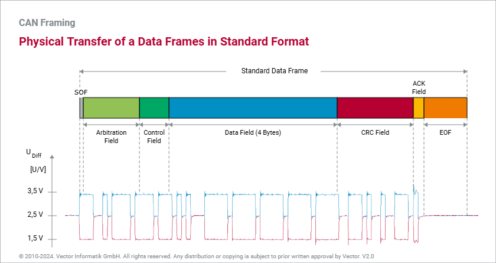

# Bài 12 - CAN

### 1. Giới thiệu

CAN (Controller Area Network) là một giao thức truyền thông được phát triển bởi Bosch vào những năm 1980, chủ yếu để sử dụng trong ngành công nghiệp ô tô. Giao thức này cho phép các thiết bị điện tử trong xe (như cảm biến, bộ điều khiển, và các thiết bị khác) giao tiếp với nhau một cách hiệu quả và đáng tin cậy mà không cần đến một máy tính trung tâm.

**Các vấn đề mà giao thức CAN giải quyết**
- **Giao tiếp giữa các thiết**: CAN cho phép nhiều thiết bị (nodes) giao tiếp với nhau trên cùng một mạng mà không cần phải có một máy chủ trung tâm. Điều này giúp giảm thiểu chi phí và độ phức tạp của hệ thống.
- **Quản lý xung đột**: Với cấu trúc multi-master, bất kỳ thiết bị nào cũng có thể gửi dữ liệu khi bus rảnh. Giao thức CAN sử dụng phương pháp phân giải xung đột không phá hủy (non-destructive bitwise arbitration), cho phép các thiết bị cạnh tranh để gửi dữ liệu mà không làm mất thông tin.
- **Độ tin cậy cao**: Giao thức CAN có nhiều cơ chế phát hiện và xử lý lỗi, giúp đảm bảo rằng dữ liệu được truyền đi một cách chính xác. Nếu một thiết bị phát hiện lỗi, nó có thể tự động gửi lại thông điệp.
- **Tốc độ cao**: CAN hỗ trợ tốc độ truyền dữ liệu lên đến 1 Mbps, phù hợp cho các ứng dụng yêu cầu thời gian thực.
- **Tính định hướng**: Giao thức CAN cung cấp một phương pháp giao tiếp có tính định hướng, rất quan trọng cho các ứng dụng nhạy cảm với thời gian.
- **Giảm thiểu dây dẫn**: Thay vì sử dụng nhiều dây dẫn cho từng kết nối giữa các thiết bị, CAN cho phép nhiều thiết bị kết nối qua một đường dây duy nhất, giúp tiết kiệm không gian và giảm trọng lượng.

### 2. Kiến trúc
#### 2.1. Bus topology
Bus topology là cấu trúc mạng mà trong đó tất cả các thiết bị (nodes) được kết nối với nhau thông qua một đường dây duy nhất gọi là bus. Đây là một trong những cấu trúc phổ biến nhất cho mạng CAN. Các đặc điểm chính của bus topology bao gồm:
- **Đường dây chung**: Tất cả các thiết bị trong mạng đều kết nối với cùng một đường dây, giúp tiết kiệm chi phí và giảm độ phức tạp của hệ thống.
- **Tín hiệu truyền thông**: Tín hiệu được truyền trên bus và tất cả các thiết bị đều có thể nhận tín hiệu này. Mỗi thiết bị sẽ kiểm tra xem liệu thông điệp có phải là dành cho nó hay không dựa trên ID của thông điệp.
- **Khả năng mở rộng**: Bạn có thể dễ dàng thêm hoặc loại bỏ các thiết bị mà không làm ảnh hưởng đến toàn bộ mạng.
- **Giảm thiểu dây dẫn**: Việc sử dụng một đường dây duy nhất giúp giảm thiểu số lượng dây dẫn cần thiết, từ đó giảm trọng lượng và chi phí.

CAN bus này gồm hai dây tín hiệu chính, là:
- CANH (CAN High): Dây tín hiệu cao, thường có điện áp cao hơn so với CANL khi mạng đang hoạt động. Khi một node gửi tín hiệu, điện áp trên dây CANH sẽ tăng lên.
- CANL (CAN Low): Dây tín hiệu thấp, thường có điện áp thấp hơn so với CANH. Khi một node gửi tín hiệu, điện áp trên dây CANL sẽ giảm xuống.
Các tín hiệu truyền qua bus CAN là tín hiệu vi sai (differential signaling), nghĩa là thông tin được mã hóa dựa trên sự chênh lệch điện áp giữa hai dây CANH và CANL. Điều này giúp mạng CAN chống lại nhiễu từ môi trường và duy trì tín hiệu ổn định trên đường truyền.

  - Cách thức hoạt động: Khi một node gửi dữ liệu, nó sẽ tạo ra một sự chênh lệch điện áp giữa CANH và CANL. Ví dụ, nếu CANH có điện áp là 2.5V và CANL có điện áp là 1.5V, thì sự chênh lệch điện áp là 1V. Thông tin được mã hóa dựa trên sự thay đổi này.
  - Khả năng chống nhiễu: Một trong những lợi ích lớn nhất của việc sử dụng tín hiệu vi sai là khả năng chống nhiễu từ môi trường. Bởi vì cả hai dây CANH và CANL đều bị ảnh hưởng bởi nhiễu điện từ (EMI) một cách tương tự, sự chênh lệch điện áp giữa chúng vẫn giữ nguyên. Điều này có nghĩa là nếu có nhiễu làm tăng điện áp trên cả hai dây, sự chênh lệch vẫn có thể được duy trì, giúp đảm bảo rằng tín hiệu truyền đi vẫn chính xác.
  - Duy trì tín hiệu ổn định: Việc sử dụng tín hiệu vi sai cũng giúp duy trì tính ổn định của tín hiệu trên đường truyền. Điều này rất quan trọng trong các ứng dụng yêu cầu độ tin cậy cao, như trong ngành ô tô và tự động hóa công nghiệp.

Hai dây tín hiệu này được xoắn lại tạo thành đường dây xoắn đôi giúp:
- Giảm thiểu nhiễu từ môi trường bên ngoài: Khi các dây được xoắn lại, mỗi đoạn của cặp dây sẽ nhận nhiễu với cường độ khác nhau và theo các hướng ngược nhau, làm triệt tiêu phần lớn nhiễu điện từ.
- Giảm thiểu nhiễu xuyên âm: Việc xoắn đôi các dây giúp giảm hiện tượng này bằng cách phân tán nhiễu xuyên âm ra khắp chiều dài của cáp.

Đặc điểm của Bus topology:
- Kết nối song song: Trong Bus topology, tất cả các thiết bị (nodes) được kết nối với nhau thông qua một đường dây duy nhất (bus). Điều này có nghĩa là mỗi thiết bị có thể truy cập vào bus để gửi hoặc nhận dữ liệu mà không cần phải thông qua một máy tính chủ (master). Mỗi node có thể hoạt động độc lập, cho phép chúng gửi và nhận thông điệp bất cứ lúc nào. Điều này tạo ra một cấu trúc mạng linh hoạt và dễ dàng mở rộng, vì bạn có thể thêm hoặc loại bỏ các thiết bị mà không làm ảnh hưởng đến toàn bộ hệ thống. Việc không cần một máy chủ điều khiển giúp giảm độ phức tạp của hệ thống và tăng tính khả dụng. Điều này rất quan trọng trong các ứng dụng thời gian thực, nơi mà độ trễ trong việc truyền thông có thể gây ra vấn đề.
- Giảm số lượng dây dẫn: Trong Bus topology, tất cả các thiết bị chia sẻ chung một đường dây truyền dữ liệu. Điều này có nghĩa là thay vì phải sử dụng nhiều dây dẫn cho từng kết nối giữa các thiết bị, bạn chỉ cần một đường dây duy nhất cho toàn bộ mạng. Việc giảm số lượng dây dẫn không chỉ giúp tiết kiệm chi phí vật liệu mà còn giúp tiết kiệm không gian trong thiết kế hệ thống. Điều này đặc biệt quan trọng trong các ứng dụng nhúng, nơi mà không gian và trọng lượng là yếu tố quan trọng. Với cấu trúc bus, việc lắp đặt và bảo trì hệ thống dây dẫn trở nên đơn giản hơn. Bạn không cần phải quản lý nhiều kết nối phức tạp, mà chỉ cần tập trung vào một đường dây duy nhất.
- Termination Resistor (Điện trở kết cuối): Khi tín hiệu được truyền qua một dây dẫn, nó tạo ra một sóng điện từ di chuyển dọc theo dây. Nếu dây dẫn này không được kết thúc đúng cách, sóng tín hiệu có thể gặp phải một "đầu mở" (open end) ở cuối dây dẫn. Khi sóng tín hiệu đến đầu mở này, nó không có nơi nào để đi và sẽ bị phản xạ trở lại vào trong dây dẫn. Khi sóng tín hiệu gặp phải một đầu mở, một phần của tín hiệu sẽ quay trở lại, gây ra hiện tượng phản xạ. Điều này có thể dẫn đến việc tín hiệu bị méo hoặc bị nhiễu, làm cho các thiết bị nhận không thể đọc được tín hiệu chính xác. Điện trở kết cuối được kết nối ở hai đầu của bus CAN (thường là 120Ω) để tạo ra một "tải" cho tín hiệu. Khi tín hiệu đến điện trở kết cuối, nó sẽ được hấp thụ bởi điện trở thay vì bị phản xạ trở lại. Điện trở sẽ tạo ra một dòng điện tương ứng với điện áp của tín hiệu. Dòng điện này sẽ tiêu thụ năng lượng của tín hiệu, làm cho tín hiệu không còn đủ năng lượng để quay trở lại. Nếu điện trở kết cuối có giá trị trở kháng phù hợp với trở kháng của dây dẫn, nó sẽ hấp thụ tín hiệu một cách hiệu quả mà không gây ra méo tín hiệu. Điều này giúp duy trì tính ổn định của tín hiệu trên bus, giúp ngăn chặn hiện tượng phản xạ và đảm bảo rằng tín hiệu không bị méo. Bằng cách hấp thụ tín hiệu thay vì phản xạ, điện trở kết cuối giúp duy trì tính ổn định của tín hiệu trên bus.


#### 2.2. Các thiết bị trên bus CAN
Các node nếu muốn gửi và nhận dữ liệu CAN thì bên trong các node cần có những thành phần sau:
- Bộ điều khiển CAN (CAN Controller): Đây là thành phần chính trong node CAN, có nhiệm vụ xử lý toàn bộ giao tiếp CAN.
  - Gửi và nhận thông điệp CAN.
  - Điều khiển truy cập vào bus CAN (arbitration).
  - Phát hiện và xử lý các lỗi truyền thông CAN.
  - Kiểm soát việc truyền lại thông điệp khi gặp lỗi.
  - Cung cấp giao diện giữa các vi điều khiển và bus CAN.
  


- Transceiver CAN (CAN Transceiver):
  - Chuyển đổi tín hiệu số từ bộ điều khiển CAN thành tín hiệu điện áp dạng differential (CANH và CANL) để gửi lên bus CAN và ngược lại
  - Đảm bảo tín hiệu truyền và nhận trên bus CAN có độ chính xác và tốc độ cao.
  


- Vi điều khiển (Microcontroller): là thành phần trung tâm điều khiển hoạt động của node CAN.
  - Đọc và xử lý thông điệp CAN.
  - Tạo ra thông điệp CAN để truyền đi.
  - Quản lý các khung dữ liệu, bit arbitration và quá trình xử lý lỗi.
  - Điều khiển hành vi của node (ví dụ: bật/tắt node, reset node khi gặp lỗi bus-off).

#### 2.3. Đặc điểm giao tiếp của CAN
- Không cần máy tính chủ (No Master-Slave Architecture): Trong mạng CAN, không có một máy tính chủ (master) nào điều khiển các thiết bị (nodes). Thay vào đó, tất cả các thiết bị đều có quyền truy cập vào bus và có thể gửi hoặc nhận dữ liệu bất cứ lúc nào khi bus rảnh. Điều này cho phép các thiết bị hoạt động độc lập và dễ dàng mở rộng mạng bằng cách thêm hoặc loại bỏ các thiết bị mà không cần thay đổi cấu trúc tổng thể của mạng.
- Truyền thông quảng bá (Broadcast Communication): Khi một thiết bị gửi một thông điệp, thông điệp đó sẽ được phát đi trên bus và tất cả các thiết bị khác trong mạng đều có thể nhận được thông điệp này. Điều này giúp tiết kiệm băng thông, vì không cần phải gửi thông điệp đến từng thiết bị một cách riêng lẻ. Các thiết bị sẽ kiểm tra ID của thông điệp để xác định xem thông điệp có phải là dành cho chúng hay không.
- Tranh chấp quyền gửi (Arbitration): 
Nếu có nhiều node cùng muốn gửi dữ liệu lên bus cùng một lúc, cơ chế arbitration sẽ được thực hiện:
  - Mỗi thông điệp CAN có một ID ưu tiên. Node nào có thông điệp với ID ưu tiên thấp hơn (tức có độ ưu tiên cao hơn) sẽ chiếm quyền truy cập bus và gửi thông điệp trước.
  - Những node khác có ID ưu tiên cao hơn sẽ tự động dừng lại và chờ lượt tiếp theo để gửi thông điệp.
  - Quá trình arbitration diễn ra mà không gây mất dữ liệu hay làm gián đoạn các thiết bị khác, vì thế mạng CAN là một hệ thống non-destructive (không gây mất dữ liệu).
- Giao tiếp song công (Full-duplex Communication): Mạng CAN hỗ trợ giao tiếp song công, có nghĩa là các thiết bị có thể gửi và nhận dữ liệu đồng thời. Điều này giúp tăng cường hiệu suất của mạng và giảm thiểu độ trễ trong việc truyền thông. Việc sử dụng tín hiệu vi sai (differential signaling) giữa CANH và CANL giúp duy trì tính ổn định của tín hiệu trong quá trình giao tiếp song công.
- Phát hiện và xử lý lỗi tự động: CAN có nhiều cơ chế để phát hiện lỗi, bao gồm kiểm tra CRC (Cyclic Redundancy Check), kiểm tra bit, và kiểm tra định dạng. Nếu một thiết bị phát hiện lỗi trong thông điệp, nó sẽ gửi một thông điệp lỗi để thông báo cho các thiết bị khác. Khi phát hiện lỗi, thiết bị có thể tự động thực hiện các hành động như gửi lại thông điệp hoặc chuyển sang trạng thái lỗi (active, passive, hoặc bus-off) để đảm bảo rằng mạng vẫn hoạt động ổn định.

#### 2.4. Trạng thái “dominant” và “recessive” trong CAN
Trạng thái "Dominant" (Chiếm ưu thế): được biểu diễn bằng một điện áp cao hơn trên dây CANH (CAN High) và một điện áp thấp hơn trên dây CANL (CAN Low). Cụ thể, trong trạng thái dominant, điện áp trên CANH thường khoảng 2.5V đến 3.5V, trong khi điện áp trên CANL khoảng 1.5V đến 2.5V. Bit dominant được biểu diễn bằng 0.

Khi một node gửi một tín hiệu dominant, nó có thể "chiếm ưu thế" trong việc truyền thông điệp trên bus. Điều này có nghĩa là nếu có nhiều node cố gắng gửi dữ liệu cùng một lúc, tín hiệu dominant sẽ thắng và được truyền đi. Trạng thái dominant được sử dụng để truyền các bit dữ liệu quan trọng, như các bit trong thông điệp hoặc các bit điều khiển.

Trạng thái "Recessive" (Thụ động): được biểu diễn bằng một điện áp thấp hơn trên dây CANH và một điện áp cao hơn trên dây CANL. Cụ thể, trong trạng thái recessive, điện áp trên CANH thường khoảng 1.5V đến 2.5V, trong khi điện áp trên CANL khoảng 2.5V đến 3.5V. Bit recessive được biểu diễn bằng 1.

Khi một node không gửi dữ liệu (hoặc khi bus rảnh), trạng thái recessive sẽ được duy trì. Điều này cho phép bus CAN trở về trạng thái không hoạt động, giúp các node khác có thể gửi dữ liệu mà không bị cản trở. Trạng thái recessive cũng được sử dụng để truyền các bit không quan trọng hoặc khi không có dữ liệu nào được gửi.

Bit Dominant (0):
    - CANH: Điện áp cao
    - CANL: Điện áp thấp

Bit Recessive (1):
    - CANH: Điện áp thấp
    - CANL: Điện áp cao


Khi nhiều node cố gắng gửi dữ liệu cùng một lúc, trạng thái dominant sẽ chiếm ưu thế. Điều này có nghĩa là nếu một node gửi tín hiệu dominant trong khi một node khác gửi tín hiệu recessive, tín hiệu dominant sẽ thắng và được truyền đi. Điều này giúp đảm bảo rằng thông điệp quan trọng được gửi đi mà không bị cản trở. Phương pháp này được gọi là "non-destructive arbitration", cho phép các node cạnh tranh để gửi dữ liệu mà không làm mất thông tin.


#### 2.5. Các loại CAN bus
**CAN Tốc Độ Thấp**

CAN Tốc Độ Thấp, còn được gọi là chịu lỗi hoặc ISO 11898-3, hoạt động với tốc độ lên đến 125 kbps. Nó được thiết kế cho các hệ thống ít quan trọng hơn như mô-đun điều khiển thân xe, khóa cửa, điều khiển cửa sổ, v.v., nơi tốc độ truyền dữ liệu không phải là yếu tố quan trọng. Tính năng chính của nó là khả năng tiếp tục hoạt động ngay cả khi một dây trong bus bị hỏng.


**CAN Tốc Độ Cao**

CAN Tốc Độ Cao, hay ISO 11898-2, có thể đạt tốc độ lên đến 1 Mbps. Loại mạng này phù hợp cho các ứng dụng nhạy cảm về thời gian hơn như hệ thống quản lý động cơ và hệ thống phanh điện tử do tốc độ truyền dữ liệu nhanh hơn so với các mạng tốc độ thấp. Tuy nhiên, nó thiếu khả năng chịu lỗi mà các mạng tốc độ thấp có.


**CAN FD (Tốc Độ Dữ Liệu Linh Hoạt)**

CAN FD, được Bosch giới thiệu vào năm 2012, là một mở rộng của các mạng tốc độ cao với tốc độ dữ liệu tăng lên—lên đến 5 Mbps—trong khi vẫn duy trì khả năng tương thích ngược với các thiết bị tốc độ cao hiện có. Lợi thế chính của công nghệ này nằm ở khả năng truyền tải khối lượng dữ liệu lớn hơn một cách hiệu quả hơn so với CAN truyền thống, làm cho nó trở nên lý tưởng cho các phương tiện hiện đại với các hệ thống điện tử ngày càng phức tạp.

### 3. Các loại khung dữ liệu trong CAN
#### 3.1. Data frame
Data Frame là loại khung dữ liệu chính được sử dụng để truyền thông tin giữa các thiết bị trong mạng CAN. Nó chứa dữ liệu thực tế mà một thiết bị muốn gửi đến thiết bị khác. Data Frame chứa thông tin về ID của node gửi và dữ liệu được truyền. Mỗi khung có thể chứa tối đa 8 byte dữ liệu.

Cấu trúc:

- Start of Frame (1 bit): Đánh dấu bắt đầu của khung dữ liệu.
- Identifier (11 bits hoặc 29 bits):
	- 11 bits cho định dạng tiêu chuẩn (Standard Frame).
	- 29 bits cho định dạng mở rộng (Extended Frame).
	- Công dụng: Xác định độ ưu tiên của thông điệp.
- Control Field (6 bits):
	- 4 bits cho số byte dữ liệu (0-8 bytes).
	- 2 bits cho các thông tin khác (DLC - Data Length Code).
	- Công dụng: Chỉ định độ dài của dữ liệu.
- Data Field (0-8 bytes):
	- Tối đa 8 bytes (64 bits).
	- Công dụng: Chứa dữ liệu thực tế được truyền đi.
- CRC (15 bits + 1 bit):
	- 15 bits cho giá trị CRC.
	- 1 bit cho CRC delimiter.
	- Công dụng: Kiểm tra lỗi trong khung dữ liệu.
- ACK (2 bits):
	- 1 bit cho ACK slot và 1 bit cho ACK delimiter.
	- Công dụng: Xác nhận rằng khung dữ liệu đã được nhận thành công.
- End of Frame (7 bits):
	- Công dụng: Đánh dấu kết thúc của khung dữ liệu.

Data Frame được sử dụng để truyền thông tin từ một thiết bị đến tất cả các thiết bị khác trong mạng.




#### 3.2. Remote frame
Remote Frame được sử dụng để yêu cầu dữ liệu từ một thiết bị khác mà không gửi dữ liệu thực tế. Thay vì chứa dữ liệu thực, Remote Frame chứa ID của node cần yêu cầu, cùng với bit điều khiển RTR (Remote Transmission Request).

Cấu trúc:
- Start of Frame (1 bit): Đánh dấu bắt đầu của khung yêu cầu.
- Identifier (11 bits hoặc 29 bits):
	- 11 bits cho định dạng tiêu chuẩn (Standard Frame).
	- 29 bits cho định dạng mở rộng (Extended Frame).
	- Công dụng: Xác định thông điệp mà thiết bị yêu cầu.
- Control Field (6 bits):
	- 4 bits cho số byte dữ liệu mà thiết bị yêu cầu.
	- 2 bits cho các thông tin khác.
	- Công dụng: Chỉ định độ dài dữ liệu mà thiết bị yêu cầu.
- Data Field (0 bytes):
	- Không có dữ liệu thực tế trong Remote Frame.
- CRC (15 bits + 1 bit):
	- 15 bits cho giá trị CRC.
	- 1 bit cho CRC delimiter.
	- Công dụng: Kiểm tra lỗi trong khung yêu cầu.
- ACK (2 bits):
	- 1 bit cho ACK slot và 1 bit cho ACK delimiter.
	- Công dụng: Xác nhận rằng khung yêu cầu đã được nhận thành công.
- End of Frame (7 bits):
	- Công dụng: Đánh dấu kết thúc của khung yêu cầu.

Khi một thiết bị cần dữ liệu từ một thiết bị khác, nó sẽ gửi một Remote Frame để yêu cầu dữ liệu. Remote Frame này sẽ bao gồm ID của thông điệp mà node yêu cầu, ID này phải khớp với ID của Data Frame mà node khác sẽ gửi để đáp ứng yêu cầu, và Control Field để chỉ định số byte dữ liệu mà node yêu cầu. Tất cả các node trong mạng CAN đều lắng nghe bus để nhận các thông điệp. Khi một node nhận được Remote Frame, nó sẽ kiểm tra Identifier trong khung yêu cầu. Nếu ID trong Remote Frame khớp với ID của một Data Frame mà node đó có, node đó sẽ biết rằng nó cần phản hồi yêu cầu. Node nhận yêu cầu sẽ gửi một Data Frame chứa dữ liệu mà node yêu cầu. Data Frame này sẽ có cùng Identifier như trong Remote Frame, cho phép node yêu cầu nhận được dữ liệu chính xác.


#### 3.3. Error frame
Error Frame được sử dụng khi một node phát hiện ra lỗi trong quá trình truyền dữ liệu. Nó được gửi để thông báo cho các node khác rằng có lỗi đã xảy ra trên bus. Bất kỳ node nào phát hiện ra lỗi đều có thể gửi Error Frame. Error Frame gồm hai phần: Error Flag và Error Delimiter. Error Flag là chuỗi từ 6 đến 12 bit dominant, báo hiệu lỗi. Error Delimiter là chuỗi 8 bit recessive, kết thúc Error Frame.
- Error Flag: 6 bits (0b000000)
- Error Delimiter: 8 bits (0b11111111)

Khi một thiết bị phát hiện lỗi trong một khung dữ liệu (ví dụ: lỗi CRC, lỗi bit), nó sẽ gửi một Error Frame để thông báo cho các thiết bị khác rằng có lỗi xảy ra. Điều này giúp đảm bảo rằng các thiết bị khác có thể thực hiện các hành động cần thiết, chẳng hạn như gửi lại thông điệp.


#### 3.4. Overload frame
Overload Frame được sử dụng để thông báo rằng một thiết bị đang quá tải và không thể xử lý thông điệp mới.
- Overload Flag (6 bits):
    - Đây là một chuỗi bit đặc biệt để đánh dấu rằng thiết bị đang quá tải. Giá trị của Overload Flag là:
        - Dominant (0): 6 bit liên tiếp là 0 (0b000000).
    - Điều này có nghĩa là tất cả các bit trong Overload Flag đều là bit dominant.

- Overload Delimiter (8 bits):
    - Đánh dấu kết thúc của Overload Frame. Giá trị của Overload Delimiter là:
        - Recessive (1): 8 bit liên tiếp là 1 (0b11111111).
    - Điều này có nghĩa là tất cả các bit trong Overload Delimiter đều là bit recessive.
Khi một thiết bị không thể xử lý thông điệp mới (do quá tải hoặc lý do khác), nó sẽ gửi một Overload Frame để thông báo cho các thiết bị khác. Điều này giúp giảm thiểu lưu lượng trên bus và cho phép thiết bị quá tải có thời gian để xử lý các thông điệp hiện tại.


### 4. Cấu trúc của một khung dữ liệu trong CAN

```
+--------+-------------------+--------------+-------------+-------------+----------+---------+
|  SOF   |  Arbitration      |  Control     |  Data       |    CRC      |   ACK    |   EOF   |
| (1 bit)| Field             | Field        | Field       | Field       | Field    | (7 bits)|
|        | (11/29 bits + 1)  | (6 bits)     | (0-8 bytes) | (15+1 bits) | (2 bits) |         |
+--------+-------------------+--------------+-------------+-------------+----------+---------+
```

- SOF: Đồng bộ hóa khung.
- Identifier: Quy định ưu tiên và định danh thông điệp.
- RTR: Phân biệt khung dữ liệu (0) hoặc yêu cầu (1).
- IDE: Chỉ định sử dụng 11-bit hoặc 29-bit identifier.
- DLC: Xác định chiều dài dữ liệu.
- Data Field:  Mang thông tin dữ liệu thực tế.
- CRC: Phát hiện lỗi truyền dẫn.
- ACK: Đảm bảo nhận thành công dữ liệu.
- EOF: Kết thúc khung và đảm bảo khung khác không bị chồng lấn.

#### 4.1. Start of Frame (SOF)
- Chiều dài: 1 bit.
- Chức năng:
	- Xác định bắt đầu của một khung dữ liệu.
	- Được truyền dưới dạng mức logic dominant (0).
	- Giúp các thiết bị đồng bộ hóa để bắt đầu truyền nhận.
	
#### 4.2. Arbitration Field
- Chiều dài:
	- 11-bit Identifier (CAN 2.0A) hoặc 29-bit Identifier (CAN 2.0B).
	- Thêm 1 bit cho RTR (Remote Transmission Request).
- Chức năng:
	- Xác định ưu tiên của thông điệp. Identifier càng nhỏ thì ưu tiên càng cao.
	- RTR Bit:
		- 0 (dominant): Khung dữ liệu.
		- 1 (recessive): Yêu cầu dữ liệu từ thiết bị khác.
		
#### 4.3. Control Field:
- Chiều dài: 6 bits.
- Cấu trúc:
	- IDE (Identifier Extension):
		- 0: Sử dụng chuẩn 11-bit (CAN 2.0A).
		- 1: Sử dụng chuẩn 29-bit (CAN 2.0B).
	- r0 (reserved): 1 bit dự trữ, phải luôn là dominant (0).
	- DLC (Data Length Code): 4 bits, cho biết số byte dữ liệu (0-8 bytes).
- Chức năng:
	- Quy định định dạng và chiều dài của dữ liệu.
	
#### 4.4. Data Field:
- Chiều dài: 0–8 bytes.
- Chức năng:
	- Chứa dữ liệu thực tế được truyền đi.
	- Dữ liệu này có thể là thông tin cảm biến, điều khiển thiết bị, v.v.
	
#### 4.5. CRC Field (Cyclic Redundancy Check):
- Chiều dài: 15 bits (CRC Sequence) + 1 bit (CRC Delimiter).
- Chức năng:
	- Đảm bảo tính toàn vẹn của dữ liệu.
	- CRC Sequence: Chứa giá trị CRC được tính toán từ tất cả các trường trước đó.
	- CRC Delimiter: Mức logic recessive (1) để phân tách CRC.

#### 4.6. ACK Field (Acknowledgment Field):
- Chiều dài: 2 bits.
- Cấu trúc:
	- ACK Slot: Thiết bị nhận gửi dominant (0) để xác nhận nhận dữ liệu.
	- ACK Delimiter: Mức logic recessive (1), phân tách ACK.
- Chức năng:
	- Thiết bị gửi dữ liệu sẽ kiểm tra bit ACK Slot để xác nhận dữ liệu được nhận thành công.

#### 4.7. End of Frame (EOF):
- Chiều dài: 7 bits.
- Chức năng:
    - Xác định kết thúc của khung dữ liệu.
    - Mức logic recessive (1).

#### 4.8.  Intermission (Interframe Space):
- Chiều dài: 3 bits hoặc hơn.
- Chức năng:
    - Khoảng thời gian chờ giữa hai khung để chuẩn bị cho khung tiếp theo.

**Cấu trúc khung dữ liệu trong CAN FD**

- **SOF** (Start of Frame)
- **Arbitration Field**
- **Control Field**
- **Data Field**
- **CRC Field**
- **ACK Field**
- **End of Frame (EOF)**

```
| Trường                  | Số bit   | Công dụng                                                      |
|-------------------------|----------|-----------------------------------------------------------------|
| **SOF**                 | 1 bit    | Báo hiệu sự bắt đầu của khung dữ liệu (luôn là 0).              |
| **Arbitration Field**   | 13 bit   | Chứa ID của khung, yêu cầu truyền hoặc dữ liệu, ID mở rộng.     |
| **Control Field**       | 8 bit    | Điều khiển độ dài dữ liệu, tốc độ truyền và trạng thái lỗi.      |
| **Data Field**          | 0-64 byte| Chứa dữ liệu cần truyền (0-512 bit).                            |
| **CRC Field**           | 16 bit   | Mã kiểm tra toàn vẹn và phân tách CRC.                           |
| **ACK Field**           | 2 bit    | Xác nhận đã nhận thành công dữ liệu.                            |
| **EOF**                 | 7 bit    | Đánh dấu sự kết thúc của khung dữ liệu (7 bit 1 liên tiếp).      |
```

**Start of Frame (SOF):**
Một bit đơn, luôn có giá trị 0, đánh dấu bắt đầu của một khung dữ liệu.

**Identifier (ID):**
- **Standard Frame (11-bit ID)**: Khung chuẩn với 11-bit định danh.
- **Extended Frame (29-bit ID)**: Khung mở rộng với 29-bit định danh, tương tự như trong CAN 2.0B.

**Extended Identifier (IDE):**
Bit này cho biết khung dữ liệu là chuẩn (Standard Frame) hay mở rộng (Extended Frame).
- **IDE = 0**: Khung chuẩn (11-bit).
- **IDE = 1**: Khung mở rộng (29-bit).

**Remote Transmission Request (RTR):**
Bit này chỉ có trong CAN 2.0B để yêu cầu dữ liệu từ node khác. Trong CAN FD, RTR đã bị loại bỏ.

**FD Format (FDF):**
Đây là bit mới được thêm vào trong CAN FD, cho biết khung dữ liệu là CAN 2.0 hay CAN FD.
- **FDF = 0**: Khung CAN 2.0.
- **FDF = 1**: Khung CAN FD.

**Bit Rate Switch (BRS):**
Bit này cho phép điều chỉnh tốc độ truyền dữ liệu.
- Nếu **BRS = 1**, tốc độ truyền trong phần **Data Phase** (phần chứa dữ liệu) sẽ cao hơn tốc độ truyền trong phần **Arbitration Phase** (phần xác định ưu tiên).

**Error State Indicator (ESI):**
Bit này cho biết trạng thái lỗi của node.
- **ESI = 0**: Node đang trong trạng thái active (hoạt động bình thường).
- **ESI = 1**: Node đang trong trạng thái passive (chờ phục hồi sau lỗi).

**Data Length Code (DLC):**
CAN FD vẫn sử dụng trường DLC để chỉ định số byte trong **Data Field** (trường dữ liệu). Tuy nhiên, CAN FD cho phép số byte dữ liệu lớn hơn nhiều so với CAN 2.0:
- **CAN 2.0**: Tối đa 8 byte.
- **CAN FD**: Tối đa 64 byte.

**Data Field:**
Đây là trường chứa dữ liệu thực tế.
- **CAN FD** cho phép truyền tối đa 64 byte dữ liệu (trong khi CAN 2.0 chỉ cho phép 8 byte).

**Cyclic Redundancy Check (CRC):**
Trường CRC trong CAN FD dài hơn so với CAN 2.0 để đảm bảo độ tin cậy khi truyền dữ liệu lớn hơn.
- **CAN 2.0**: CRC là 15-bit.
- **CAN FD**: CRC có thể là 17-bit hoặc 21-bit, tùy thuộc vào độ dài của dữ liệu.

**ACK Slot:**
Khung ACK để các node trên bus xác nhận rằng frame đã được nhận thành công.
- Giống với CAN 2.0, node nhận sẽ ghi bit ACK nếu nhận được khung mà không gặp lỗi.

**End of Frame (EOF):**
Khung kết thúc giống với CAN 2.0, bao gồm 7 bit liên tiếp có giá trị "1".


### 5. Abitration trong CAN
Arbitration (phân xử) là cơ chế trong giao thức CAN để giải quyết xung đột khi nhiều thiết bị trên bus muốn truyền dữ liệu cùng lúc. CAN sử dụng phương pháp CSMA/CR (Carrier Sense Multiple Access with Collision Resolution) để đảm bảo rằng chỉ có một thiết bị truyền dữ liệu tại một thời điểm mà không mất dữ liệu.
- Carrier Sense: Tất cả các thiết bị trên bus "lắng nghe" trạng thái bus trước khi truyền.
- Collision Resolution: Nếu có xung đột, arbitration sẽ xác định thiết bị có ưu tiên cao hơn để tiếp tục truyền. 

Arbitration trong CAN dựa trên Identifier (mã định danh) của thông điệp.

Quy tắc:
- Identifier càng nhỏ thì ưu tiên càng cao.
- Arbitration dựa trên mức logic Dominant (0) và Recessive (1):
    - Dominant (0) sẽ luôn "ghi đè" Recessive (1) trên bus.
    - Thiết bị phát hiện mình bị ghi đè sẽ ngừng truyền ngay lập tức.

Giả sử có ba thiết bị (Node A, Node B, Node C) muốn truyền thông điệp với các Identifier lần lượt là 0x100, 0x110, và 0x120. Quá trình arbitration diễn ra như sau:
- Bước 1: Tất cả các thiết bị bắt đầu truyền đồng thời
	- Node A, B, và C truyền bit đầu tiên (MSB) của Identifier.

- Bước 2: So sánh bit trên bus
	- Node A truyền 0, Node B truyền 0, Node C truyền 0 → Không có xung đột.
    - Tiếp tục truyền bit tiếp theo.

Bước 3: Phát hiện xung đột
    - Ở một bit nào đó (ví dụ, vị trí thứ 5), Node A truyền 0 (dominant), còn Node B và Node C truyền 1 (recessive).
    - Trên bus xuất hiện mức dominant (0).

Bước 4: Loại thiết bị thua arbitration
    - Node B và Node C nhận thấy bit mình truyền không khớp với trạng thái bus → Chúng ngừng truyền.
    - Node A tiếp tục truyền dữ liệu vì Identifier của nó có ưu tiên cao hơn.

- Bước 5: Kết thúc arbitration
	- Node A truyền dữ liệu, trong khi Node B và C sẽ chờ bus rảnh để truyền sau.

```	
| **Node** | **Identifier (Hex)** | **Identifier (Binary)** | **Thứ tự ưu tiên** |
|----------|-----------------------|--------------------------|---------------------|
| Node A   | `0x100`               | `0001 0000 0000`         | Cao nhất            |
| Node B   | `0x110`               | `0001 0001 0000`         | Trung bình          |
| Node C   | `0x120`               | `0001 0010 0000`         | Thấp nhất           |
```

- Cả ba thiết bị bắt đầu truyền từ bit cao nhất (MSB).
- Tại bit thứ 5:
	- Node A truyền 0 → Bus nhận mức dominant (0).
    - Node B và Node C truyền 1 → Nhận thấy trạng thái bus không khớp với bit mình truyền → Ngừng truyền.
- Kết quả arbitration:
	- Node A chiến thắng arbitration vì Identifier của nó nhỏ nhất.
	- Node B và Node C sẽ chờ bus rảnh để thử truyền lại sau.

```
Bus:       0001 0000 0000 (Node A thắng arbitration)
Node A:    0001 0000 0000
Node B:    0001 0001 0000 → Thua tại bit thứ 5
Node C:    0001 0010 0000 → Thua tại bit thứ 5
```

Ưu điểm:
- Hiệu quả trong việc tránh xung đột dữ liệu.
- Đảm bảo thông điệp quan trọng được truyền trước.
- Phù hợp cho hệ thống thời gian thực.

Nhược điểm:
- Identifier nhỏ hơn (ưu tiên cao hơn) có thể "lấn át" các thiết bị khác nếu luôn muốn truyền.
- Hạn chế khi bus quá tải.


### 6. Lỗi trong giao thức CAN
#### 6.1. Bit Error (Lỗi Bit)
- **Nguyên nhân**:
  - Thiết bị truyền phát một giá trị logic, nhưng phát hiện giá trị khác trên bus.
- **Cơ chế phát hiện**:
  - CAN kiểm tra sự khác biệt giữa bit truyền và bit nhận.
  - Bit error không được phát hiện trong trường **ACK Field**.
- **Ví dụ**:
  - Thiết bị truyền logic `dominant (0)` nhưng trên bus là `recessive (1)`.
  
#### 6.2. Stuff Error (Lỗi Stuffing)
- **Nguyên nhân**:
  - Quy tắc CAN quy định không được truyền quá 5 bit cùng giá trị liên tiếp.
  - Nếu phát hiện vi phạm, lỗi stuffing xảy ra.
- **Cơ chế phát hiện**:
  - Phát hiện chuỗi liên tiếp quá 5 bit giống nhau (0 hoặc 1) trong các trường dữ liệu.
  
#### 6.3. Form Error (Lỗi Định Dạng)
- **Nguyên nhân**:
  - Một trường trong khung dữ liệu (như EOF, ACK Delimiter) không tuân theo định dạng quy định.
- **Cơ chế phát hiện**:
  - CAN kiểm tra định dạng của các trường cố định (SOF, CRC Delimiter, EOF, v.v.).

#### 6.4. CRC Error (Lỗi CRC)
- **Nguyên nhân**:
  - Sai lệch giữa giá trị CRC nhận được và giá trị CRC được tính từ dữ liệu.
- **Cơ chế phát hiện**:
  - Thiết bị nhận tính toán lại CRC từ dữ liệu nhận được và so sánh với giá trị CRC trong khung.

#### 6.5. Acknowledgment Error (Lỗi ACK)
- **Nguyên nhân**:
  - Thiết bị truyền không nhận được phản hồi ACK (bit dominant) từ thiết bị nhận.
- **Cơ chế phát hiện**:
  - Thiết bị truyền kiểm tra bit **ACK Slot**. Nếu là `recessive (1)`, lỗi ACK xảy ra.

**Cơ Chế Phát Hiện Lỗi**
- Giao thức CAN sử dụng các kỹ thuật sau để phát hiện lỗi:
  1. **Bit Monitoring**:
     - So sánh bit truyền với bit nhận trên bus.
  2. **CRC Check**:
     - Tính toán và so sánh giá trị CRC.
  3. **Frame Check**:
     - Kiểm tra cấu trúc khung.
  4. **Stuffing Rule**:
     - Xác minh số lượng bit giống nhau liên tiếp không vượt quá 5.
  5. **ACK Check**:
     - Kiểm tra phản hồi từ thiết bị nhận.

**Cơ Chế Sửa Lỗi Tự Động**
- CAN hỗ trợ cơ chế sửa lỗi như sau:
  1. **Bỏ qua khung lỗi**:
     - Nếu phát hiện lỗi, khung hiện tại bị bỏ qua.
  2. **Automatic Retransmission**:
     - Thiết bị truyền sẽ tự động truyền lại khung nếu không nhận được ACK hoặc phát hiện lỗi.
  3. **Error Signaling**:
     - Thiết bị phát hiện lỗi sẽ gửi **Error Frame** để thông báo lỗi cho toàn bộ bus.

**Các Trạng Thái Lỗi**

**Error Active (Lỗi Hoạt Động)**
- **Mô tả**:
  - Thiết bị trong trạng thái bình thường, có thể truyền và nhận dữ liệu.
  - Khi phát hiện lỗi, thiết bị gửi **Active Error Frame**.
  - **Active Error Frame** là loại Error Frame được gửi khi thiết bị đang ở trạng thái Error Active, được sử dụng để thông báo lỗi một cách chủ động, khi thiết bị phát hiện lỗi nhưng vẫn hoạt động bình thường trên bus. Active Error Frame bao gồm 6 bit dominant (0) liên tiếp biểu thị lỗi mạnh và 8 bit recessive (1) liên tiếp dùng để tái đồng bộ hóa bus.
- **Điều kiện**:
  - Bộ đếm lỗi **Transmit Error Counter (TEC)** hoặc **Receive Error Counter (REC)** nhỏ hơn 128.

**Error Passive (Lỗi Thụ Động)**
- **Mô tả**:
  - Thiết bị vẫn có thể tham gia truyền và nhận nhưng gửi **Passive Error Frame** khi phát hiện lỗi.
  - **Passive Error Frame** là loại Error Frame được gửi khi thiết bị ở trạng thái Error Passive, được sử dụng khi thiết bị phát hiện lỗi nhưng đã chuyển sang trạng thái lỗi thụ động (Error Passive), tránh làm gián đoạn mạnh bus. Passive Error Frame bao gồm 6 bit recessive (1) liên tiếp thay vì dominant như trong Active Error Frame và 8 bit recessive (1) để tái đồng bộ hóa bus.
- **Điều kiện**:
  - TEC hoặc REC lớn hơn hoặc bằng 128 nhưng nhỏ hơn 256.

**Bus Off (Ngắt Kết Nối Bus)**
- **Mô tả**:
  - Thiết bị không thể tham gia truyền hoặc nhận trên bus.
  - Cần reset thủ công hoặc tự động để khôi phục hoạt động.
- **Điều kiện**:
  - TEC lớn hơn hoặc bằng 256.

```

| **Loại lỗi**      | **Nguyên nhân chính**                             | **Phương pháp phát hiện**            | **Cách sửa lỗi**                     |
|--------------------|--------------------------------------------------|--------------------------------------|---------------------------------------|
| **Bit Error**      | Sai khác giữa bit truyền và bit nhận.            | So sánh bit truyền và bit trên bus.  | Truyền lại khung dữ liệu.            |
| **Stuff Error**    | Chuỗi > 5 bit giống nhau liên tiếp.              | Kiểm tra stuffing rule.              | Gửi Error Frame, truyền lại khung.   |
| **Form Error**     | Trường định dạng không đúng.                     | Kiểm tra định dạng trường cố định.   | Gửi Error Frame, truyền lại khung.   |
| **CRC Error**      | CRC nhận không khớp CRC tính toán.               | Kiểm tra CRC.                        | Gửi Error Frame, truyền lại khung.   |
| **ACK Error**      | Không nhận được ACK từ thiết bị nhận.            | Kiểm tra ACK Slot.                   | Truyền lại khung dữ liệu.            |
```

### 7. Tốc độ truyền và giới hạn vật lý của CAN
#### 7.1. **Tốc độ truyền (Baud Rate)**
- **Tốc độ truyền**, hay còn gọi là **Baud Rate**, biểu thị số lượng bit được truyền qua bus CAN trong một giây. Đơn vị: **bit/giây (bps)**.
- Ví dụ:
  - 125 kbps: Truyền 125.000 bit/giây.
  - 500 kbps: Truyền 500.000 bit/giây.
  - 1 Mbps: Truyền 1.000.000 bit/giây (giới hạn tối đa trong CAN tiêu chuẩn).

#### 7.2. **Giới hạn vật lý**
- **Chiều dài dây dẫn** và **tốc độ truyền** trong CAN có quan hệ nghịch đảo:
  - Tốc độ cao → Chiều dài dây giảm.
  - Tốc độ thấp → Chiều dài dây tăng.
- Nguyên nhân:
  - CAN sử dụng cơ chế **arbitration** và tín hiệu **dominant/recessive** cần đảm bảo tín hiệu được truyền đồng bộ trên toàn bus.
  - Thời gian lan truyền tín hiệu (propagation delay) qua dây dẫn càng dài, tốc độ truyền phải càng thấp để tránh xung đột tín hiệu.

```
| **Tốc độ truyền (Baud Rate)** | **Chiều dài tối đa của bus CAN** |
|-------------------------------|----------------------------------|
| 1 Mbps                        | 40 m                           |
| 500 kbps                      | 100 m                          |
| 250 kbps                      | 250 m                          |
| 125 kbps                      | 500 m                          |
```

#### 7.3. **Cách Tính Tốc Độ Baud (Baud Rate)**
Tốc độ truyền được xác định bằng cách cấu hình các thông số của bộ điều khiển CAN:
\[
\text{Baud Rate} = \frac{1}{\text{TQ} \times \text{Number of TQ}}
\]
- **TQ (Time Quantum)**: Đơn vị thời gian nhỏ nhất trong bit time.
- **Number of TQ**: Tổng số Time Quantum trong một bit.

Trong giao thức CAN, một bit không chỉ được truyền trong một lần, mà nó phải được chia nhỏ và xử lý một cách chính xác để đảm bảo tính đồng bộ trong toàn bộ hệ thống. Điều này dẫn đến việc chia một bit thành nhiều phần, và phần chia này có liên quan trực tiếp đến Time Quantum (TQ).

Bit Time là khoảng thời gian cần thiết để truyền một bit. Một bit có thể kéo dài vài đơn vị thời gian, và hệ thống CAN chia khoảng thời gian đó thành các đơn vị nhỏ hơn gọi là Time Quantum (TQ).
 
Tóm lại:
- Bit Time là thời gian để truyền một bit.
- TQ (Time Quantum) là đơn vị thời gian nhỏ nhất trong một Bit Time.

Time Quantum (TQ) là đơn vị thời gian cơ bản trong giao thức CAN, và nó đại diện cho một chu kỳ đồng hồ (clock cycle) rất ngắn. Một TQ thường là khoảng thời gian rất ngắn, ví dụ, 125 nanosecond (ns) khi tần số đồng hồ là 8 MHz. Mỗi bit trong CAN có thể được chia thành nhiều TQ, và các TQ này giúp đồng bộ hóa việc truyền tải và nhận dữ liệu trên bus. TQ giúp điều chỉnh chính xác các sự kiện trên bus CAN, đảm bảo rằng các thiết bị khác nhau có thể nhận biết và xử lý tín hiệu chính xác.

Giả sử đồng hồ hệ thống có tần số là 8 MHz. Điều này có nghĩa là mỗi chu kỳ đồng hồ sẽ có thời gian là:

$$\text{Thời gian mỗi chu kỳ đồng hồ} = {1 \over 8000000} = 125ns$$

Vì vậy, 1 TQ = 125 ns.

Một Bit Time (thời gian truyền một bit) không chỉ đơn giản là một khoảng thời gian liên tục. Thực tế, trong giao thức CAN, một bit được chia thành 4 phần khác nhau, được gọi là Segment. Đây là cách CAN xử lý đồng bộ hóa và đảm bảo rằng tín hiệu được truyền chính xác.

Các Segment này bao gồm:
- Synchronization Segment (SYNC_SEG): Đây là phần đồng bộ hóa tín hiệu. Mục đích của nó là để đồng bộ tín hiệu giữa tất cả các thiết bị trên bus. Phần này luôn luôn chiếm 1 TQ.
- Propagation Segment (PROP_SEG): Phần này dùng để bù đắp độ trễ tín hiệu khi tín hiệu đi qua dây cáp hoặc thiết bị. Thời gian này giúp xử lý độ trễ tín hiệu trên bus và điều chỉnh tốc độ truyền cho phù hợp.
- Phase Segment 1 (PHASE_SEG1): Đây là phần điều chỉnh tín hiệu theo chiều đi tới (forward). Nó giúp điều chỉnh độ dài của tín hiệu trước khi nó được nhận.  Tức là điều chỉnh tín hiệu từ thiết bị gửi (transmitter) đến thiết bị nhận (receiver). Tín hiệu được phát ra từ thiết bị gửi và sẽ đi trên bus CAN tới các thiết bị nhận. Nếu trong quá trình này có độ lệch về thời gian (chẳng hạn như do độ trễ khi tín hiệu lan truyền qua dây dẫn), PHASE_SEG1 sẽ điều chỉnh lại tín hiệu này, khiến nó "kịp" với thời gian mà thiết bị nhận mong đợi.
- Phase Segment 2 (PHASE_SEG2): Đây là phần điều chỉnh tín hiệu theo chiều đi ngược lại (backward), tức là điều chỉnh độ dài của tín hiệu sau khi đã nhận. Sau khi tín hiệu đã đi từ thiết bị gửi đến thiết bị nhận, nếu có bất kỳ sự lệch pha nào trong quá trình truyền tải hoặc nhận tín hiệu, PHASE_SEG2 sẽ điều chỉnh tín hiệu theo chiều ngược lại, giúp thiết bị nhận đồng bộ hóa và điều chỉnh lại tín hiệu. Điều này giống như việc sửa chữa tín hiệu trong khi nó đang quay lại thiết bị gửi sau khi thiết bị nhận đã nhận xong.

PHASE_SEG1 giúp chỉnh tín hiệu trong khi đi tới, trong khi PHASE_SEG2 sẽ chỉnh lại tín hiệu khi nó đi ngược lại, giúp tối ưu hóa việc đồng bộ hóa tín hiệu trong quá trình truyền dữ liệu. Nếu chỉ có một Phase Segment, hệ thống sẽ khó có thể điều chỉnh kịp thời các sự cố nhỏ trong khi truyền tín hiệu, dẫn đến việc nhận dữ liệu sai hoặc gặp phải xung đột.

Một Bit Time = SYNC_SEG + PROP_SEG + PHASE_SEG1 + PHASE_SEG2.

Để tính Baud Rate của CAN, ta cần phải hiểu mối quan hệ giữa TQ và Segment:
- Baud Rate (tốc độ truyền) là 1 chia cho tổng số TQ trong một bit.
- Tổng số TQ được tính bằng cách cộng các TQ từ các Segment lại.

$${BaudRate} = {1 \over {\text{TQ} \times \text{Số TQ trong 1 bit}}}$$

Giả sử hệ thống sử dụng tần số đồng hồ 8 MHz (tương đương mỗi TQ là 125 ns). Tổng số TQ trong một bit là 20 (giả sử cho mỗi segment trong bit time, ta có SYNC_SEG = 1 TQ, PROP_SEG = 4 TQ, PHASE_SEG1 = 8 TQ, PHASE_SEG2 = 7 TQ).

$${BaudRate} = {1 \over {\text{125ns} \times {20}}} = 400kbps$$

### 8. Bộ Lọc CAN (CAN Filter)
- Bộ lọc CAN cho phép thiết bị chỉ nhận những khung dữ liệu phù hợp với tiêu chí nhất định (thường là **Identifier**) và bỏ qua các khung không liên quan.
- Giúp giảm tải xử lý cho vi điều khiển bằng cách loại bỏ các thông điệp không cần thiết.

- Mỗi bộ điều khiển CAN có các **bộ lọc (Filter)** và **mặt nạ (Mask)**:
  - **Mask**: Quy định bit nào trong Identifier cần được so khớp.
  - **Filter**: Giá trị được so khớp với các bit đã chọn trong Mask.

Giả sử:
- Identifier nhận: `0x123`.
- Filter: `0x120`.
- Mask: `0xFF0`.

**Quy trình**:
1. Lấy Mask `0xFF0` (bảo toàn 12 bit đầu, bỏ qua 4 bit cuối).
2. Áp dụng Mask lên cả Filter và Identifier:
   - Filter & Mask: `0x120 & 0xFF0 = 0x120`.
   - Identifier & Mask: `0x123 & 0xFF0 = 0x120`.
3. So sánh kết quả:
   - Vì `0x120` = `0x120`, khung dữ liệu được nhận.
4. Nếu Identifier khác (ví dụ `0x124`):
   - Identifier & Mask: `0x124 & 0xFF0 = 0x120` (khớp).
   - Nhưng nếu Mask khác (ví dụ `0xFFF`), kết quả không khớp, khung sẽ bị bỏ qua.

### Tình huống:
- Một xe ô tô có 3 thiết bị trên bus CAN:
  - Thiết bị A (ECU động cơ): Chỉ nhận các thông điệp liên quan đến tốc độ động cơ (Identifier `0x100` - `0x1FF`).
  - Thiết bị B (Hệ thống phanh): Chỉ nhận các thông điệp liên quan đến phanh (Identifier `0x200` - `0x2FF`).
  - Thiết bị C (Hệ thống đèn): Nhận mọi thông điệp.

**Thiết lập bộ lọc**:
1. ECU động cơ:
   - Mask: `0xF00` (chỉ quan tâm đến 8 bit đầu tiên).
   - Filter: `0x100`.
2. Hệ thống phanh:
   - Mask: `0xF00`.
   - Filter: `0x200`.
3. Hệ thống đèn:
   - Mask: `0x000` (nhận tất cả).
   - Filter: `0x000`.

Kết quả:
- Một khung dữ liệu với Identifier `0x123`:
  - ECU động cơ nhận (khớp với `0x100` - `0x1FF`).
  - Hệ thống phanh bỏ qua (không khớp với `0x200` - `0x2FF`).
  - Hệ thống đèn nhận (không áp dụng lọc).

### Q&A:
#### 1. Làm sao CAN nhận biết dược 2 bit liền kề ?

CAN sử dụng một đồng hồ nội bộ với mỗi node CAN để đồng bộ hóa, nhưng không gửi tín hiệu clock riêng biệt. Thay vào đó, tín hiệu clock được lấy từ các cạnh tín hiệu trong luồng dữ liệu. Các nút CAN dựa vào sự thay đổi giữa các mức logic (cạnh lên hoặc cạnh xuống) để đồng bộ lại đồng hồ bên trong. Điều này gọi là edge-based synchronization.

CAN chia mỗi bit thời gian thành nhiều phần nhỏ hơn, gọi là Time Quanta (TQ). Một chu kỳ bit trong CAN bao gồm: 4 đoạn chính:
- Synchronization Segment (Sync-Seg): Phát hiện cạnh đầu tiên (lên hoặc xuống) để đồng bộ hóa.
- Propagation Segment (Prop-Seg): Dành cho việc truyền tín hiệu qua mạng.
- Phase Segment 1 (Phase-Seg1): Dùng để điều chỉnh nếu có sai lệch thời gian.
- Phase Segment 2 (Phase-Seg2): Thời gian chờ trước khi nhận hoặc gửi bit tiếp theo.
Tổng các đoạn này tạo thành thời gian của một bit. Khi nút CAN gửi bit đầu tiên (1), nó sử dụng đồng hồ nội bộ và kiểm tra cạnh tín hiệu để xác định thời gian truyền bit đó. Khi gửi bit thứ hai (1), nút này cũng gửi tín hiệu theo thời gian đã định (bit timing) và kiểm tra viền (cạnh) tín hiệu. Dù cả hai bit là 1, CAN vẫn biết chúng khác nhau vì chúng nằm trong khoảng thời gian khác nhau. 

Để đảm bảo rằng các nút CAN nhận đúng các bit trong luồng dữ liệu, CAN áp dụng các cơ chế:
- Resynchronization (Đồng bộ lại): Khi phát hiện cạnh tín hiệu, nút CAN sẽ điều chỉnh đồng hồ nội bộ nếu cần, để khớp với thời gian của mạng.
- Bit Stuffing: Đảm bảo có đủ cạnh tín hiệu trong luồng dữ liệu để duy trì đồng bộ.

Khi gửi (Transmitter):
- Nếu phát hiện có 5 bit liên tiếp giống nhau, bên truyền sẽ chèn 1 bit đối lập.
- Dữ liệu sau khi nhồi sẽ được gửi qua bus.

Khi nhận (Receiver):
- Bên nhận sẽ kiểm tra luồng bit trên bus.
- Mỗi khi phát hiện 5 bit liên tiếp giống nhau, nó sẽ tự động loại bỏ bit thứ 6 (Stuff Bit).
- Dữ liệu ban đầu (trước khi nhồi bit) sẽ được khôi phục chính xác.


Nếu một cạnh tín hiệu thực tế xảy ra trong Sync-Seg hoặc rất gần đó, thì tín hiệu được coi là đồng bộ. Nếu không, điều chỉnh lại (resynchronization) sẽ được thực hiện. CAN controller liên tục giám sát tín hiệu trên đường truyền. Khi một cạnh tín hiệu (lên hoặc xuống) xảy ra, nó kiểm tra vị trí cạnh này so với vị trí dự kiến:
- Nếu cạnh nằm ngoài phạm vi cho phép (ngoài Sync-Seg), điều này cho thấy đồng hồ của nút nhận bị lệch so với luồng tín hiệu.
- Khoảng lệch này gọi là Phase Error (lỗi pha).

Khi phát hiện lỗi pha, CAN controller thực hiện đồng bộ lại để khớp với tín hiệu thực tế.Quá trình này được thực hiện qua:
- Hard Synchronization: Áp dụng khi một nút CAN vừa khởi động hoặc bắt đầu nhận một khung tin mới. Đồng hồ nội bộ được đặt lại hoàn toàn.
- Phase Adjustment (Soft Synchronization): Điều chỉnh nhỏ Phase-Seg1 hoặc Phase-Seg2 để đồng bộ hóa với cạnh tín hiệu thực tế.

#### 2. Trong mạng CAN, làm sao node truyền biết được node nhận ở xa và cần thời gian lâu để nhận ACK ?
- Khi một nút truyền một khung dữ liệu, nút nhận phải gửi bit ACK trong trường ACK (ACK Slot) của khung dữ liệu đó.
- Bit ACK này được gửi vào bit cuối cùng của CRC Delimiter trên bus.
- Vì tất cả các nút trong mạng CAN đều sử dụng cùng một bus vật lý và hoạt động đồng bộ hóa, thời gian chờ để nhận ACK phụ thuộc vào:
	- Tốc độ bit (Bit Rate) của mạng CAN.
	- Độ trễ của bus (gồm thời gian truyền tín hiệu qua cáp và xử lý tại các nút nhận).

Trong mỗi chu kỳ bit, tất cả các nút sử dụng cơ chế bit timing synchronization để đồng bộ hóa tín hiệu.
- Bit Timing được chia thành các phần như Sync Segment, Propagation Segment, Phase Segment 1, và Phase Segment 2:
- Propagation Segment (Prop-Seg): Được thiết kế để bù đắp trễ tín hiệu do khoảng cách vật lý và thời gian truyền qua cáp.

Cách CAN hỗ trợ cho khoảng cách xa:
- Thông qua việc cấu hình Propagation Segment trong bit timing:
	- Ta có thể tính toán thời gian tối đa tín hiệu cần để di chuyển từ nút truyền tới nút nhận xa nhất và quay trở lại.
	- Nếu khoảng cách xa, ta cần tăng giá trị Propagation Segment để đảm bảo nút truyền có đủ thời gian chờ tín hiệu phản hồi từ nút nhận.

Tốc độ bit (bit rate) của mạng CAN ảnh hưởng trực tiếp đến khoảng cách tối đa giữa các nút:
- Tốc độ bit cao (ví dụ: 1 Mbps) → Khoảng cách tối đa ngắn hơn.
- Tốc độ bit thấp (ví dụ: 125 kbps) → Khoảng cách tối đa dài hơn.

$$\text{Distance(m)}= {\text{Speed of Signal in Cable (m/s)} \over {{\text{Bit rate(bps)}} \times {2} \times {\text{Propagation Delay}}}}$$

Ví dụ:
- Tốc độ truyền tín hiệu: 200 x 10^6 m/s (trong cáp đồng)
- Tốc độ bit: 125kps
- propagation delay: 40ns/m

Khoảng cách tối đa:

$$\text{Distance(m)}= {{200} \times {10^6} \over {{{125} \times {10^3}} \times {2} \times {{40} \times {10^{-9}}}}} = 500m$$

Nếu một nút truyền không nhận được ACK trong khoảng thời gian mong đợi:
- Nút truyền sẽ đưa ra lỗi Acknowledgment (ACK Error).
- Một lỗi được báo trong trường hợp không nút nào trên mạng kéo bit ACK xuống mức Dominant (0) trong trường ACK Slot.

Khi cấu hình mạng CAN, bạn cần tính toán và điều chỉnh các thông số sau để hỗ trợ các nút nhận ở xa:
- Giảm tốc độ bit (Bit Rate): Tốc độ thấp hơn sẽ tăng khoảng cách tối đa và thời gian chờ ACK.
- Tăng Propagation Segment: Cho phép thời gian trễ lớn hơn giữa nút truyền và nút nhận.
- Sử dụng dây cáp chất lượng cao: Cáp có đặc tính điện tốt (như độ suy hao thấp) giúp giảm propagation delay.
- Cân nhắc về topology mạng: Tránh các mạng CAN với topology sao hoặc cấu trúc không cân bằng, vì chúng có thể gây ra vấn đề đồng bộ.
