# Bài 12 - CAN Software

Vì Low Layer (LL) API không hỗ trợ thư viện cho CAN, nên chúng ta sẽ viết phần mêm giao tiếp CAN sử dụng trực tiếp các thanh ghi. STM32L476 sẽ đóng vai trò truyền dữ liệu và STM32F446 sẽ nhận dữ liệu. Với mỗi ID trong message nhận được từ STM32L476 thì LED trên STM32F446 sẽ nhấp nháy với thời gian khác nhau, cụ thể như sau:
- 0x1AD : LED nhấp nháy 2s
- 0x4A3 : LED nhấp nháy 1s
- 0x9A1 : LED nhấp nháy 0.5s

## 1. Cấu hình thiết bị truyền dữ liệu STM32L476
### GPIO Initialization
Tạo 2 file đặt tên là CANBus_L476.c và CANBus_L476.h, thêm 2 file này vào KeilC project. Trong file CANBus_L476.c, thêm 2 dòng code sau:

```c
#include "CANBus_L476.h"
#include "stm32l476xx.h"
```

Sau đó, khai báo hàm ```CANBus_L476_Pin_Init(void)```.

Trên STM32L476, chúng ta sẽ sử dụng 2 chân PB8 và PB9 tương ứng với CANRX và CANTX. Vậy nên chúng ta cần cấu hình xung clock cho GPIOB.

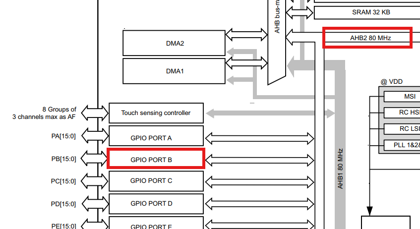

GPIOB được kết nối với AHB2, nên chúng ta cần set bit tương ứng trên register AHB2ENR

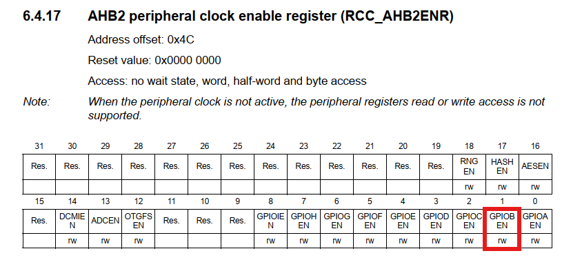

Chúng ta có hàm Init như sau:
```c
	/*Enable clock access to GPIOB*/
	RCC->AHB2ENR|=RCC_AHB2ENR_GPIOBEN;
```

Sau đó, chúng ta cần cấu hình 2 chân PB8 và PB2 để sử dụng alternate function:

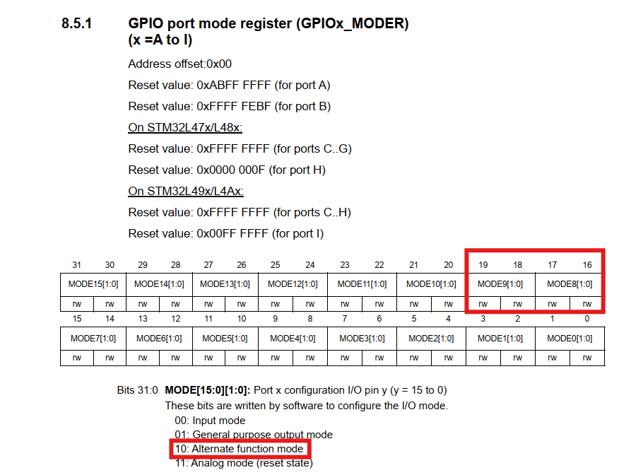

```c
	GPIOB->MODER |=   GPIO_MODER_MODE8_1|GPIO_MODER_MODE9_1;
	GPIOB->MODER &=~ (GPIO_MODER_MODE8_0|GPIO_MODER_MODE9_0);
```

Chúng ta cần tìm xem AF nào được sử dụng cho CANBus. Từ hình sau chúng ta thấy AF09 được dùng cho CANBus trên chân PB8 và PB9

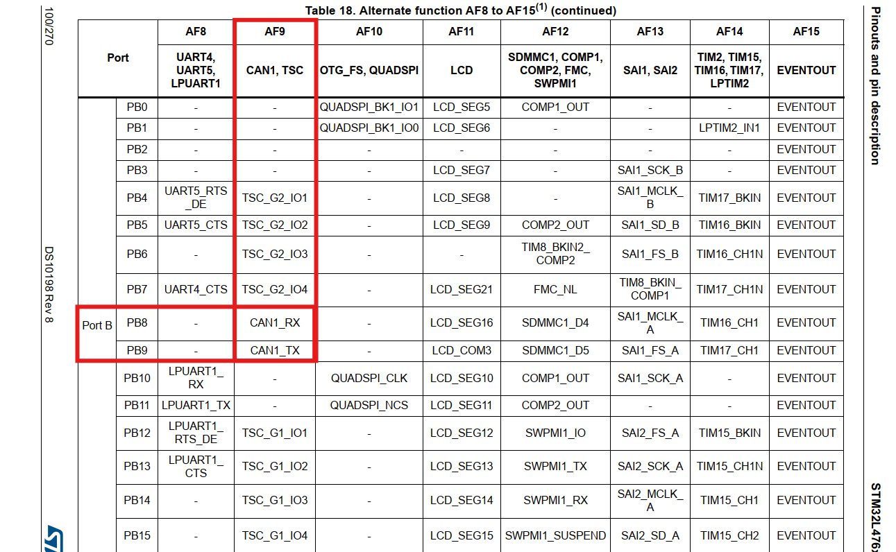

Do đó, trong file CANBus_L476.h, chúng ta tạo 1 macro như sau:

```c
#define CAN_AF 0x09
```

Tiếp đó, chúng ta cấu hình chân PB8 và PB9 để sử dụng CAN Bus alternate function.
```c
	GPIOB->AFR[1] |= (CAN_AF<<GPIO_AFRH_AFSEL8_Pos)|(CAN_AF<<GPIO_AFRH_AFSEL9_Pos);
```

Cuối cùng, chúng ta có hàm sau:
```c
void CANBus_L476_Pins_Init(void)
{
	/*Enable clock access to GPIOB*/
	RCC->AHB2ENR |= RCC_AHB2ENR_GPIOBEN;
	
	GPIOB->MODER |=   GPIO_MODER_MODE8_1|GPIO_MODER_MODE9_1;
	GPIOB->MODER &=~ (GPIO_MODER_MODE8_0|GPIO_MODER_MODE9_0);
	
	/*Configure PB8 and PB9 to use CAN Bus AF*/
	GPIOB->AFR[1] |= (CAN_AF<<GPIO_AFRH_AFSEL8_Pos)|(CAN_AF<<GPIO_AFRH_AFSEL9_Pos);
}
```

### CANBus Initialization
Khai báo thêm 1 hàm có tên ```void CANBus_L476_Init(void)``` dùng để init CANBus. Để sử dụng CAN Bus trên STM32L476, chúng ta cần kích hoạt xung clock cho CAN.

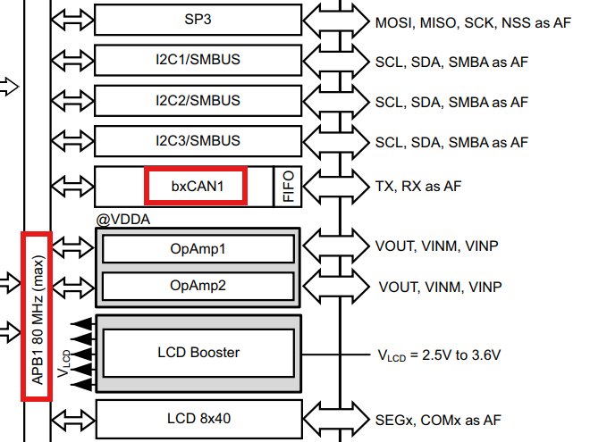

Vì CAN1 được kết nối với APB1 nên chúng ta cần set bit CAN1EN trong register APB1ENR1.

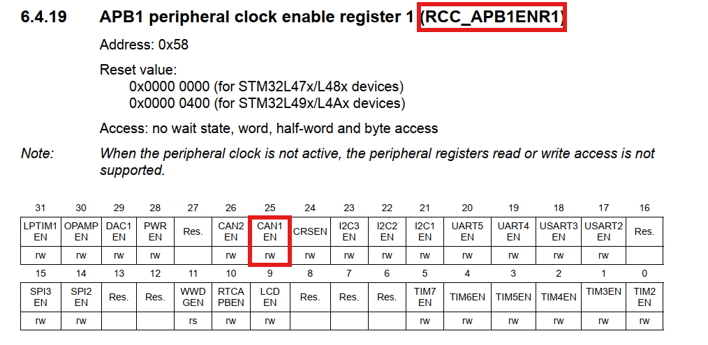

Do đó trong hàm ```void CANBus_L476_Init(void)``` chúng ta thêm dòng code sau:

```c
	/*Enable Clock access to CAN1*/
	RCC->APB1ENR1 |= RCC_APB1ENR1_CAN1EN;
```

Để khởi tạo CANBus, chúng ta cần set nó thành Initialization mode, bằng cách set INRQ bit trong CAN_MCR register (CAN master control register) thành 1.

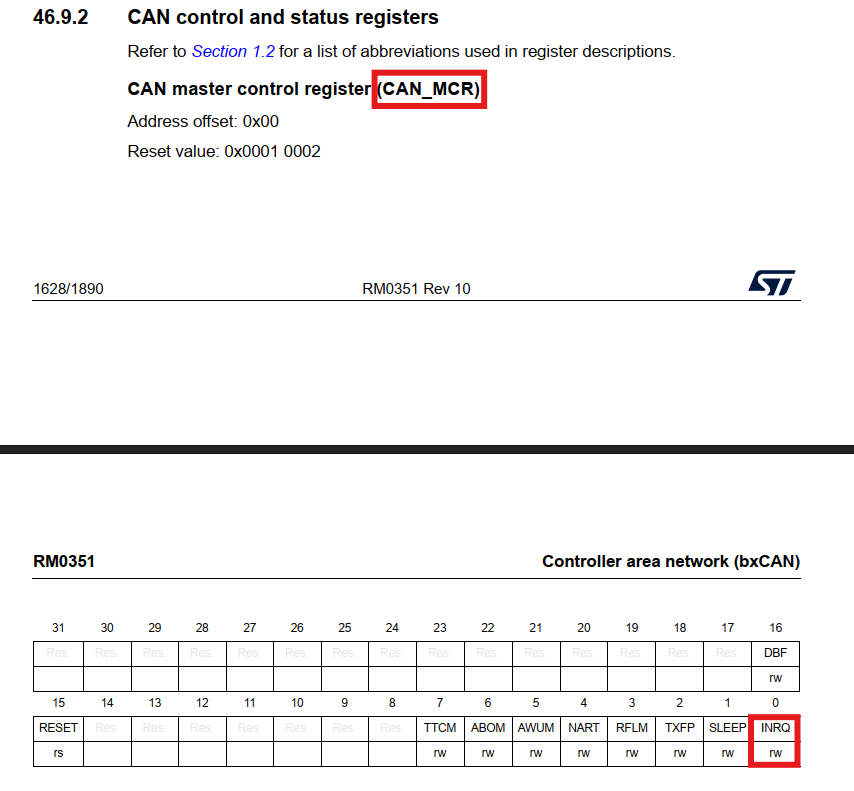

```c
  /* Enter Initialization mode*/
  CAN1->MCR |= CAN_MCR_INRQ;
  /*Wait until CANBus peripheral is in initialization mode*/
  while (!(CAN1->MSR & CAN_MSR_INAK));
```

Cấu hình tiếp CAN_MCR register để thoát khỏi sleep mode và kích hoạt CAN1.

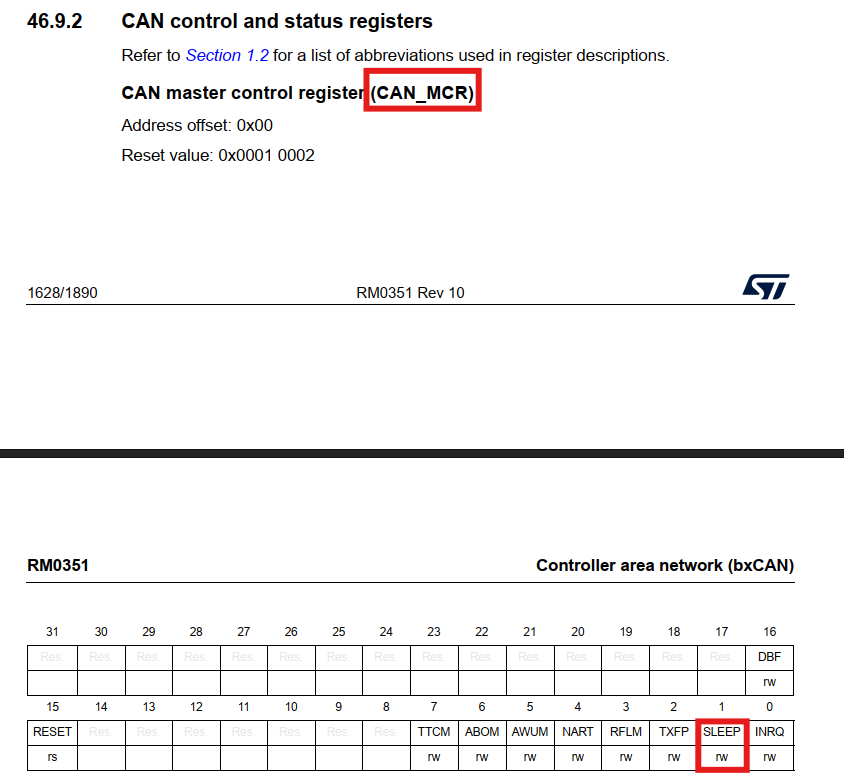

```c
  // Enable CAN1 peripheral
  CAN1->MCR &= ~CAN_MCR_SLEEP;
  while ((CAN1->MSR & CAN_MSR_SLAK)!=0U){}
```

Tiếp sao chúng ta cần cấu hình timing cho CANBus sử dụng CAN_BTR register (CAN bit timing register).

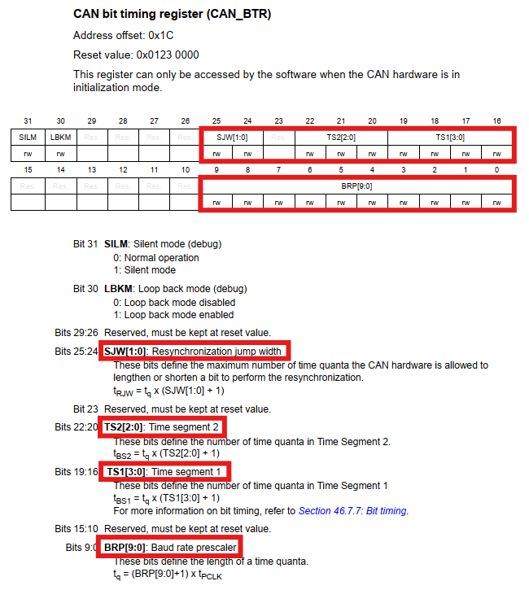

```c
  /*Reset the non-zero initial values*/
  CAN1->BTR &=~ (CAN_BTR_TS1_Msk|CAN_BTR_TS2_Msk|CAN_BTR_SJW_Msk);
  CAN1->BTR  =  (1<<CAN_BTR_TS1_Pos)|(0<<CAN_BTR_TS2_Pos)|(9U<<CAN_BTR_BRP_Pos);
```

- ```(1 << CAN_BTR_TS1_Pos)```: TS1=1, số time quanta của Time Segment 1 = TS1 + 1 = 2.
- ```(0 << CAN_BTR_TS2_Pos)```: TS2=0, số time quanta của Time Segment 2 = TS2 + 1 = 1.
- ```(9U << CAN_BTR_BRP_Pos)```: BRP=9

Tần số clock của CAN là: 

$$Clock_{CAN}={{Clock_{APB1}} \over {BRP+1}}$$

Với BRP = 9, clock của CAN sẽ giảm đi 10 lần vì BRP+1=10.

Baudrate là tốc độ truyền dữ liệu trong giao tiếp CAN, được tính theo công thức:

$$Baudrate={{Clock_{CAN}} \over {\text{Tổng số time quanta trong mỗi bit}}}$$

Ở đây, Clock của APB1 là 40MHz, với BRP là 9, ta có

$$Clock_{CAN}={{40MHz} \over {9+1}}=4MHz$$

Tổng số time quanta trong một bit:

$$TQ_{total}=\text{Sync Segment} + \text{Time Segment 1 (TS1)} + \text{Time Segment 2 (TS2)}$$

Trong đó:
- Sync Segment: Luôn là 1 TQ.
- TS1 = 2
- TS2 = 1

Vậy 

$$TQ_{total}=1 + 2 + 1 = 4TQ$$

$$Baudrate={{4MHz} \over {4}} = 1Mbps$$

### Filter configuration

Trước hết, cần set filter mode cho CAN thành init mode.

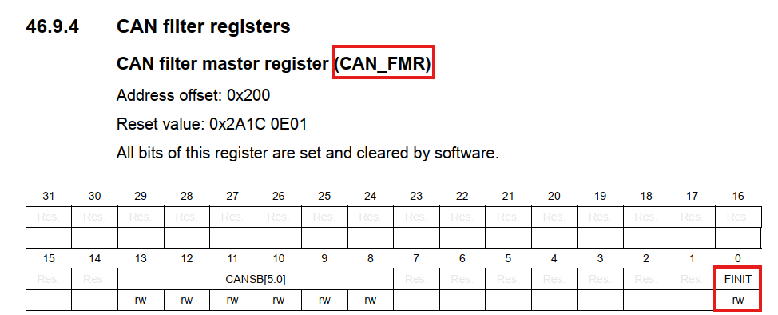

Tắt filter bank 0 trước khi cấu hình

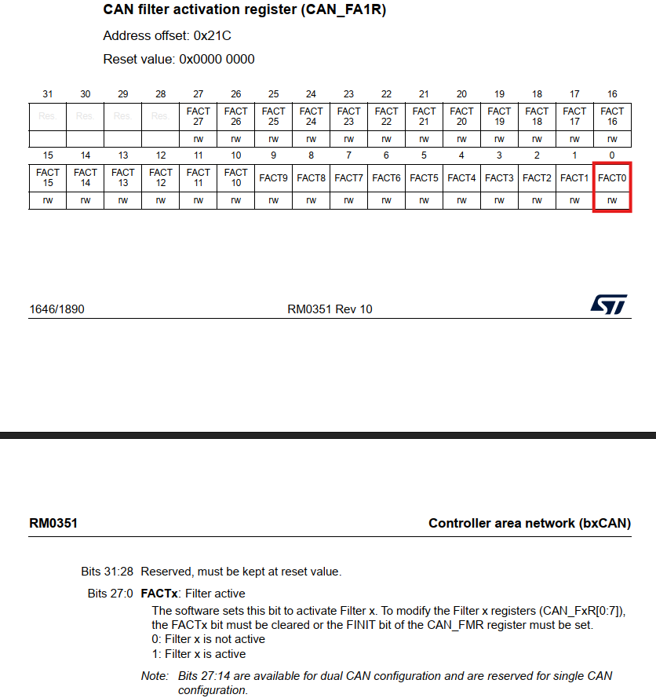

Cấu hình filter bank 0 ở chế độ 32-bit

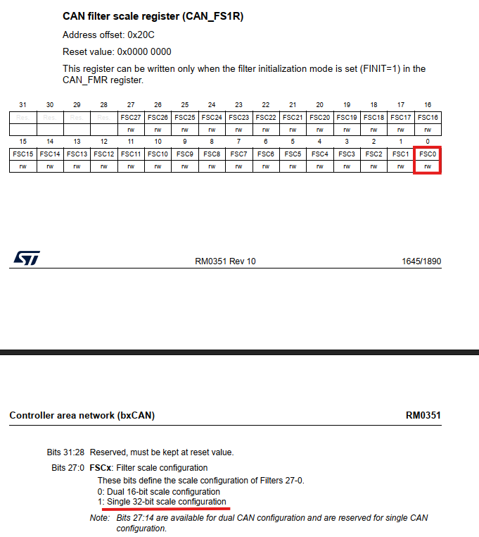

Đặt filter bank 0 ở chế độ identifier mask mode

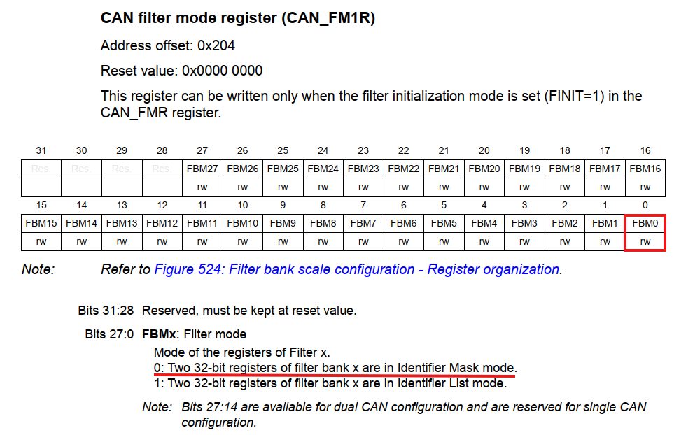

Thiết lập giá trị filter và mask

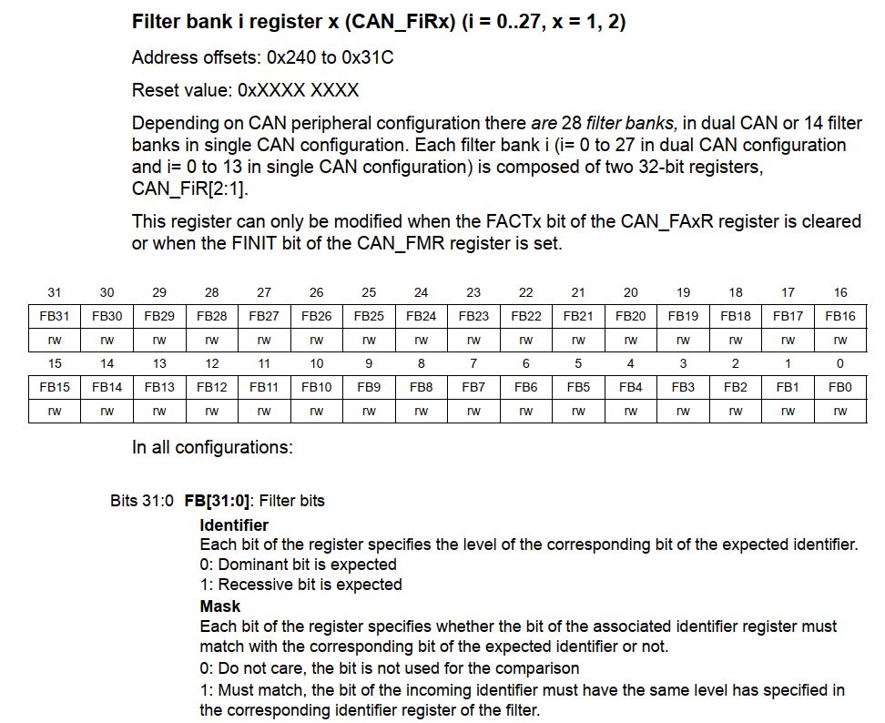

Gán filter bank 0 cho FIFO0

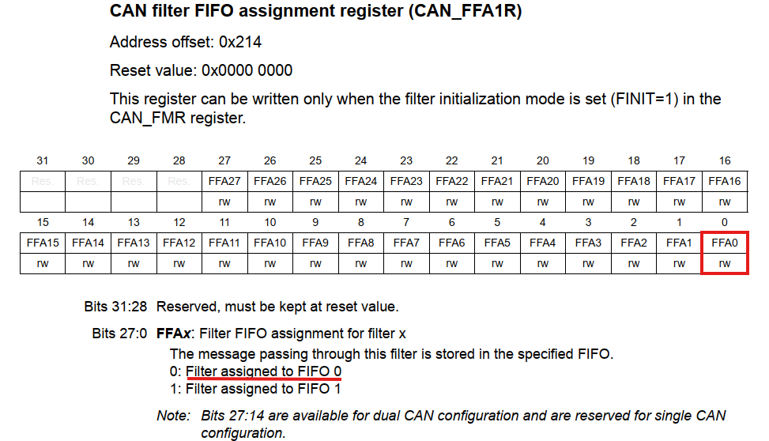

Cuối cùng là kích hoạt filter bank 0 và thoát khỏi chế độ cấu hình Filter

```c
void Filter_Configuration(void)
{
	/* Set the filter initialization mode*/
	CAN1->FMR |= CAN_FMR_FINIT;

	/* Deactivate filter bank 0 before config */
	CAN1->FA1R &=~ (CAN_FA1R_FACT0);

	CAN1->FS1R |= CAN_FS1R_FSC0;  // Set to 1 for 32-bit scale configuration

	CAN1->FM1R &= ~CAN_FM1R_FBM0; // Set to 0 for identifier mask mode

	/* Accept following IDs: 0x1A1, 0x7E1, 0x9A1 */
	CAN1->sFilterRegister[0].FR1 = (0x1A1 << 5); // Identifier

	CAN1->sFilterRegister[0].FR2 = (0x7E1 << 5); // Identifier mask 
	
	/*Assign filter 0 to FIFO0*/
	CAN1->FFA1R&=~CAN_FFA1R_FFA0;

	// Activate filter 0
	CAN1->FA1R |= CAN_FFA1R_FFA0;

	CAN1->FMR &= ~CAN_FMR_FINIT; // Clear the filter initialization mode
}
```
### CANBus Start

Để khởi động CAN Bus, chúng ta cần thoát khỏi chế độ init mode và chờ đến khi việc thoát ra này hoàn tất.


```c
void CANBus_L476_Start(void)
{
	// Leave Initialization mode
  CAN1->MCR &= ~CAN_MCR_INRQ;
  while (CAN1->MSR & CAN_MSR_INAK);
}
```

### Transmit function

Trước hết, chúng ta cần khai báo 2 struct chứa dữ liệu truyền và nhận trong CAN.

```c
typedef struct CANBusTxFrame
{
	uint32_t identifier;
	uint8_t length;
	uint8_t data[8];
}CANBusTxFrameDef;

typedef struct CANBusRxFrame
{
	uint32_t identifier;
	uint8_t length;
	uint8_t data[8];
}CANBusRxFrameDef;
```

Trong đó:
- Identifier: là ID của CAN node.
- Length: độ dài của data cần gửi hoặc nhận (Maximum 8).
- data array: chứa data buffer cần gửi hoặc nhận.

Sau đó, khai báo hàm ```void CANBus_SendMessage(CANBusTxFrameDef *TXFrame )```. Trong hàm này, chúng ta đợi cho tới khi mailbox trống bằng cách kiểm tra TME0 (Transmit Mailbox 0) được set thành 1 hay không.

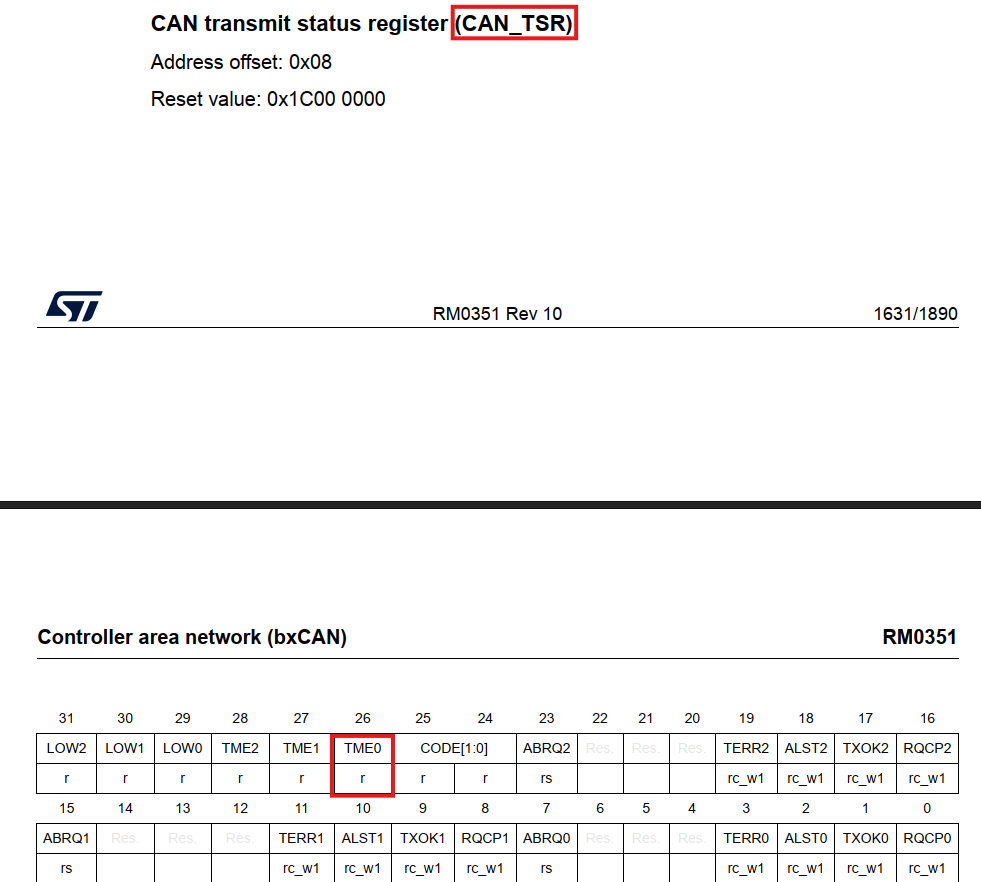

```c
  // Wait until the transmit mailbox is empty
  while ((CAN1->TSR & CAN_TSR_TME0) == 0){}
```

Đặt identifier mode thành standard identifier

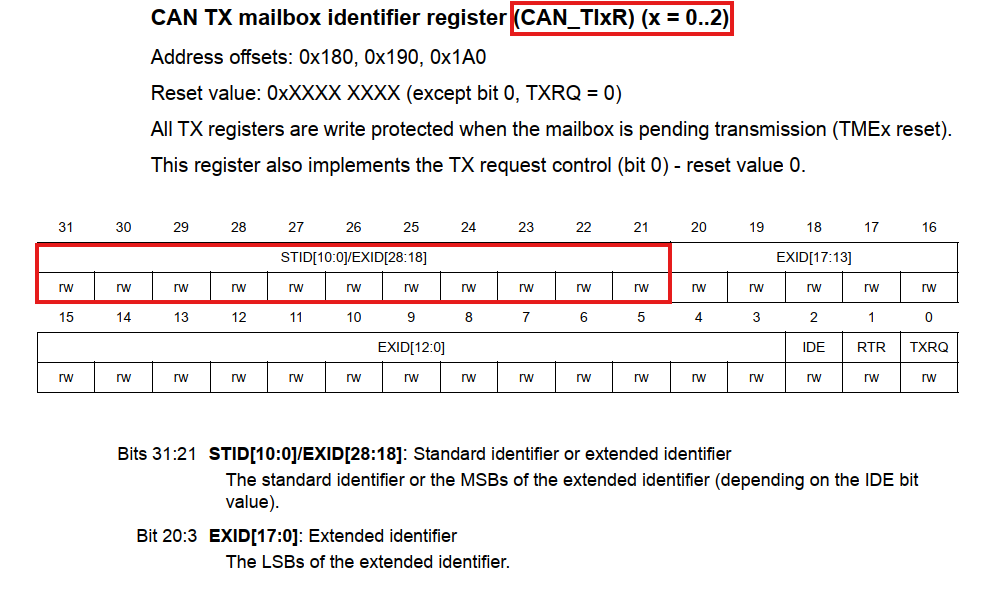

```c
 // Set the standard identifier and data length
  CAN1->sTxMailBox[0].TIR &= ~CAN_TI0R_STID;
```

Set mailbox ID

```c
  // Configure the transmit mailbox identifier
  CAN1->sTxMailBox[0].TIR |= (TXFrame->identifier << 21);
```

Set độ dài của data cần gửi

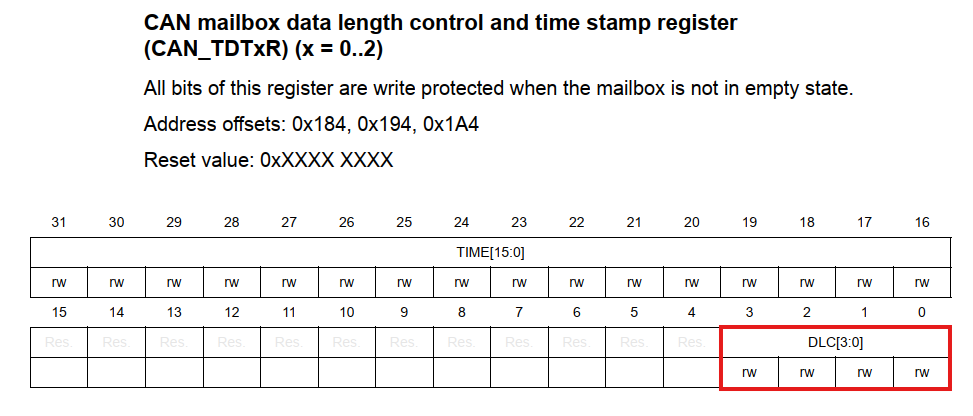

Set buff vào CANBus FIFO:

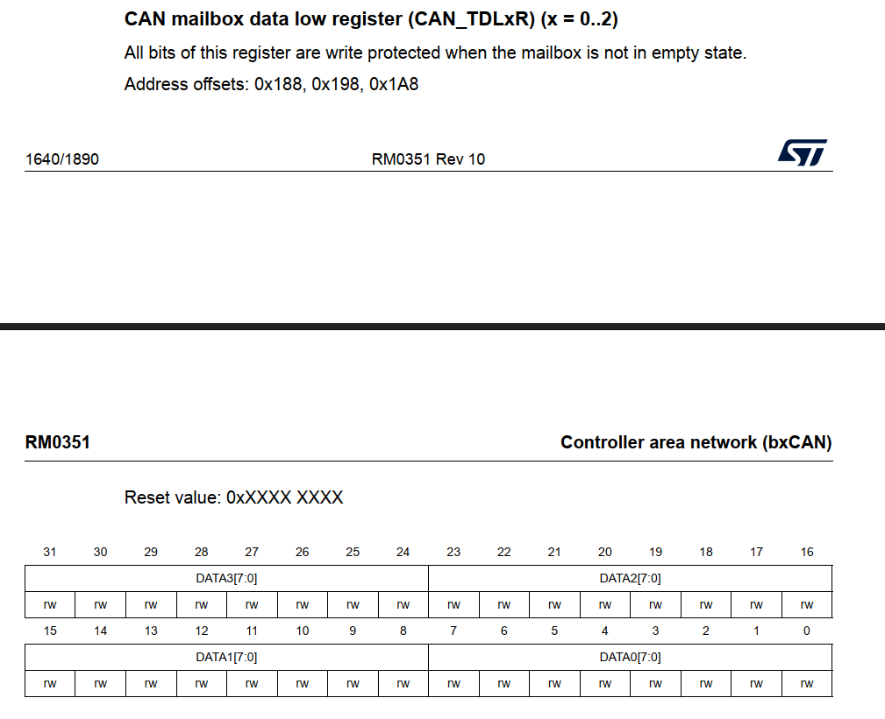

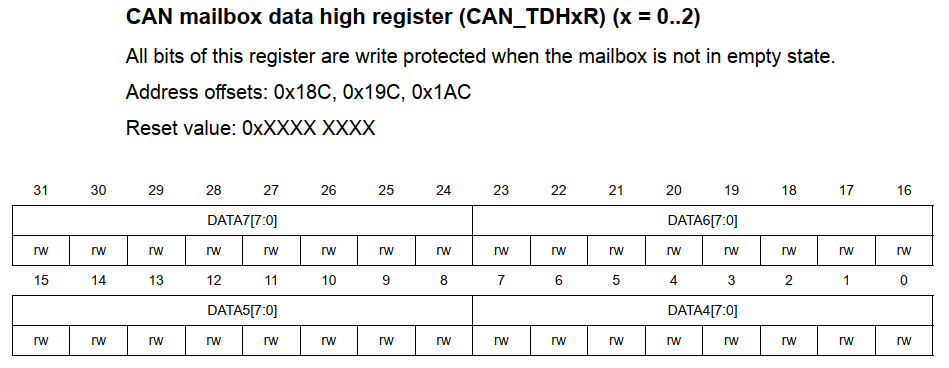

```c
	CAN1->sTxMailBox[0].TDLR=
				((uint32_t)TXFrame->data[3] << CAN_TDL0R_DATA3_Pos) |
				((uint32_t)TXFrame->data[2] << CAN_TDL0R_DATA2_Pos) |
				((uint32_t)TXFrame->data[1] << CAN_TDL0R_DATA1_Pos) |
				((uint32_t)TXFrame->data[0] << CAN_TDL0R_DATA0_Pos);

	CAN1->sTxMailBox[0].TDHR=
				((uint32_t)TXFrame->data[7] << CAN_TDH0R_DATA7_Pos) |
				((uint32_t)TXFrame->data[6] << CAN_TDH0R_DATA6_Pos) |
				((uint32_t)TXFrame->data[5] << CAN_TDH0R_DATA5_Pos) |
				((uint32_t)TXFrame->data[4] << CAN_TDH0R_DATA4_Pos);
```

Cuối cùng là bắt đầu quá trình truyền dữ liệu

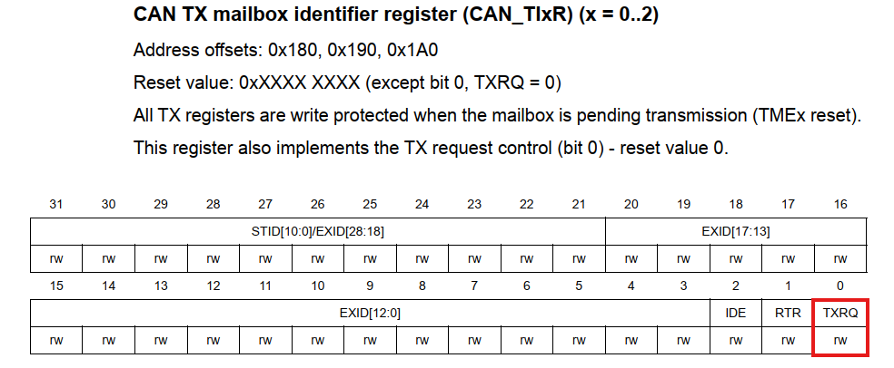

```c
  // Set the TXRQ bit to request transmission
  CAN1->sTxMailBox[0].TIR |= CAN_TI0R_TXRQ;
```

### Receive function

Chúng ta khai báo hàm ```void CANBus_L476_ReceiveMessage(CANBusRxFrameDef *RXFrame)``` để thực hiện việc nhận dữ liệu.

Trước hết, chờ cho đến khi hộp thư gửi (TX Mailbox) trống, tức là có thể gửi dữ liệu mới.

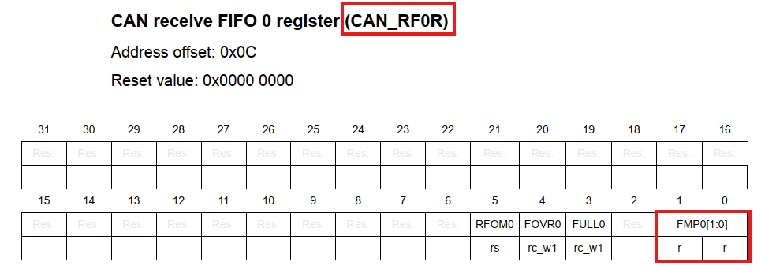

Nếu không có message pending, chúng ta bắt đầu lấy ID từ dữ liệu nhận được. Đảm bảo rằng các bit của standard identifier (ID tiêu chuẩn) trong thanh ghi TIR được reset trước khi cấu hình. 

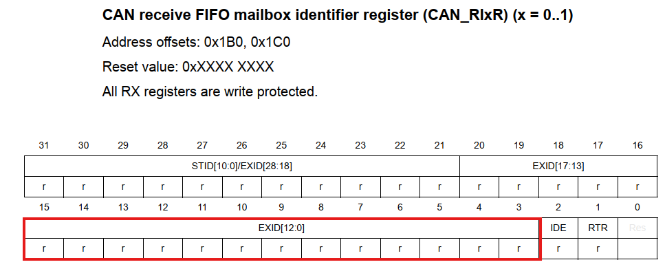

Tiếp theo, lấy độ dài của dữ liệu. 

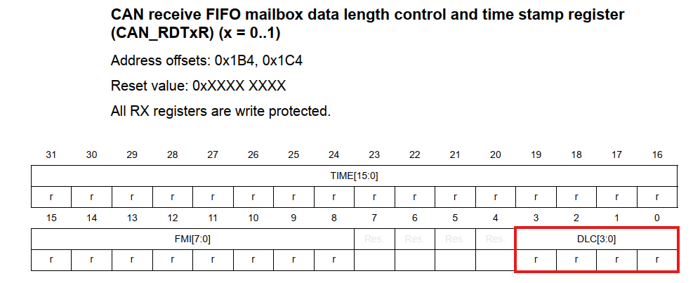

Sau đó, xoá dữ liệu cũ đang lưu trong mảng data, đọc dữ liệu mới từ FIFO0 và copy dữ liệu mới vào mảng data 

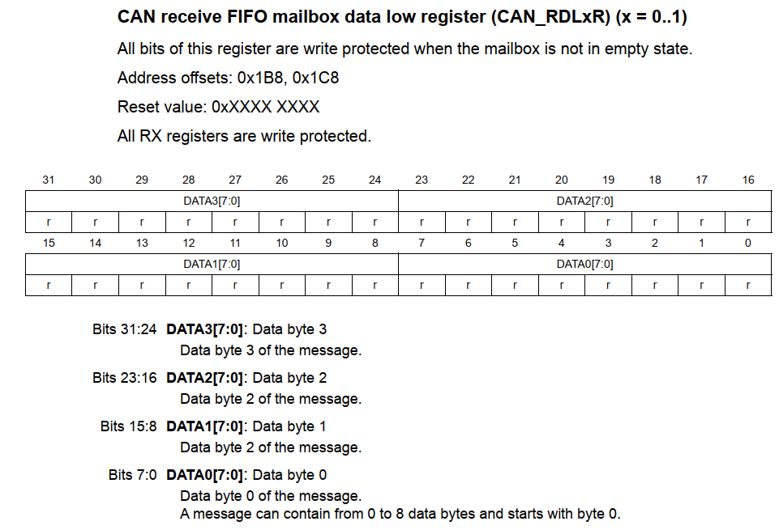

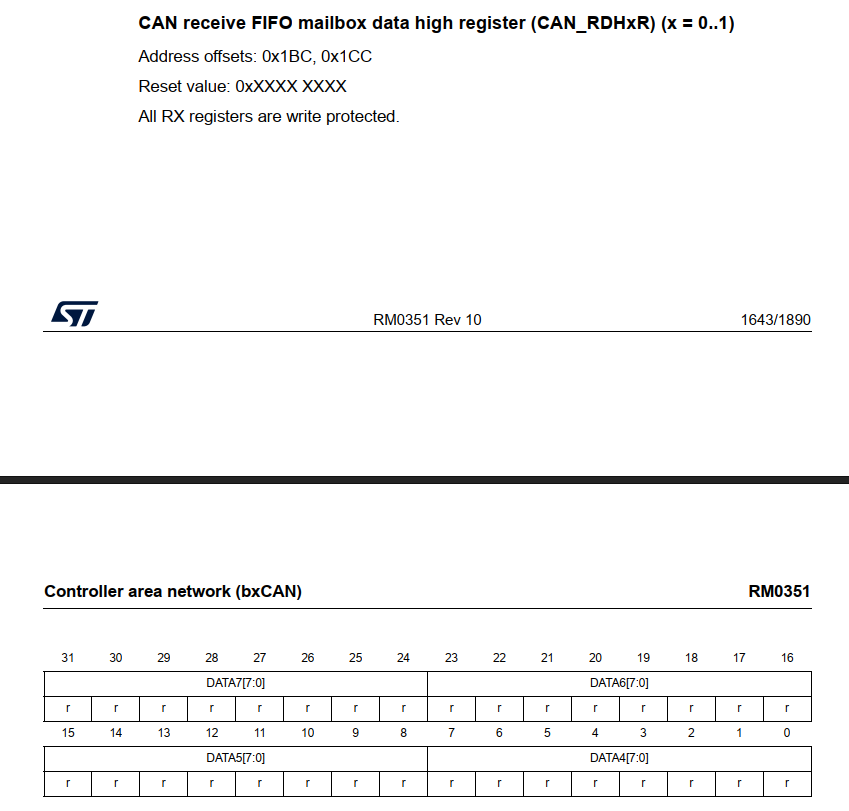

Cuối cùng là giải phóng FIFO0 để nó có thể nhận thông điệp mới.

```c
void CANBus_L476_ReceiveMessage(CANBusRxFrameDef *RXFrame)
{
	if (CAN1->RF0R & CAN_RF0R_FMP0)
	{
		// Read the received identifier
    RXFrame->identifier = (CAN1->sFIFOMailBox[0].RIR >> 3) & 0x1FFFFFFF;
		
		// Read the data length
    RXFrame->length = CAN1->sFIFOMailBox[0].RDTR & 0x0F;
		
		/*Clear old data*/
    for (int i=0;i<8;i++)
    {
    	RXFrame->data[i]=0;
    }
		
		RXFrame->data[0]=CAN1->sFIFOMailBox[0].RDLR >>CAN_RDL0R_DATA0_Pos;
		RXFrame->data[1]=CAN1->sFIFOMailBox[0].RDLR >>CAN_RDL0R_DATA1_Pos;
		RXFrame->data[2]=CAN1->sFIFOMailBox[0].RDLR >>CAN_RDL0R_DATA2_Pos;
		RXFrame->data[3]=CAN1->sFIFOMailBox[0].RDLR >>CAN_RDL0R_DATA3_Pos;

		RXFrame->data[4]=CAN1->sFIFOMailBox[0].RDHR >>CAN_RDH0R_DATA4_Pos;
		RXFrame->data[5]=CAN1->sFIFOMailBox[0].RDHR >>CAN_RDH0R_DATA5_Pos;
		RXFrame->data[6]=CAN1->sFIFOMailBox[0].RDHR >>CAN_RDH0R_DATA6_Pos;
		RXFrame->data[7]=CAN1->sFIFOMailBox[0].RDHR >>CAN_RDH0R_DATA7_Pos;
		
		// Release the FIFO (not necessary for FIFO0)
    CAN1->RF0R |= CAN_RF0R_RFOM0;
	}
}
```

