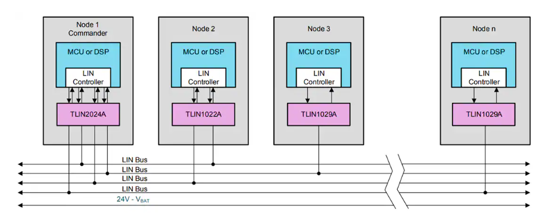

# Bài 13: LIN

## Lý thuyết

### 1. Giới thiệu về LIN


- Mục tiêu phát triển:
	- Giảm chi phí phần cứng và độ phức tạp trong thiết kế mạng truyền thông trên xe hơi.
	- Hoạt động như một giao thức phụ trợ cho CAN, với trọng tâm vào các ứng dụng không yêu cầu tốc độ truyền cao hay tính thời gian thực.

- Ứng dụng chính:
	- Điều khiển các hệ thống đơn giản như cửa sổ, đèn nội thất, điều hòa không khí, và gương chỉnh điện.

- LIN hoạt động như một mạng nhánh (sub-network) kết nối nhiều thiết bị, với một node master LIN thường liên kết với mạng CAN để truyền dữ liệu lên hệ thống chính.
	- Node master LIN đóng vai trò làm cầu nối giữa mạng LIN và CAN.
	- Khi cần, master LIN sẽ chuyển đổi dữ liệu từ mạng LIN sang mạng CAN và ngược lại.

- Một mạng CAN chính thường kết nối với nhiều mạng LIN phụ thông qua các node gateway:
	- Mỗi gateway (thường là master LIN) liên kết mạng LIN với mạng CAN.
	- Dữ liệu từ mạng LIN được chuyển lên CAN để trao đổi với các hệ thống phức tạp hơn.

- Gateway thực hiện:
	- Đọc dữ liệu từ mạng LIN (do slave LIN gửi lên).
	- Định dạng lại dữ liệu để phù hợp với giao thức CAN.
	- Gửi dữ liệu này lên mạng CAN.
- Quy trình ngược lại cũng áp dụng khi cần điều khiển thiết bị LIN từ CAN.




### 2. Đặc điểm chính của LIN
- Tốc độ truyền dữ liệu thấp
	- Tốc độ: 1 - 20 kbps, thường gặp 19.2 kbps.
	- LIN đủ nhanh để hỗ trợ các ứng dụng đơn giản nhưng không đáp ứng yêu cầu thời gian thực khắt khe.
	- Ít nhiễu hơn nhờ tốc độ thấp, giảm yêu cầu đồng bộ hóa phức tạp.
	
- Mô hình master-slave
	- LIN dựa trên mô hình master-slave, gồm:
		- 1 node master: Điều phối truyền thông, phát header để yêu cầu thông tin.
		- Nhiều node slave: Phản hồi yêu cầu từ master.
	- Lợi ích:
		- Đơn giản hóa quản lý và đồng bộ thiết bị.
		- Dễ dàng thêm slave mà không thay đổi mạng tổng thể.
	


- Giao tiếp không đồng bộ (Asynchronous)
	- Không sử dụng tín hiệu clock chung.
	- Phương thức UART truyền thông qua:
		- Bit Start: Báo hiệu bắt đầu truyền.
		- Tốc độ truyền (baud rate): Được tất cả các node đồng ý trước.
		- Bit Stop: Báo hiệu kết thúc byte dữ liệu.
	- Đồng bộ thông qua Sync Field: Byte 0x55 giúp slave điều chỉnh tốc độ truyền của mình dựa trên tốc độ master.


### 3. Cấu trúc khung LIN

Mỗi khung LIN gồm 5 phần chính:

#### 3.1. Break Field (>= 13 bit)
- Mục đích:
	- Tín hiệu dài, báo hiệu tất cả node slave rằng một khung mới sắp bắt đầu.

- Cách hoạt động:
	- Gồm ít nhất 13 bit 0 liên tục, dài hơn 1 byte UART thông thường.
	- Master phát tín hiệu này, tất cả các node slave dừng hoạt động hiện tại để đồng bộ.

#### 3.2. Sync Field (8 bit)
- Giá trị cố định: 0x55 (01010101).
- Mục đích:
	- Đồng bộ tốc độ truyền giữa master và các slave.
	- Các slave dùng byte này để điều chỉnh baud rate cho khớp với master.
	
#### 3.3. Identifier Field (ID) (8 bit)
- Thành phần:
	- 6 bit ID: Xác định loại dữ liệu (ví dụ: cảm biến nhiệt độ, điều khiển đèn).
	- 2 bit Parity (P0, P1): Dùng kiểm tra lỗi trên ID.
- Tổng cộng: 64 ID khác nhau, phù hợp với các hệ thống đơn giản.

#### 3.4. Data Field (16 - 64 bit)
- Dung lượng: 2-8 byte.
- Chứa dữ liệu chính từ slave hoặc master, như:
	- Lệnh điều khiển từ master.
	- Phản hồi cảm biến từ slave.
	
#### 3.5.  Checksum Field (8 bit)
- Byte cuối cùng, dùng phát hiện lỗi trong dữ liệu.
- Loại checksum:
	- Classic Checksum: Tính trên Data Field.
	- Enhanced Checksum: Tính trên ID + Data Field.
	
| Thành phần	   |      Số bit      |  Mục đích |
|----------|-------------|------|
| Break Field |  >= 13 bit | Báo hiệu bắt đầu khung. |
| Sync Field |    8 bit   |   Đồng bộ tốc độ truyền. |
| Identifier Field | 	6 bit ID + 2 bit Parity |   Định danh dữ liệu, kiểm tra lỗi ID. |
| Data Field | 16 - 64 bit | Chứa dữ liệu chính, từ 2 đến 8 byte. |
| Checksum Field | 8 bit |  Phát hiện lỗi trong dữ liệu. |

#### 3.6. Response space
Trong giao thức LIN, Response Space là khoảng thời gian không hoạt động (idle) trên bus giữa phần Header (do master truyền) và phần Response (do slave truyền). 

Cụ thể:
- Header: Được gửi bởi master, bao gồm:
	- Break (tín hiệu bắt đầu khung LIN).
	- Sync (byte đồng bộ hóa tốc độ baud).
	- PID (Protected Identifier - byte định danh loại dữ liệu).
- Response: Được gửi bởi slave, bao gồm:
	- Dữ liệu (Data Bytes).
	- Byte checksum.
	
Response Space nằm giữa hai giai đoạn trên, tạo thời gian cho slave xác định header, chuẩn bị dữ liệu phản hồi, và bắt đầu truyền Response.

- Slave cần thời gian để xử lý phần Header do master gửi (ví dụ: xác định PID để biết loại dữ liệu cần phản hồi). Response Space đảm bảo rằng slave có đủ thời gian để chuẩn bị dữ liệu.
- Trong mạng LIN, chỉ có một node truyền dữ liệu tại một thời điểm. Khoảng trống trong Response Space giúp đảm bảo rằng master ngừng truyền trước khi slave bắt đầu, tránh xung đột tín hiệu trên bus.
- LIN hỗ trợ các tốc độ baud khác nhau (1-20 kbps). Response Space phải được tính toán phù hợp để đảm bảo mọi slave có thể phản hồi kịp thời mà không vi phạm giao thức.
- Trong Response Space, bus LIN được giữ ở trạng thái recessive (logic mức cao, thường là 1) để tất cả các node biết bus đang rỗi và sẵn sàng nhận dữ liệu.
- Mọi khung LIN phải có Response Space. Nếu khoảng thời gian này bị bỏ qua, slave có thể không đủ thời gian để chuẩn bị dữ liệu, dẫn đến lỗi giao tiếp.

Theo tiêu chuẩn LIN, Response Space có độ dài tối thiểu là 1.5 bit time. Với tốc độ baud là B bps, thời gian một bit là 
$${T_{bit}}={1 \over B} $$

Do đó thời gian Response Space tối thiểu là 
$$1.5 \times {T_{bit}}$$


Response Space được thiết kế cho trường hợp slave phản hồi:
- Trong giao thức LIN tiêu chuẩn, master chịu trách nhiệm gửi Header (Break, Sync, PID), và một slave được chỉ định sẽ gửi Response (Data và Checksum).
- Response Space nằm giữa Header (do master gửi) và Response (do slave gửi), đảm bảo slave có đủ thời gian chuẩn bị dữ liệu.

Nếu master tự gửi cả Header và Response:
- Vì không có sự chuyển đổi từ master sang slave trên bus, không cần khoảng thời gian idle giữa Header và Response.
- Master gửi dữ liệu liên tục từ Break đến Checksum, không để lại khoảng trống.

### 4. Quá trình truyền thông LIN
#### 4.1. Master gửi header
Gồm 3 phần:
- Break Field: Báo hiệu bắt đầu khung.
- Sync Field: Đồng bộ tốc độ truyền.
- Identifier Field: Xác định dữ liệu và node slave liên quan.


#### 4.2. Slave hoặc master phản hồi
- Sau header, slave phản hồi hoặc master gửi thêm dữ liệu (nếu cần).
- Response gồm:
	- Data Field: Chứa nội dung chính.
	- Checksum Field: Kiểm tra lỗi.
#### 4.3. Master kiểm tra
Master kiểm tra checksum để xác nhận dữ liệu đúng.

#### 4.4. Ví dụ quá trình truyền thông LIN
Giả sử node master muốn lấy thông tin từ một cảm biến nhiệt độ được kết nối trong hệ thống:
- Master gửi Header:
	- Break Field: Node master gửi Break để báo hiệu cho các node slave rằng một khung truyền mới sắp bắt đầu.
	- Sync Field: Byte Sync (0x55) được gửi để đồng bộ tốc độ truyền.
	- ID Field: Master gửi ID tương ứng với cảm biến nhiệt độ, xác định rằng node cảm biến cần phản hồi.
- Slave gửi Response:
	- Node cảm biến nhiệt độ nhận ID và chuẩn bị gửi dữ liệu phản hồi.
	- Cảm biến nhiệt độ gửi giá trị nhiệt độ hiện tại trong trường Data Field (ví dụ: 4 byte dữ liệu nhiệt độ).
	- Cuối cùng, node cảm biến tính toán và gửi byte checksum để đảm bảo dữ liệu không bị lỗi trong quá trình truyền.
	
Toàn bộ quá trình này diễn ra liên tục giữa master và các node slave, giúp mạng LIN hoạt động hiệu quả với việc truyền thông có trật tự và được điều khiển bởi master.

### 5. Checksum và Parity
#### 5.1. Checksum
- Classic Checksum:
	- Tính tổng các byte dữ liệu (trong Data Field). (Cộng tất cả các byte trong Data Field.)
	- Loại bỏ giá trị vượt quá 1 byte (nếu tổng > 255, thì lấy tổng đó trừ đi 255).
	- Lấy bù 1 của tổng (nghĩa là phủ định từng bit).

	- Ví dụ 1:
		- Dữ liệu: 0x12, 0x34, 0x56.
		- Tổng: 0x12 + 0x34 + 0x56 = 0x9C (156 thập phân).
		- Bù 1: ~0x9C = 0x63.
		- Classic Checksum = 0x63.
		
	- Ví dụ 2:
		- Dữ liệu: 0x80 , 0x90 , 0xE0 
		- Tổng: 0x80+0x90+0xE0=128+144+224=496
		- 496−0xFF=496−255=241 (11110001)
		- Bù 1: ~11110001=00001110 = 0xE
- Enhanced Checksum:
	- Tương tự Classic, nhưng bao gồm cả ID.
	- Byte ID nằm trong Header và được thêm vào trước khi tính tổng.
	- Ví dụ:
		- Byte ID: 0x2C (ID = 44 thập phân).
		- Data Field: 0x12, 0x34, 0x56.
		- Tính toán:
			- Tổng: 0x2C + 0x12 + 0x34 + 0x56 = 0xC8 (200 thập phân).
			- Tổng không vượt quá 255, giữ nguyên: 0xC8.
			- Lấy bù 1: ~0xC8 = 0x37.
			- Enhanced Checksum = 0x37.

#### 5.2. Parity
- Hai bit P0, P1 dùng kiểm tra lỗi trên ID:
	- P0: XOR giữa các bit 0, 1, 2, 4 của ID.
	- P1: XOR giữa các bit 1, 3, 4, 5 của ID.
- Ví dụ:
	- ID: 0b101100 (0x2C).
	- P0: 1 XOR 0 XOR 1 XOR 0 = 0.
	- P1: 0 XOR 1 XOR 0 XOR 0 = 1.
	- ID hoàn chỉnh: 0b10110010 (0xB2).

### 6. Quy trình kiểm tra lỗi
- Gửi dữ liệu: Dữ liệu đi kèm checksum.
- Slave kiểm tra: Tính lại checksum trên dữ liệu nhận được.
- So sánh checksum:
	- Khớp: Dữ liệu hợp lệ.
	- Sai: Báo lỗi, bỏ qua dữ liệu.
	
## Project

Cấu hình phần mềm cho LIN được làm tương tự như với UART, tuy nhiên cần thêm 1 số setting để kích hoạt LIN:

```c
static void MX_USART2_UART_Init(void)
{

  /* USER CODE BEGIN USART2_Init 0 */

  /* USER CODE END USART2_Init 0 */

  LL_USART_InitTypeDef USART_InitStruct = {0};

  LL_GPIO_InitTypeDef GPIO_InitStruct = {0};

  LL_RCC_SetUSARTClockSource(LL_RCC_USART2_CLKSOURCE_PCLK1);

  /* Peripheral clock enable */
  LL_APB1_GRP1_EnableClock(LL_APB1_GRP1_PERIPH_USART2);

  LL_AHB2_GRP1_EnableClock(LL_AHB2_GRP1_PERIPH_GPIOA);
  /**USART2 GPIO Configuration
  PA2   ------> USART2_TX
  PA3   ------> USART2_RX
  */
  GPIO_InitStruct.Pin = USART_TX_Pin|USART_RX_Pin;
  GPIO_InitStruct.Mode = LL_GPIO_MODE_ALTERNATE;
  GPIO_InitStruct.Speed = LL_GPIO_SPEED_FREQ_VERY_HIGH;
  GPIO_InitStruct.OutputType = LL_GPIO_OUTPUT_PUSHPULL;
  GPIO_InitStruct.Pull = LL_GPIO_PULL_NO;
  GPIO_InitStruct.Alternate = LL_GPIO_AF_7;
  LL_GPIO_Init(GPIOA, &GPIO_InitStruct);

  /* USER CODE BEGIN USART2_Init 1 */

  /* USER CODE END USART2_Init 1 */
  USART_InitStruct.BaudRate = 19200;
  USART_InitStruct.DataWidth = LL_USART_DATAWIDTH_8B;
  USART_InitStruct.StopBits = LL_USART_STOPBITS_1;
  USART_InitStruct.Parity = LL_USART_PARITY_NONE;
  USART_InitStruct.TransferDirection = LL_USART_DIRECTION_TX_RX;
  USART_InitStruct.OverSampling = LL_USART_OVERSAMPLING_16;
  LL_USART_Init(USART2, &USART_InitStruct);
  LL_USART_SetLINBrkDetectionLen(USART2, LL_USART_LINBREAK_DETECT_10B);
  LL_USART_DisableDMADeactOnRxErr(USART2);
  LL_USART_ConfigLINMode(USART2);
  LL_USART_Enable(USART2);
  /* USER CODE BEGIN USART2_Init 2 */
	LL_USART_EnableLIN(USART2);
  /* USER CODE END USART2_Init 2 */

}
```

Ở đây chân PA2 và PA3 được cấu hình lần lượt là USART2_TX và USART2_RX, sử dụng AF7 để kích hoạt tính năng giao tiếp UART của 2 chân này.

Tiếp đến là cấu hình cho USART2:
- BaudRate = 19200: Thiết lập tốc độ truyền 19200 bps.
- DataWidth = LL_USART_DATAWIDTH_8B: Truyền dữ liệu 8-bit.
- StopBits = LL_USART_STOPBITS_1: Sử dụng 1 bit dừng.
- Parity = LL_USART_PARITY_NONE: Không sử dụng parity.
- TransferDirection = LL_USART_DIRECTION_TX_RX: Cho phép cả truyền (TX) và nhận (RX).
- OverSampling = LL_USART_OVERSAMPLING_16: Sử dụng over-sampling 16 lần (cải thiện độ chính xác baud rate).
- LL_USART_SetLINBrkDetectionLen: Đặt độ dài LIN break là 10-bit, phù hợp với chuẩn LIN.
- LL_USART_DisableDMADeactOnRxErr: Vô hiệu hóa chế độ DMA khi gặp lỗi nhận.
- LL_USART_ConfigLINMode: Cấu hình USART2 vào chế độ LIN.
- LL_USART_Enable: Kích hoạt USART2.
- LL_USART_EnableLIN: Bật chế độ LIN trên USART2, cho phép hoạt động như một node trong mạng LIN.
