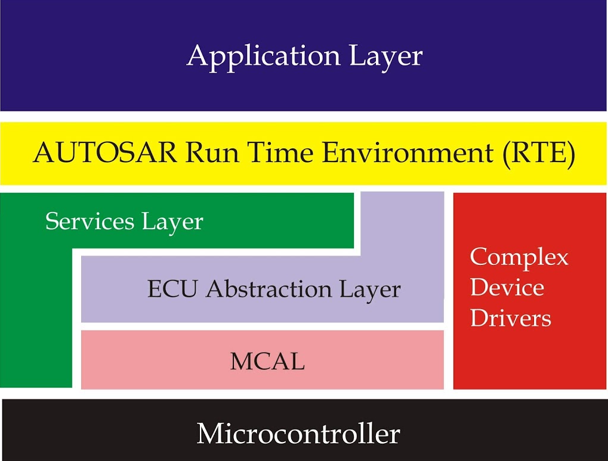
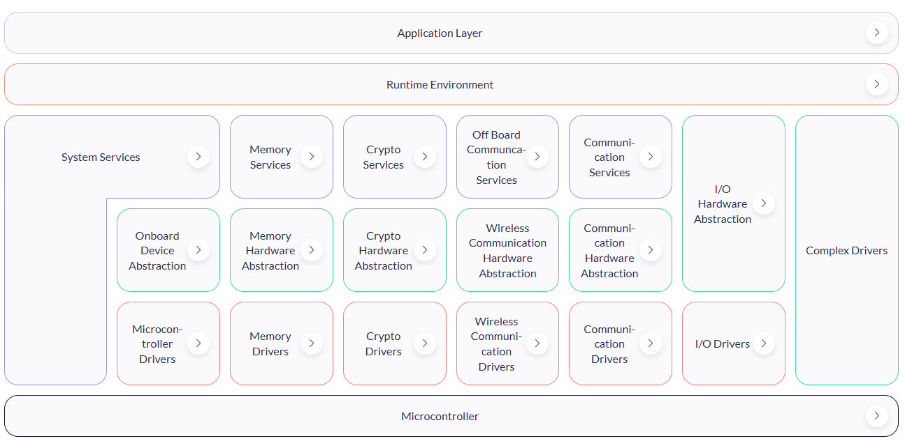

# Bài 14 - AUTOSAR

AUTOSAR (AUTomotive Open System ARchitecture) là một tiêu chuẩn quốc tế về kiến trúc phần mềm cho các hệ thống điện tử trong ô tô. AUTOSAR ra đời nhằm mục đích tiêu chuẩn hóa và chuẩn hóa kiến trúc phần mềm cho các hệ thống điều khiển nhúng trong ô tô.

- Application Layer: Lớp này chứa code nằm ở trên cùng. Nó có thể có các khối ứng dụng khác nhau được gọi là Software Components (SWCs) cho mỗi tính năng mà ECU cần hỗ trợ theo ứng dụng. Ví dụ, các chức năng như cửa sổ điện và đo nhiệt độ sẽ có SWC riêng biệt. Điều này không phải là quy chuẩn, mà phụ thuộc vào Designer.
- AUTOSAR RTE: Đây là một trong những lớp quan trọng của AUTOSAR, nó cung cấp giao tiếp giữa các SWC khác nhau và cũng giữa các ECU. Application Layer sử dụng lớp này khi giao tiếp với các lớp bên dưới thông qua các ports.
- Services Layer: Lớp này cung cấp các dịch vụ khác nhau cho ứng dụng sử dụng. Các services như: System Services, Memory Services, Crypto Services, Off board communication services, Communication services.
- ECU Abstraction Layer: Lớp này cung cấp các trừu tượng liên quan đến ECU. Nó chứa các lớp trừu tượng khác nhau như I/O Hardware Abstraction layer, On board device abstraction, Memory hardware Abstraction, Crypto hardware abstraction, v.v. để làm cho các ứng dụng độc lập với phần cứng.
- MCAL: Đây là Micro Controller Abstraction Layer, nó có các trình điều khiển mà qua đó các lớp trên giao tiếp với các thiết bị phần cứng của bộ điều khiển vi mạch.

### 1. SWC (Software-Components)
Là các khối phần mềm ứng dụng, đại diện cho chức năng cụ thể trong hệ thống. Các SWC là thành phần độc lập, giao tiếp với nhau và với các thành phần khác trong hệ thống thông qua RTE.
- Mỗi SWC thực hiện 1 chức năng cụ thể trong hệ thống ECU
- Chỉ cần quan tâm đến các logic, không cần quan tâm đến phần cứng

### 2. RTE
RTE (Runtime Enviroment) là lớp trung gian, đảm nhiệm việc truyền thông giữa các SWC và giữa SWC với BSW. Nó đảm bảo rằng các SWC có thể giao tiếp với nhau một cách trong suốt, không cần biết về các cơ chế truyền thông thực tế. RTE có 2 chức năng chính:
- Giúp các SWC giao tiếp với nhau và là lớp trung gian với BSW
- Phân chia lịch trình và quản lý việc gọi các chức năng

### 3. BSW
BSW (Basic Software) là lớp phần mềm nền tảng để hỗ trợ phần mềm ứng dụng (SWC) hoạt động trên phần cứng. BSW cung cấp các dịch vụ cơ bản như quản lý phần cứng, giao tiếp, chẩn đoán, và các dịch vụ hệ thống.
- Service: Cung cấp các dịch vụ hệ thống, tiện ích và quản lý cần thiết để hỗ trợ các lớp phần mềm ứng dụng và BSW khác
- EAL (ECU Abstraction Layer): Cung cấp một giao diện trừu tượng cho tất cả các thiết bị ngoại vi và phần cứng cụ thể của ECU như các cảm biến mà ECU sử dụng.
- MCAL (Microcontroller Abstraction Layer): Cung cấp giao diện trừu tượng để tương tác trực tiếp với các thành phần phần cứng của vi điều khiển như GPIO, ADC, PWM,...
