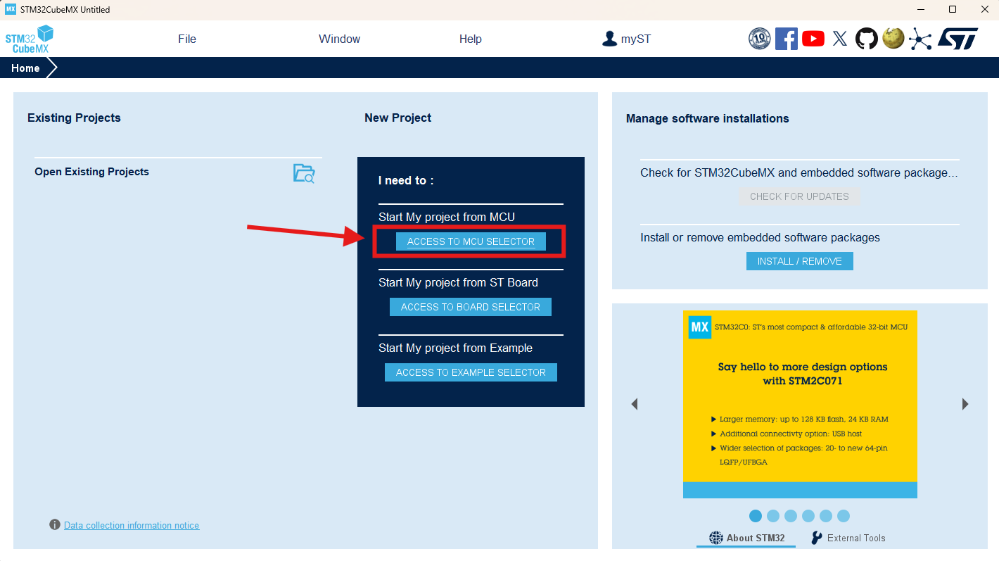

# Bài 2: GPIO

STM32L476RGTx không hỗ trợ Standard Peripherals Firmware Library, thư viện này ST đã ngừng phát triển và bị thay thế bởi STMCube. Nên để sử dụng thư việc cho dòng STM32L4, chúng ta có thể sử dụng Low-Layer API (LL) từ STM32CubeMX. Project sẽ được generate sử dụng STM32CubeMX và được code trên KeilC.

Full project: [Bai2-Project](../Bai2-Project/)

### 1. Cài đặt STM32CubeMX và khởi tạo project
Tải STM32CubeMX về máy tính và cài đặt vào máy tính từ địa chỉ:
https://www.st.com/en/development-tools/stm32cubemx.html

Để khởi tạo project, chúng ta mở STM32CubeMX lên và chọn dòng MCU đang sử dụng:


Ở đây chúng ta dùng STM32L476RGT3, sau đó bấm nút Start Project:


### 2. Projects
#### a. Nháy LED PA5 dùng thư vien Low-Layer API (LL)
Ở mục Pinout & Configuration, cấu hình chân PA5 thành GPIO_Output


Sau đó, đặt tên cho project và chọn project location. Lưu ý, ở mục Toolchain/IDE, chúng ta chọn MDK-ARM và chọn phiên bản KeilC đang sử dụng. Như vậy, CubeMX sẽ generate ra KeilC project để có thể chỉnh sửa code từ KeilC


Vào mục Advanced Settings, chọn Driver Selector là LL thay vì HAL để CubeMX gen ra code dùng LL driver.


Bấm vào nút Generate Code, rồi mở thư mục chứa project, tìm thư mục MDK-ARM, mở file .uvprojx để code bằng KeilC.

Ở file main.c, tìm đến hàm MX_GPIO_Init()

```c
static void MX_GPIO_Init(void)
{
  LL_GPIO_InitTypeDef GPIO_InitStruct = {0};
/* USER CODE BEGIN MX_GPIO_Init_1 */
/* USER CODE END MX_GPIO_Init_1 */

  /* GPIO Ports Clock Enable */
  LL_AHB2_GRP1_EnableClock(LL_AHB2_GRP1_PERIPH_GPIOA);

  /**/
  LL_GPIO_ResetOutputPin(GPIOA, LL_GPIO_PIN_5);

  /**/
  GPIO_InitStruct.Pin = LL_GPIO_PIN_5;
  GPIO_InitStruct.Mode = LL_GPIO_MODE_OUTPUT;
  GPIO_InitStruct.Speed = LL_GPIO_SPEED_FREQ_LOW;
  GPIO_InitStruct.OutputType = LL_GPIO_OUTPUT_PUSHPULL;
  GPIO_InitStruct.Pull = LL_GPIO_PULL_NO;
  LL_GPIO_Init(GPIOA, &GPIO_InitStruct);

/* USER CODE BEGIN MX_GPIO_Init_2 */
/* USER CODE END MX_GPIO_Init_2 */
}
```

- ```void LL_AHB2_GRP1_EnableClock(uint32_t Periphs)``` dùng để enable clock cho GPIOA
- ```void LL_GPIO_TogglePin(GPIO_TypeDef *GPIOx, uint32_t PinMask)``` dùng để reset chân PA5
- ```ErrorStatus LL_GPIO_Init(GPIO_TypeDef *GPIOx, LL_GPIO_InitTypeDef *GPIO_InitStruct)``` dùng để cấu hình cho chân PA5 theo các tham số được cài đặt từ LL_GPIO_InitTypeDef GPIO_InitStruct

Tham số của LL_GPIO_InitTypeDef bao gồm:

```c
typedef struct
{
  uint32_t Pin;          /*!< Specifies the GPIO pins to be configured.
                              This parameter can be any value of @ref GPIO_LL_EC_PIN */

  uint32_t Mode;         /*!< Specifies the operating mode for the selected pins.
                              This parameter can be a value of @ref GPIO_LL_EC_MODE.

                              GPIO HW configuration can be modified afterwards using unitary function @ref LL_GPIO_SetPinMode().*/

  uint32_t Speed;        /*!< Specifies the speed for the selected pins.
                              This parameter can be a value of @ref GPIO_LL_EC_SPEED.

                              GPIO HW configuration can be modified afterwards using unitary function @ref LL_GPIO_SetPinSpeed().*/

  uint32_t OutputType;   /*!< Specifies the operating output type for the selected pins.
                              This parameter can be a value of @ref GPIO_LL_EC_OUTPUT.

                              GPIO HW configuration can be modified afterwards using unitary function @ref LL_GPIO_SetPinOutputType().*/

  uint32_t Pull;         /*!< Specifies the operating Pull-up/Pull down for the selected pins.
                              This parameter can be a value of @ref GPIO_LL_EC_PULL.

                              GPIO HW configuration can be modified afterwards using unitary function @ref LL_GPIO_SetPinPull().*/

  uint32_t Alternate;    /*!< Specifies the Peripheral to be connected to the selected pins.
                              This parameter can be a value of @ref GPIO_LL_EC_AF.

                              GPIO HW configuration can be modified afterwards using unitary function @ref LL_GPIO_SetAFPin_0_7() and LL_GPIO_SetAFPin_8_15().*/
} LL_GPIO_InitTypeDef;
```

Ở đây, để thực hiện việc nhấp nháy LED, chúng ta có thể gọi hàm LL_GPIO_TogglePin() với 2 tham số là GPIOA và LL_GPIO_PIN_5. Sau đó, sử dụng hàm delay tương tự như [Bài 1](Bai1-SetupKeilC/Bai1-Project/) để nhấp nháy đèn LED.

```c
LL_GPIO_TogglePin(GPIOA, LL_GPIO_PIN_5)
```

#### b. Chase LED
Tạo project mới dùng STM32CubeMX tương tự nhưng project BlinkLED. Sau khi code được generate, mở project bằng KeilC và bắt đầu thêm cấu hình cho PA5, PA6, PA7 và PA8.

```c
static void MX_GPIO_Init(void)
{
  LL_GPIO_InitTypeDef GPIO_InitStruct = {0};
/* USER CODE BEGIN MX_GPIO_Init_1 */
/* USER CODE END MX_GPIO_Init_1 */

  /* GPIO Ports Clock Enable */
  LL_AHB2_GRP1_EnableClock(LL_AHB2_GRP1_PERIPH_GPIOA);

  /**/
  LL_GPIO_ResetOutputPin(GPIOA, LL_GPIO_PIN_5|LL_GPIO_PIN_6|LL_GPIO_PIN_7|LL_GPIO_PIN_8);

  /**/
  GPIO_InitStruct.Pin = LL_GPIO_PIN_5|LL_GPIO_PIN_6|LL_GPIO_PIN_7|LL_GPIO_PIN_8;
  GPIO_InitStruct.Mode = LL_GPIO_MODE_OUTPUT;
  GPIO_InitStruct.Speed = LL_GPIO_SPEED_FREQ_LOW;
  GPIO_InitStruct.OutputType = LL_GPIO_OUTPUT_PUSHPULL;
  GPIO_InitStruct.Pull = LL_GPIO_PULL_NO;
  LL_GPIO_Init(GPIOA, &GPIO_InitStruct);

/* USER CODE BEGIN MX_GPIO_Init_2 */
/* USER CODE END MX_GPIO_Init_2 */
}
```

Ngay khi bắt đầu hàm main, ta cần gọi hàm ```MX_GPIO_Init();``` để cấu hình GPIO cho chương trình. Ở đây, ta vẫn dùng GPIOA, nên hàm ```LL_AHB2_GRP1_EnableClock(LL_AHB2_GRP1_PERIPH_GPIOA);``` vẫn được gọi. Tuy nhiên, vì PA5, 6, 7, 8 đều được dùng, nên ta cần dùng phép OR để OR cả 4 pin lại và reset cùng 1 lúc trong hàm ```LL_GPIO_ResetOutputPin(GPIOA, LL_GPIO_PIN_5|LL_GPIO_PIN_6|LL_GPIO_PIN_7|LL_GPIO_PIN_8);```. Tại phần init cho các pin thuộc port A, ta cũng thực hiện tương tự phép OR ở phần tử ```GPIO_InitStruct.Pin = LL_GPIO_PIN_5|LL_GPIO_PIN_6|LL_GPIO_PIN_7|LL_GPIO_PIN_8;``` để gọi ```LL_GPIO_Init(GPIOA, &GPIO_InitStruct);``` cho cả 4 pin.

Chúng ta viết thêm hàn chaseLed để gọi trong vòng lặp While của hàm main như sau:

```c
void chaseLed(uint8_t loop)
{
	uint16_t Ledval;
	for(int j = 0; j < loop; j++)
	{
		Ledval = 0x0010; //0b0000 0000 0001 0000
		for(int i = 0; i < 4; i++)
		{
			Ledval = Ledval << 1;
			LL_GPIO_WriteOutputPort(GPIOA, Ledval);
			delay(1000000);
		}
	}
}
```

Biến ```Ledval``` sẽ được khởi tạo ở ```0x0010``` tức là bit thứ 4. Sau đó, ```Ledval``` sẽ được shift sang trái 1 bit, bắt đầu output từ bit thứ 5 rồi đến 6, 7 , 8, cứ như vậy cho mỗi một lần thực hiện vòng lặp.
Hàm ```void LL_GPIO_WriteOutputPort(GPIO_TypeDef *GPIOx, uint32_t PortValue)``` được gọi để ghi giá trị từ ```Ledval``` để output ra GPIOA.
Project này có thể test bằng cách nạp code vào MCU, rồi mở phần Debug, quan sát ODR của GPIOA từ KeilC.

#### c. Button LED dùng thư vien Low-Layer API (LL)
Tạo project mới dùng STM32CubeMX tương tự nhưng project BlinkLED. Sau khi code được generate, mở project bằng KeilC và bắt đầu thêm cấu hình cho PA5 (LED) và PC13(nút bấm)
```c
static void MX_GPIO_Init(void)
{
  LL_GPIO_InitTypeDef GPIO_InitStruct = {0};
/* USER CODE BEGIN MX_GPIO_Init_1 */
/* USER CODE END MX_GPIO_Init_1 */

  /* GPIO Ports Clock Enable */
  LL_AHB2_GRP1_EnableClock(LL_AHB2_GRP1_PERIPH_GPIOC);
  LL_AHB2_GRP1_EnableClock(LL_AHB2_GRP1_PERIPH_GPIOA);

  /**/
  LL_GPIO_ResetOutputPin(GPIOA, LL_GPIO_PIN_5);

  /**/
  GPIO_InitStruct.Pin = LL_GPIO_PIN_13;
  GPIO_InitStruct.Mode = LL_GPIO_MODE_INPUT;
  GPIO_InitStruct.Pull = LL_GPIO_PULL_UP;
  LL_GPIO_Init(GPIOC, &GPIO_InitStruct);

  /**/
  GPIO_InitStruct.Pin = LL_GPIO_PIN_5;
  GPIO_InitStruct.Mode = LL_GPIO_MODE_OUTPUT;
  GPIO_InitStruct.Speed = LL_GPIO_SPEED_FREQ_LOW;
  GPIO_InitStruct.OutputType = LL_GPIO_OUTPUT_PUSHPULL;
  GPIO_InitStruct.Pull = LL_GPIO_PULL_NO;
  LL_GPIO_Init(GPIOA, &GPIO_InitStruct);

/* USER CODE BEGIN MX_GPIO_Init_2 */
/* USER CODE END MX_GPIO_Init_2 */
}
```

Code trong hàm MX_GPIO_Init() tương tự như trong project BlinkLED, tuy nhiên ```LL_AHB2_GRP1_EnableClock(LL_AHB2_GRP1_PERIPH_GPIOC)``` được gọi để cấu hình clock cho GPIOC. Thêm vào đó, ta cũng có đoạn code để cấu hình PC13 thành input với chế độ Pull-up.
```c
GPIO_InitStruct.Pin = LL_GPIO_PIN_13;
GPIO_InitStruct.Mode = LL_GPIO_MODE_INPUT;
GPIO_InitStruct.Pull = LL_GPIO_PULL_UP;
LL_GPIO_Init(GPIOC, &GPIO_InitStruct);
```

Ngay khi bắt đầu hàm main, ta cần gọi hàm ```MX_GPIO_Init();``` để cấu hình GPIO cho chương trình. 
```c
 // Variable to keep track of the button state
	uint8_t button_pressed = 0;

	while (1)
	{
		// Check if the button is pressed
		if (!LL_GPIO_IsInputPinSet(GPIOC, LL_GPIO_PIN_13))
		{
			// If the button was not previously pressed, it is a new press
			if (button_pressed == 0)
			{
				button_pressed = 1;  // Mark the button as pressed

				// Toggle the LED state
				if (LL_GPIO_IsOutputPinSet(GPIOA, LL_GPIO_PIN_5))
				{
					LL_GPIO_ResetOutputPin(GPIOA, LL_GPIO_PIN_5);
				}
				else
				{
					LL_GPIO_SetOutputPin(GPIOA, LL_GPIO_PIN_5);
				}
			}
		}
		else
		{
			// If the button is not pressed, reset the state
			button_pressed = 0;
		}
		delay(50);  // Small delay for debouncing
	}
```

- ```uint32_t LL_GPIO_IsInputPinSet(GPIO_TypeDef *GPIOx, uint32_t PinMask)``` kiểm tra giá trị input tại GPIOx với PinMask tương ứng.
- ```uint32_t LL_GPIO_IsInputPinSet(GPIO_TypeDef *GPIOx, uint32_t PinMask)``` kiểm tra giá trị output tại GPIOx với PinMask tương ứng.
- ```void LL_GPIO_ResetOutputPin(GPIO_TypeDef *GPIOx, uint32_t PinMask)``` reset chân PinMask tại GPIOx.
- ```void LL_GPIO_SetOutputPin(GPIO_TypeDef *GPIOx, uint32_t PinMask)``` set chân PinMask tại GPIOx.

Sau đó, ta khởi tạo 1 biến có tên ```button_pressed```, biến này sẽ là biến giúp điều khiển trạng thái của đèn LED khi ta bấm nút.
Ở trong vòng lặp while, ta có dòng điều kiện if  ```if (!LL_GPIO_IsInputPinSet(GPIOC, LL_GPIO_PIN_13))``` để kiểm tra giá trị nút bấm PC13 xem nút có đang bấm không, nếu có, ngay tập tức, kiểm tra luôn giá trị của biến ```button_pressed```, nếu bằng 0 thì ta set lên 1, nếu nút nhấn PC13 không được nhất thì lại set giá trị của ```button_pressed``` về 0. Sau đó, ```if (LL_GPIO_IsOutputPinSet(GPIOA, LL_GPIO_PIN_5))``` kiểm tra xem đèn LED PA5 có đang sáng không, nếu có thì gọi ```LL_GPIO_ResetOutputPin(GPIOA, LL_GPIO_PIN_5);``` để tắt đèn LED, nếu không thì gọi ```LL_GPIO_SetOutputPin(GPIOA, LL_GPIO_PIN_5);``` để bật đèn LED.
