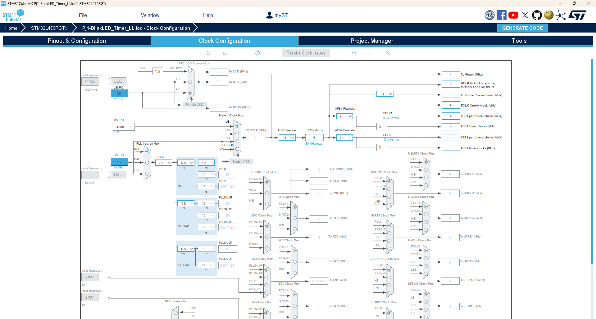

# Bài 3: Interrupt & Timer

Full project: [Bai3-Project](../Bai3-Project/)

### 1. Ngắt (Interrupt)
Ngắt (Interrupt) trong vi điều khiển là một cơ chế cho phép vi điều khiển tạm dừng chương trình hiện tại để xử lý một sự kiện khẩn cấp hoặc quan trọng. Sau khi xử lý xong sự kiện, vi điều khiển sẽ quay lại tiếp tục thực hiện chương trình đang dang dở.

Ngắt giúp tối ưu hóa hệ thống vì nó cho phép vi điều khiển phản ứng với các sự kiện ngoại vi hoặc nội bộ mà không cần phải liên tục kiểm tra trạng thái (polling), tiết kiệm thời gian và tài nguyên.

#### a. Quy trình hoạt động của ngắt
1. Xảy Ra Sự Kiện Ngắt
    - Một sự kiện ngắt xảy ra, có thể là từ một nguồn ngoại vi (chẳng hạn nút nhấn, cảm biến) hoặc từ một sự kiện nội bộ (như hết thời gian của timer).
    - Mỗi sự kiện ngắt được liên kết với một Interrupt Request (IRQ) cụ thể.
    - Bộ Điều Khiển NVIC Phát Hiện Ngắt

2. Bộ điều khiển NVIC (Nested Vectored Interrupt Controller) của vi điều khiển sẽ phát hiện khi có một ngắt xảy ra.
    - NVIC sẽ kiểm tra độ ưu tiên của ngắt vừa xảy ra so với ngắt hiện tại đang xử lý (nếu có).
    - Nếu ngắt mới có độ ưu tiên cao hơn, NVIC sẽ tạm dừng công việc hiện tại và chuyển sang xử lý ngắt.
  
3. Lưu Trạng Thái Hiện Tại (Context Saving)
    - Vi điều khiển sẽ lưu lại trạng thái hiện tại của chương trình vào stack. Trạng thái này bao gồm:
        - Giá trị của các thanh ghi quan trọng như PC (Program Counter), PSR (Program Status Register).
        - Ngữ cảnh chương trình hiện tại, bao gồm các giá trị thanh ghi tổng quát (R0-R12).
    - Việc lưu này giúp đảm bảo sau khi xử lý xong ngắt, vi điều khiển có thể quay lại đúng vị trí và tiếp tục công việc mà không bị mất dữ liệu.

4. Chuyển Đến Vector Ngắt Tương Ứng
    - Khi ngắt được kích hoạt, NVIC sẽ trỏ tới một vị trí trong Vector Table. Vector Table là một bảng chứa các địa chỉ hàm xử lý ngắt (Interrupt Service Routine - ISR) cho từng loại ngắt cụ thể.
    - Vi điều khiển nhảy đến địa chỉ của ISR tương ứng với ngắt xảy ra để bắt đầu xử lý sự kiện.

5. Thực Hiện ISR (Interrupt Service Routine)
    - ISR là một hàm con được viết để xử lý ngắt. Bên trong ISR, bạn có thể thực hiện các hành động cần thiết, chẳng hạn như đọc dữ liệu từ cảm biến hoặc thay đổi trạng thái của thiết bị ngoại vi.
    - ISR cần được viết ngắn gọn và hiệu quả để tránh làm chậm hệ thống, vì khi ISR đang được thực thi, các tác vụ khác sẽ bị tạm dừng.

6. Kết Thúc ISR và Khôi Phục Trạng Thái (Context Restoring)
    - Khi ISR kết thúc, vi điều khiển sẽ khôi phục lại trạng thái của chương trình từ stack (ngữ cảnh trước khi xảy ra ngắt).
    - Điều này đảm bảo rằng vi điều khiển sẽ tiếp tục thực thi đúng công việc mà nó đang làm trước khi ngắt xảy ra.

7. Quay Lại Công Việc Đang Dang Dở
    - Sau khi khôi phục trạng thái, vi điều khiển sẽ quay lại tiếp tục chương trình chính tại đúng vị trí mà nó đã tạm dừng.

#### b. Các Loại Ngắt
Ngắt trong vi điều khiển được chia thành nhiều loại, dựa vào nguồn gốc và chức năng của chúng:

- Ngắt Ngoại Vi (External Interrupt): 
    - Ngắt này xảy ra khi một tín hiệu thay đổi trạng thái ở một chân GPIO được cấu hình để kích hoạt ngắt. \
    Ví dụ: EXTI (External Interrupt) trên các chân GPIO.

    - Có thể cấu hình để kích hoạt khi:
        - Mức cao (high level),
        - Mức thấp (low level),
        - Cạnh lên (rising edge), hoặc
        - Cạnh xuống (falling edge).

- Ngắt Nội Vi (Internal Interrupt)
    - Ngắt này xảy ra khi một sự kiện hoặc tình huống bên trong vi điều khiển xảy ra. Các loại ngắt nội vi phổ biến bao gồm:
        - Ngắt Timer/Counter: Xảy ra khi bộ đếm (counter) hoặc bộ định thời (timer) đạt đến giá trị nhất định. Dùng để đo thời gian hoặc tạo xung PWM.
        - Ngắt truyền thông: Xảy ra khi nhận hoặc truyền một byte dữ liệu.
        - Ngắt Watchdog Timer: Xảy ra khi watchdog timer phát hiện vi điều khiển không hoạt động bình thường.

- Ngắt Hệ Thống (System Interrupt)
    - Ngắt này xảy ra khi một sự kiện hệ thống đặc biệt xảy ra. Chúng bao gồm:
        - Ngắt Reset: Khi hệ thống bị reset (do nút reset hoặc do một điều kiện lỗi như watchdog timer), ngắt này được gọi.
        - Ngắt Hard Fault: Xảy ra khi hệ thống gặp một lỗi nghiêm trọng như truy cập vùng nhớ không hợp lệ hoặc lỗi phần cứng.
        - Ngắt SysTick: Liên quan đến hệ thống định thời SysTick của Cortex-M để tạo ra ngắt định kỳ.

### 2. Timer
Timer (hay bộ đếm thời gian) là một phần tử phần cứng tích hợp sẵn trong vi điều khiển, dùng để đo đếm thời gian hoặc tạo ra các sự kiện với khoảng thời gian xác định. Timer có thể hoạt động độc lập với CPU và là một công cụ quan trọng để thực hiện nhiều chức năng như:

Một Timer cơ bản bao gồm các thành phần chính như sau:

- **Thanh ghi đếm (Counter Register)**: Đây là thanh ghi lưu trữ giá trị đếm của timer. Giá trị này sẽ tăng hoặc giảm (tùy thuộc vào cấu hình) theo xung nhịp của timer.
- **Prescaler**: Prescaler là một bộ chia tần số, cho phép chia nhỏ xung nhịp gốc (từ hệ thống hoặc từ một nguồn xung bên ngoài) để tạo ra xung nhịp cho thanh ghi đếm. Điều này giúp điều chỉnh tốc độ đếm của timer, cho phép timer đếm chậm hơn hoặc nhanh hơn tùy theo yêu cầu.
- **Auto-Reload Register (ARR)**: ARR xác định giá trị mà khi thanh ghi đếm đạt đến thì timer sẽ thực hiện một hành động, chẳng hạn như reset về 0 hoặc tạo ngắt. Giá trị ARR cho phép thiết lập khoảng thời gian chính xác mà timer sẽ đếm trước khi thực hiện hành động.
- **Timer Modes (Các chế độ hoạt động)**: 
    - Up-counting mode: Timer sẽ đếm từ 0 đến giá trị ARR, sau đó reset về 0 và bắt đầu lại.
    - Down-counting mode: Timer đếm ngược từ giá trị ARR về 0, sau đó lặp lại quá trình.
    - Center-aligned mode: Timer đếm lên đến ARR rồi đếm ngược về 0, tạo ra một tín hiệu đối xứng.
- **Các nguồn xung nhịp (Clock Source)**: Timer có thể lấy xung nhịp từ hệ thống xung nhịp nội bộ hoặc nguồn xung bên ngoài.

### 3. Project
Ứng dụng timer để viết hàm delay cho project BlinkLED.
- Khởi tạo project trên STM32CubeMX theo như hướng dẫn trong [Bài 2](Bai2-GPIO/Bai2-LyThuyet/Bai2-GPIO.md). Tuy nhiên, ở bước Pinout & Configuration, tại mục Categories, chọn Timers, sau đó chọn TIM2.
- Tại mục TIM2 Mode & Configuration, ở phần Clock Source, chọn Internal Clock.
- Ở mục Parameter Setting, cấu hình Prescaler là 399, Counter Mode là Up và Counter Period là 9.
- Chọn PA5 là GPIO_Output.


- Ở tab Clock Configuration, giữ nguyên như mặc định để dùng 4MHz internal clock từ MCU.


- Generate project ra như bình thường.

Khi mở file main.c từ KeilC, ta thấy có một hàm mới là ```static void MX_TIM2_Init(void)``` được generate
```c
static void MX_TIM2_Init(void)
{

  /* USER CODE BEGIN TIM2_Init 0 */

  /* USER CODE END TIM2_Init 0 */

  LL_TIM_InitTypeDef TIM_InitStruct = {0};

  /* Peripheral clock enable */
  LL_APB1_GRP1_EnableClock(LL_APB1_GRP1_PERIPH_TIM2);

  /* USER CODE BEGIN TIM2_Init 1 */

  /* USER CODE END TIM2_Init 1 */
  TIM_InitStruct.Prescaler = 400-1;
  TIM_InitStruct.CounterMode = LL_TIM_COUNTERMODE_UP;
  TIM_InitStruct.Autoreload = 10-1;
  TIM_InitStruct.ClockDivision = LL_TIM_CLOCKDIVISION_DIV1;
  LL_TIM_Init(TIM2, &TIM_InitStruct);
  LL_TIM_DisableARRPreload(TIM2);
  LL_TIM_SetClockSource(TIM2, LL_TIM_CLOCKSOURCE_INTERNAL);
  LL_TIM_SetTriggerOutput(TIM2, LL_TIM_TRGO_RESET);
  LL_TIM_DisableMasterSlaveMode(TIM2);
  /* USER CODE BEGIN TIM2_Init 2 */

  /* USER CODE END TIM2_Init 2 */

}
```

Biến ```TIM_InitStruct``` được khai báo cho kiểu dữ liệu ```LL_TIM_InitTypeDef```. Kiểu dữ liệu dạng struct bao gồm các phần tử sau:
```c
typedef struct
{
  uint16_t Prescaler;         /*!< Specifies the prescaler value used to divide the TIM clock.
                                   This parameter can be a number between Min_Data=0x0000 and Max_Data=0xFFFF.

                                   This feature can be modified afterwards using unitary function
                                   @ref LL_TIM_SetPrescaler().*/

  uint32_t CounterMode;       /*!< Specifies the counter mode.
                                   This parameter can be a value of @ref TIM_LL_EC_COUNTERMODE.

                                   This feature can be modified afterwards using unitary function
                                   @ref LL_TIM_SetCounterMode().*/

  uint32_t Autoreload;        /*!< Specifies the auto reload value to be loaded into the active
                                   Auto-Reload Register at the next update event.
                                   This parameter must be a number between Min_Data=0x0000 and Max_Data=0xFFFF.
                                   Some timer instances may support 32 bits counters. In that case this parameter must
                                   be a number between 0x0000 and 0xFFFFFFFF.

                                   This feature can be modified afterwards using unitary function
                                   @ref LL_TIM_SetAutoReload().*/

  uint32_t ClockDivision;     /*!< Specifies the clock division.
                                   This parameter can be a value of @ref TIM_LL_EC_CLOCKDIVISION.

                                   This feature can be modified afterwards using unitary function
                                   @ref LL_TIM_SetClockDivision().*/

  uint32_t RepetitionCounter;  /*!< Specifies the repetition counter value. Each time the RCR downcounter
                                   reaches zero, an update event is generated and counting restarts
                                   from the RCR value (N).
                                   This means in PWM mode that (N+1) corresponds to:
                                      - the number of PWM periods in edge-aligned mode
                                      - the number of half PWM period in center-aligned mode
                                   GP timers: this parameter must be a number between Min_Data = 0x00 and
                                   Max_Data = 0xFF.
                                   Advanced timers: this parameter must be a number between Min_Data = 0x0000 and
                                   Max_Data = 0xFFFF.

                                   This feature can be modified afterwards using unitary function
                                   @ref LL_TIM_SetRepetitionCounter().*/
} LL_TIM_InitTypeDef;
```
Trong đó:
- **Prescaler**: Thiết lập giá trị chia để giảm tần số của đồng hồ (clock) đến timer. Điều này có nghĩa là tần số đầu vào của timer sẽ được chia cho giá trị này cộng thêm 1.
- **CounterMode**: Xác định chế độ đếm của timer. Có các chế độ như đếm tăng (UP), đếm giảm (DOWN), hoặc đếm trung tâm (CENTER).
- **Autoreload**: Thiết lập giá trị auto-reload, đây là giá trị được nạp vào thanh ghi auto-reload khi sự kiện cập nhật xảy ra. Nó xác định giá trị mà timer sẽ quay lại sau khi đếm đến.
- **ClockDivision**: Chia tần số clock của timer. Điều này cho phép điều chỉnh tần số mà timer hoạt động.
- **RepetitionCounter**: Xác định giá trị của bộ đếm lặp lại. Mỗi khi bộ đếm này đạt 0, một sự kiện cập nhật sẽ được phát sinh và đếm sẽ bắt đầu lại từ giá trị lặp lại. Điều này thường được sử dụng trong chế độ PWM để điều khiển số chu kỳ PWM.

Từ những thông số trên, ta có thể cấu hình TIM2 như sau:
```c
TIM_InitStruct.Prescaler = 400-1;
TIM_InitStruct.CounterMode = LL_TIM_COUNTERMODE_UP;
TIM_InitStruct.Autoreload = 10-1;
TIM_InitStruct.ClockDivision = LL_TIM_CLOCKDIVISION_DIV1;
LL_TIM_Init(TIM2, &TIM_InitStruct);
```

Với Internal Clock chúng ta set lúc khởi tạo project ở STM32CubeMX là 4MHz, Prescaler có thể set thành 400-1 tức là 399. Khi đó, tần số cho mỗi clock tick là:
$${4MHz \over 400}=10kHz$$

Điều này có nghĩa là timer đếm được 10000 tick mỗi giây. Thời gian của mỗi tick sẽ là:
$${1 \over 10kHz}=0.1ms$$

Khi đó, với Autoreload bằng 9 có nghĩa là timer sẽ đếm từ 0 đến 9, tức là tạo ra 10 ticks. Với tần số 10 kHz, delay mỗi lần gọi delay_ms(1) sẽ là: 
$$Delay=(9+1)×0.1ms=1ms$$

Ở đây, **CounterMode** được set thành ```LL_TIM_COUNTERMODE_UP``` tức là đếm lên và **ClockDivision** là ```LL_TIM_CLOCKDIVISION_DIV1```  tức là không chia tần số clock của timer.

Sau khi cấu hình timer2 hoàn tất, ta có hàm delay như sau:
```c
void delay_ms(uint32_t timeDelay)
{
    for (uint32_t i = 0; i < timeDelay; i++)
    {
        LL_TIM_SetCounter(TIM2, 0);
        while (!LL_TIM_IsActiveFlag_UPDATE(TIM2));
        LL_TIM_ClearFlag_UPDATE(TIM2);
    }
}
```

- ```LL_TIM_SetCounter(TIM2, 0);```: Đặt giá trị của bộ đếm timer TIM2 về 0. Điều này đảm bảo rằng timer bắt đầu từ đầu mỗi lần delay.
- ```while (!LL_TIM_IsActiveFlag_UPDATE(TIM2));```: Vòng lặp này chờ cho cờ cập nhật (UPDATE flag) của timer TIM2 được thiết lập. Cờ này được thiết lập khi timer đếm đến giá trị tự động nạp lại (autoreload value). Điều này có nghĩa là nó sẽ chờ cho timer hoàn thành chu kỳ đếm của nó.
- ```LL_TIM_ClearFlag_UPDATE(TIM2);```: Sau khi cờ cập nhật được thiết lập, lệnh này sẽ xóa cờ đó để chuẩn bị cho chu kỳ đếm tiếp theo. Việc xóa cờ là cần thiết để đảm bảo rằng bạn có thể theo dõi đúng việc đếm trong lần gọi hàm tiếp theo.

Hàm main có thể được viết như sau:
```c
int main(void)
{
  /* Initialize all configured peripherals */
  MX_GPIO_Init();
  MX_TIM2_Init();
  /* USER CODE BEGIN 2 */
  LL_TIM_EnableCounter(TIM2); // turn on timer
  /* USER CODE END 2 */

  /* Infinite loop */
  /* USER CODE BEGIN WHILE */
  while (1)
  {
    /* USER CODE END WHILE */
	LL_GPIO_TogglePin(GPIOA, LL_GPIO_PIN_5);
	delay_ms(1000); // delay 1s
    /* USER CODE BEGIN 3 */
  }
  /* USER CODE END 3 */
}
```

- ```LL_TIM_EnableCounter(TIM2);```: Bắt đầu timer
- ```delay_ms(1000);```: Với tham số là 1000 thì thời gian delay sẽ là 
$$1000 * 0.1ms = 1s$$
Nghĩa là đèn LED PA5 nhấp nháy 1s. Tham số hàm ```delay_ms``` có thể được tuỳ chỉnh phù hợp với nhu cầu sử dụng.
