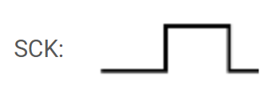

# Bài 5 - SPI

### 1. SPI Software
Trên mỗi dòng vi điều khiển khác nhau module SPI sẽ được tích hợp, điều khiển bởi các thanh ghi,phần cứng, IO khác nhau, đấy gọi là SPI cứng (hardware SPI). Nhưng trong một số trường hợp, chúng ta có thể thực hiện giao tiếp SPI bằng phần mềm (Software SPI). Điều này có thể hữu ích khi vi điều khiển không hỗ trợ giao thức SPI ở cấp phần cứng, hoặc khi chúng ta cần linh hoạt hơn trong việc điều khiển các chân GPIO, ví dụ như khi chúng ta đã sử dụng hết các bộ điều khiển SPI tích hợp.

Software SPI là việc mô phỏng hoạt động của SPI bằng cách điều khiển thủ công các chân GPIO (General Purpose Input/Output) của vi điều khiển. Thay vì sử dụng bộ điều khiển SPI tích hợp, chúng ta tự quản lý việc gửi và nhận dữ liệu qua các chân như MOSI, MISO, SCK và SS bằng phần mềm.

Trong bài này, chúng ta sẽ sử dụng 2 vi điều khiển để giao tiếp với nhau thông qua chuẩn giao tiếp SPI. Master sẽ là STM32L476RGT3 và Slave sẽ là STM32F446.

**Sơ đồ kết nối các chân để thực hiện giao tiếp SPI bằng phần mềm giữa STM32L476 và STM32F446**
```
   STM32L476 (Master)            STM32F446 (Slave)
   +------------+                +------------+
   |            |                |            |
   |     PC3    |--------------->|     PC3    |  <- MOSI
   |            |                |            |
   |     PC2    |<---------------|     PC2    |  <- MISO
   |            |                |            |
   |    PB10    |--------------->|    PB10    |  <- SCK
   |            |                |            |
   |     PB5    |--------------->|     PB4    |  <- SS
   |            |                |            |
   +------------+                +------------+
       |                             |
       |-----------------------------|  
                   GND

```

#### SPI Software trên STM32L476 (Master)
**1. Khởi tạo project trên STM32CubeMX** \
Đảm bảo các chân GPIO được cấu hình như sau:
```
PC3, PB10, PB5 --- Output
PC2            --- Input
```
Chọn TIM2 và đặt Clock Source là Internal Clock để sử dụng Timer 2 cho project.

**2. Cấu hình GPIO**
```c
static void MX_GPIO_Init(void)
{
  LL_GPIO_InitTypeDef GPIO_InitStruct = {0};
/* USER CODE BEGIN MX_GPIO_Init_1 */
/* USER CODE END MX_GPIO_Init_1 */

  /* GPIO Ports Clock Enable */
  LL_AHB2_GRP1_EnableClock(LL_AHB2_GRP1_PERIPH_GPIOC);
  LL_AHB2_GRP1_EnableClock(LL_AHB2_GRP1_PERIPH_GPIOB);

  /**/
  LL_GPIO_ResetOutputPin(GPIOC, LL_GPIO_PIN_3);

  /**/
  LL_GPIO_ResetOutputPin(GPIOB, LL_GPIO_PIN_10|LL_GPIO_PIN_5);

  /*PC2 - MISO*/
  GPIO_InitStruct.Pin = LL_GPIO_PIN_2;
  GPIO_InitStruct.Mode = LL_GPIO_MODE_INPUT;
  GPIO_InitStruct.Pull = LL_GPIO_PULL_NO;
  LL_GPIO_Init(GPIOC, &GPIO_InitStruct);

  /*PC3 - MOSI*/
  GPIO_InitStruct.Pin = LL_GPIO_PIN_3;
  GPIO_InitStruct.Mode = LL_GPIO_MODE_OUTPUT;
  GPIO_InitStruct.Speed = LL_GPIO_SPEED_FREQ_LOW;
  GPIO_InitStruct.OutputType = LL_GPIO_OUTPUT_PUSHPULL;
  GPIO_InitStruct.Pull = LL_GPIO_PULL_NO;
  LL_GPIO_Init(GPIOC, &GPIO_InitStruct);

  /*PB10 - SCK, PB5 - SS*/
  GPIO_InitStruct.Pin = LL_GPIO_PIN_10|LL_GPIO_PIN_5;
  GPIO_InitStruct.Mode = LL_GPIO_MODE_OUTPUT;
  GPIO_InitStruct.Speed = LL_GPIO_SPEED_FREQ_LOW;
  GPIO_InitStruct.OutputType = LL_GPIO_OUTPUT_PUSHPULL;
  GPIO_InitStruct.Pull = LL_GPIO_PULL_NO;
  LL_GPIO_Init(GPIOB, &GPIO_InitStruct);

/* USER CODE BEGIN MX_GPIO_Init_2 */
/* USER CODE END MX_GPIO_Init_2 */
}
```
Vì bài này sử dụng GPIOC và GPIO, nên ta kích hoạt clock cho 2 GPIO này và cấu hình các chân input và output tương ứng.

**3. Cấu hình Timer 2** \
Với Internal Clock chúng ta set lúc khởi tạo project ở STM32CubeMX là 4MHz, Prescaler có thể set thành 400-1 tức là 399. Khi đó, tần số cho mỗi clock tick là:
$${4MHz \over 400}=10kHz$$

Điều này có nghĩa là timer đếm được 10000 tick mỗi giây. Thời gian của mỗi tick sẽ là:
$${1 \over 10kHz}=0.1ms$$

Khi đó, với Autoreload bằng 9 có nghĩa là timer sẽ đếm từ 0 đến 9, tức là tạo ra 10 ticks. Với tần số 10 kHz, delay mỗi lần gọi delay_ms(1) sẽ là: 
$$Delay=(9+1)×0.1ms=1ms$$

```c
static void MX_TIM2_Init(void)
{

  /* USER CODE BEGIN TIM2_Init 0 */

  /* USER CODE END TIM2_Init 0 */

  LL_TIM_InitTypeDef TIM_InitStruct = {0};

  /* Peripheral clock enable */
  LL_APB1_GRP1_EnableClock(LL_APB1_GRP1_PERIPH_TIM2);

  /* USER CODE BEGIN TIM2_Init 1 */

  /* USER CODE END TIM2_Init 1 */
  TIM_InitStruct.Prescaler = 400-1;
  TIM_InitStruct.CounterMode = LL_TIM_COUNTERMODE_UP;
  TIM_InitStruct.Autoreload = 10-1;
  TIM_InitStruct.ClockDivision = LL_TIM_CLOCKDIVISION_DIV1;
  LL_TIM_Init(TIM2, &TIM_InitStruct);
  LL_TIM_DisableARRPreload(TIM2);
  LL_TIM_SetClockSource(TIM2, LL_TIM_CLOCKSOURCE_INTERNAL);
  LL_TIM_SetTriggerOutput(TIM2, LL_TIM_TRGO_RESET);
  LL_TIM_DisableMasterSlaveMode(TIM2);
  /* USER CODE BEGIN TIM2_Init 2 */

  /* USER CODE END TIM2_Init 2 */

}
```

Sau khi cấu hình timer2 hoàn tất, ta có hàm delay như sau:
```c
void delay_ms(uint32_t timeDelay)
{
    for (uint32_t i = 0; i < timeDelay; i++)
    {
        LL_TIM_SetCounter(TIM2, 0);
        while (!LL_TIM_IsActiveFlag_UPDATE(TIM2));
        LL_TIM_ClearFlag_UPDATE(TIM2);
    }
}
```

**4. Cấu hình xung clock cho chân SCK** \
Tín hiệu clock được tạo bằng cách kết hợp kéo chân SCK lên 1, xuống 0 và delay. Delay được tạo bằng timer



```c
/* SPI SCK clock pulse*/
void SPI_SCK_clock_pulse(void)
{
	LL_GPIO_SetOutputPin(GPIOB, LL_GPIO_PIN_10);
	delay_ms(4);
	LL_GPIO_ResetOutputPin(GPIOB, LL_GPIO_PIN_10);
	delay_ms(4);
}
```

**5. Cấu hình SPI ở trạng thái lúc không truyền dữ liệu** \
Vì chúng ta đang mô phỏng SPI sử dụng phần mềm, nên phải chọn trạng thái mặc định cho các pin:
- SCK: chọn trạng thái ban đầu bằng 0
- CS: trạng thái ban đầu bằng 1, khi chọn slave thì chúng ta sẽ hạ chân CS xuống 0
- Chân MOSI có thể chọn trạng thái chân tuỳ thích, ở đây chúng ta chọn là 0 luôn

```c
/* SPI init */
void SPI_Init(void)
{
	LL_GPIO_ResetOutputPin(GPIOB, LL_GPIO_PIN_10);   // SCK
	LL_GPIO_SetOutputPin(GPIOB, LL_GPIO_PIN_5);      // SS
	LL_GPIO_ResetOutputPin(GPIOC, LL_GPIO_PIN_3);    // MOSI
}
```

**6. Hàm truyền dữ liệu từ Master sang Slave** \
Hàm truyền sẽ truyền dữ liệu 8 bit 1 lần, MSB trong byte dữ liệu sẽ được truyền trước, rồi lần lượt đến các bít thấp hơn rồi đến LSB. Quy trình truyền như sau:
- Kéo CS xuống 0
	- Truyền 1 bit dữ liệu
	- Dịch 1 bit sang trái để sẵn sàng truyền bit tiếp theo
	- Gửi ```SPI_SCK_clock_pulse()```
- Kéo CS lên 1

```c
/* Ham truyen du lieu tren SPI */
void SPI_transfer(uint8_t data_out) 
{
    // Bat dau giao tiep bang cach keo chan SS xuong
    LL_GPIO_ResetOutputPin(GPIOB, LL_GPIO_PIN_5);
	delay_ms(1);
	test = data_out;
    // Gui du lieu
    for (uint8_t i = 0; i < 8u; i++) 
	{
        // Goi bit cao nhat truoc
        if (data_out & 0x80u) 
		{
            LL_GPIO_SetOutputPin(GPIOC, LL_GPIO_PIN_3); // Set MOSI
			delay_ms(1);
        } 
		else 
		{
            LL_GPIO_ResetOutputPin(GPIOC, LL_GPIO_PIN_3); // Reset MOSI
			delay_ms(1);
        }
		
		data_out <<= 1; // Dich du lieu ve ben trai
        // Tao xung clock
        SPI_SCK_clock_pulse();
		test = data_out;
    }
	
    // Ket thuc giao tiep bang cach keo chan SS len
    LL_GPIO_SetOutputPin(GPIOB, LL_GPIO_PIN_5);
	delay_ms(1);
}
```

**7. Hàm nhận dữ liệu từ Slave** \
Master sẽ nhận dữ liệu từ Slave theo quy trình sau:
- Kéo chân CS xuống để chọn Slave và bắt đầu giao tiếp:
  - Tạo xung clock bằng cách kéo chân SCK lên 
  - Dịch dữ liệu sang trái
  - Đọc dữ liệu từ chân MISO và thực hiện phép OR
  - Đưa chân SCK xuống
- Kéo chân SCK lên để kết thúc giao tiếp

```c
uint8_t SPI_receive()
{
	uint8_t data_in = 0;
	
	// Bat dau giao tiep bang cach keo chan SS xuong
    LL_GPIO_ResetOutputPin(GPIOB, LL_GPIO_PIN_5);
	delay_ms(4);
	
	for (uint8_t i = 0; i < 8u; i++) 
	{
       // Tao xung clock
        LL_GPIO_SetOutputPin(GPIOB, LL_GPIO_PIN_10); // SCK High
        delay_ms(4);
        data_in <<= 1; // Dich du lieu sang trai

        // Doc bit tu MISO
        if (LL_GPIO_IsInputPinSet(GPIOC, LL_GPIO_PIN_2)) 
		{
            data_in |= 0x01; // Neu MISO là High, set bit thap nhat
        }

        // Ðua SCK xuong
        LL_GPIO_ResetOutputPin(GPIOB, LL_GPIO_PIN_10); // SCK Low
		delay_ms(4);
    }
	// Ket thuc giao tiep bang cach keo chan SS len
    LL_GPIO_SetOutputPin(GPIOB, LL_GPIO_PIN_5);
	delay_ms(4);
	
	return data_in;
}
```

**8. Hàm main**
Trong hàm ```main()```, chúng ta có thể test bằng cách viết một đoạn code truyền dữ liệu đơn giản như sau:
```c
volatile uint8_t DataTrans[] = {7, 8, 4, 2};//Data
while (1)
  {
    /* USER CODE END WHILE */

    /* USER CODE BEGIN 3 */
	
	for(uint8_t i = 0; i < (sizeof(DataTrans) / sizeof(DataTrans[0])); i++)
	{
		SPI_transfer(DataTrans[i]);
		delay_ms(1000);
	}
	counter = 0;
	delay_ms(100);
	while (counter <= (sizeof(DataTrans) / sizeof(DataTrans[0])))
	{
		dataReceive = SPI_receive();
		counter++;
		delay_ms(1000);
	}
  }
```

#### SPI Software trên STM32F446 (Slave)
**1. Khởi tạo project**
Khởi tạo project dùng Low-layer API (LL) như STM32L476. GPIO được cấu hình như sau:
```
PC3, PB10, PB4 --- Input
PC2 	 	   --- Output
```
**2. Cấu hình GPIO**
GPIO được cấu hình tương tự như Master, chỉ có các chân input và output là khác.
```c
static void MX_GPIO_Init(void)
{
  LL_GPIO_InitTypeDef GPIO_InitStruct = {0};
/* USER CODE BEGIN MX_GPIO_Init_1 */
/* USER CODE END MX_GPIO_Init_1 */

  /* GPIO Ports Clock Enable */
  LL_AHB1_GRP1_EnableClock(LL_AHB1_GRP1_PERIPH_GPIOC);
  LL_AHB1_GRP1_EnableClock(LL_AHB1_GRP1_PERIPH_GPIOB);

  /**/
  LL_GPIO_ResetOutputPin(GPIOC, LL_GPIO_PIN_2);

  /**/
  GPIO_InitStruct.Pin = LL_GPIO_PIN_2;
  GPIO_InitStruct.Mode = LL_GPIO_MODE_OUTPUT;
  GPIO_InitStruct.Speed = LL_GPIO_SPEED_FREQ_LOW;
  GPIO_InitStruct.OutputType = LL_GPIO_OUTPUT_PUSHPULL;
  GPIO_InitStruct.Pull = LL_GPIO_PULL_NO;
  LL_GPIO_Init(GPIOC, &GPIO_InitStruct);

  /**/
  GPIO_InitStruct.Pin = LL_GPIO_PIN_3;
  GPIO_InitStruct.Mode = LL_GPIO_MODE_INPUT;
  GPIO_InitStruct.Pull = LL_GPIO_PULL_NO;
  LL_GPIO_Init(GPIOC, &GPIO_InitStruct);

  /**/
  GPIO_InitStruct.Pin = LL_GPIO_PIN_10|LL_GPIO_PIN_4;
  GPIO_InitStruct.Mode = LL_GPIO_MODE_INPUT;
  GPIO_InitStruct.Pull = LL_GPIO_PULL_NO;
  LL_GPIO_Init(GPIOB, &GPIO_InitStruct);

/* USER CODE BEGIN MX_GPIO_Init_2 */
/* USER CODE END MX_GPIO_Init_2 */
```
**3. Cấu hình Timer2**
Vì Internal clock của STM32F446 là 16MHz, nên Prescaler có thể set thành 400-1 tức là 399. Khi đó, tần số cho mỗi clock tick là:
$${4MHz \over 1600}=10kHz$$

Điều này có nghĩa là timer đếm được 10000 tick mỗi giây. Thời gian của mỗi tick sẽ là:
$${1 \over 10kHz}=0.1ms$$

Khi đó, với Autoreload bằng 9 có nghĩa là timer sẽ đếm từ 0 đến 9, tức là tạo ra 10 ticks. Với tần số 10 kHz, delay mỗi lần gọi delay_ms(1) sẽ là: 
$$Delay=(9+1)×0.1ms=1ms$$

```c
static void MX_TIM2_Init(void)
{

  /* USER CODE BEGIN TIM2_Init 0 */

  /* USER CODE END TIM2_Init 0 */

  LL_TIM_InitTypeDef TIM_InitStruct = {0};

  /* Peripheral clock enable */
  LL_APB1_GRP1_EnableClock(LL_APB1_GRP1_PERIPH_TIM2);

  /* USER CODE BEGIN TIM2_Init 1 */

  /* USER CODE END TIM2_Init 1 */
  TIM_InitStruct.Prescaler = 1600-1;
  TIM_InitStruct.CounterMode = LL_TIM_COUNTERMODE_UP;
  TIM_InitStruct.Autoreload = 10-1;
  TIM_InitStruct.ClockDivision = LL_TIM_CLOCKDIVISION_DIV1;
  LL_TIM_Init(TIM2, &TIM_InitStruct);
  LL_TIM_DisableARRPreload(TIM2);
  LL_TIM_SetClockSource(TIM2, LL_TIM_CLOCKSOURCE_INTERNAL);
  LL_TIM_SetTriggerOutput(TIM2, LL_TIM_TRGO_RESET);
  LL_TIM_DisableMasterSlaveMode(TIM2);
  /* USER CODE BEGIN TIM2_Init 2 */

  /* USER CODE END TIM2_Init 2 */

}
```
**4. Cấu hình xung clock cho chân SCK** \
Slave không cần hàm tạo xung clock như Master vì chân SCK sẽ là chân input và nhận xung clock từ Master để đọc dữ liệu. 

**5. Cấu hình SPI ở trạng thái lúc không truyền dữ liệu** \
Chỉ có chân MISO là output nên ở đây chúng ta chọn là 0 luôn

```c
void SPI_Init(void)
{
	LL_GPIO_ResetOutputPin(GPIOC, LL_GPIO_PIN_2);    // MISO
}
```
**6. Hàm nhận dữ liệu từ Master** \
Hàm nhận sẽ nhận dữ liệu 8 bit 1 lần, MSB trong byte dữ liệu sẽ được nhận trước, rồi lần lượt đến các bít thấp hơn rồi đến LSB. Quy trình nhận như sau:
- Kiểm tra nếu CS==0? Có dữ liệu nếu CS = 0
	- Kiểm tra chân ```LL_GPIO_PIN_10``` có được set hay không, nếu có nghĩa là có dữ liệu tới
	- Đọc data trên MOSI, ghi vào biến
	- Dịch 1 bit để chừa chỗ nhận bit tiếp theo
- Kiểm tra nếu CS==1? Hết dữ liệu nếu CS = 1
```c
uint8_t SPI_receive()
{
	uint8_t data_in = 0;
	// Cho tin hieu tu Master (CS o muc thap)
    while (LL_GPIO_IsInputPinSet(GPIOB, LL_GPIO_PIN_4));
	// Bat dau nhan du lieu
    for (int i = 0; i < 8; i++) 
	{
        // Cho xung clock tu master
        while (!LL_GPIO_IsInputPinSet(GPIOB, LL_GPIO_PIN_10));  // Cho SCK lên cao

        // Ðoc bit tu MOSI
        data_in <<= 1;  // Dich bit nhan vào
        if (LL_GPIO_IsInputPinSet(GPIOC, LL_GPIO_PIN_3)) 
		{
            data_in |= 0x01;  // Neu MOSI là High, set bit thap nhat
        }
		test = data_in;
		delay_ms(1);

        // Cho SCK xuong thap truoc khi nhan bit tiep theo
        while (LL_GPIO_IsInputPinSet(GPIOB, LL_GPIO_PIN_10));  // Cho SCK xuong thap
    }

    // Sau khi nhan xong 8 bit, Slave se dung lai và doi Master tiep tuc.

    return data_in;  // Tra ve byte du lieu nhan duoc tu Master

}
```

**6. Hàm gửi dữ liệu từ Slave sang Master** \
Quy trình gửi dữ liệu từ Slave sang Master được thực hiện như sau:
- Kiểm tra chân CS == 0 ?
  - Kiểm tra chân SCK có đang HIGH hay không ?
  - Bắt đầu gửi từng bit từ chân MISO
  - Dịch dữ liệu sang trái
  - Kiểm tra chân SCK có đang LOW hay không?
- Chờ chân CS lên cao

```c
void SPI_transfer(uint8_t data_out) 
{
    // Cho chan SS keo xuong
    while (LL_GPIO_IsInputPinSet(GPIOB, LL_GPIO_PIN_4));
    // Gui du lieu
    for (uint8_t i = 0; i < 8u; i++) 
	{
		// Cho chan SCK len cao
		while (!LL_GPIO_IsInputPinSet(GPIOB, LL_GPIO_PIN_10))
			; // SCK high
		
        // Goi bit cao nhat truoc
        if (data_out & 0x80u) 
		{
            LL_GPIO_SetOutputPin(GPIOC, LL_GPIO_PIN_2);  // Set MISO high
        } 
		else 
		{
            LL_GPIO_ResetOutputPin(GPIOC, LL_GPIO_PIN_2);  // Set MISO low
        }
		
		data_out <<= 1; // Dich du lieu ve ben trai
        // Cho chan SCK xuong
        while (LL_GPIO_IsInputPinSet(GPIOB, LL_GPIO_PIN_10)); //SCK low
    }
	
    // Ket thuc giao tiep bang cach cho chan SS len
    while (!LL_GPIO_IsInputPinSet(GPIOB, LL_GPIO_PIN_4));
}
```

**8. Hàm main**
Trong hàm ```main()```, chúng ta có thể test bằng cách viết một đoạn code nhận dữ liệu đơn giản như sau:
```c
volatile uint8_t DataTrans[] = {7, 8, 4, 2};//Data
while (1)
  {
    /* USER CODE END WHILE */
    /* USER CODE BEGIN 3 */
	counter = 0;
	while (counter <= (sizeof(DataTrans) / sizeof(DataTrans[0])))
	{
		dataReceive = SPI_receive();
		counter++;
	}
	for(uint8_t i = 0; i < (sizeof(DataTrans) / sizeof(DataTrans[0])); i++)
	{
		SPI_transfer(DataTrans[i]);
	}
  }
```

### 2. SPI Hardware
Trên STM32L476 có 3 khối SPI, cụ thể là SPI1 kết nối với APB2, SPI2 và SPI3 kết nối với APB1.\
Trong bài này, chúng ta sẽ demo với SPI2, sơ đồ nối chân như sau.


**Sơ đồ kết nối các chân để thực hiện giao tiếp SPI bằng phần cứng giữa STM32L476 và STM32F446**
```
   STM32L476 (Master)            STM32F446 (Slave)
   +------------+                +------------+
   |            |                |            |
   |     PC3    |--------------->|     PC3    |  <- MOSI
   |            |                |            |
   |     PC2    |<---------------|     PC2    |  <- MISO
   |            |                |            |
   |    PB10    |--------------->|    PB10    |  <- SCK
   |            |                |            |
   |    PB12    |--------------->|     PB12   |  <- SS
   |            |                |            |
   +------------+                +------------+
       |                             |
       |-----------------------------|  
                   GND
```

#### SPI Hardware trên STM32L476 (Master)
Tiến hành khởi tạo project. Hàm khai báo timer2 sẽ giống y như với SPI Hardware, tuy nhiên, với SPI hardware, hàm khởi tạo SPI sẽ cần được viết như sau:

```c
static void MX_SPI2_Init(void)
{

  /* USER CODE BEGIN SPI2_Init 0 */

  /* USER CODE END SPI2_Init 0 */

  LL_SPI_InitTypeDef SPI_InitStruct = {0};

  LL_GPIO_InitTypeDef GPIO_InitStruct = {0};

  /* Peripheral clock enable */
  LL_APB1_GRP1_EnableClock(LL_APB1_GRP1_PERIPH_SPI2);

  LL_AHB2_GRP1_EnableClock(LL_AHB2_GRP1_PERIPH_GPIOC);
  LL_AHB2_GRP1_EnableClock(LL_AHB2_GRP1_PERIPH_GPIOB);
  /**SPI2 GPIO Configuration
  PC2   ------> SPI2_MISO
  PC3   ------> SPI2_MOSI
  PB10   ------> SPI2_SCK
  PB12   ------> SPI2_NSS
  */
  GPIO_InitStruct.Pin = LL_GPIO_PIN_2|LL_GPIO_PIN_3;
  GPIO_InitStruct.Mode = LL_GPIO_MODE_ALTERNATE;
  GPIO_InitStruct.Speed = LL_GPIO_SPEED_FREQ_VERY_HIGH;
  GPIO_InitStruct.OutputType = LL_GPIO_OUTPUT_PUSHPULL;
  GPIO_InitStruct.Pull = LL_GPIO_PULL_NO;
  GPIO_InitStruct.Alternate = LL_GPIO_AF_5;
  LL_GPIO_Init(GPIOC, &GPIO_InitStruct);

  GPIO_InitStruct.Pin = LL_GPIO_PIN_10|LL_GPIO_PIN_12;
  GPIO_InitStruct.Mode = LL_GPIO_MODE_ALTERNATE;
  GPIO_InitStruct.Speed = LL_GPIO_SPEED_FREQ_VERY_HIGH;
  GPIO_InitStruct.OutputType = LL_GPIO_OUTPUT_PUSHPULL;
  GPIO_InitStruct.Pull = LL_GPIO_PULL_NO;
  GPIO_InitStruct.Alternate = LL_GPIO_AF_5;
  LL_GPIO_Init(GPIOB, &GPIO_InitStruct);

  /* USER CODE BEGIN SPI2_Init 1 */

  /* USER CODE END SPI2_Init 1 */
  /* SPI2 parameter configuration*/
  SPI_InitStruct.TransferDirection = LL_SPI_FULL_DUPLEX;
  SPI_InitStruct.Mode = LL_SPI_MODE_MASTER;
  SPI_InitStruct.DataWidth = LL_SPI_DATAWIDTH_8BIT;
  SPI_InitStruct.ClockPolarity = LL_SPI_POLARITY_LOW;
  SPI_InitStruct.ClockPhase = LL_SPI_PHASE_1EDGE;
  SPI_InitStruct.NSS = LL_SPI_NSS_HARD_OUTPUT;
  SPI_InitStruct.BaudRate = LL_SPI_BAUDRATEPRESCALER_DIV32;
  SPI_InitStruct.BitOrder = LL_SPI_MSB_FIRST;
  SPI_InitStruct.CRCCalculation = LL_SPI_CRCCALCULATION_DISABLE;
  SPI_InitStruct.CRCPoly = 7;
  LL_SPI_Init(SPI2, &SPI_InitStruct);
  LL_SPI_SetStandard(SPI2, LL_SPI_PROTOCOL_MOTOROLA);
  LL_SPI_EnableNSSPulseMgt(SPI2);
  /* USER CODE BEGIN SPI2_Init 2 */
	
  /* USER CODE END SPI2_Init 2 */

}
```
Trong đó, PC2, PC3, PB10 và PB12 sẽ là các chân output với chế độ pushpull, nhưng chúng sẽ được khởi tạo với AF5, tương ứng với việc chúng sẽ được sử dụng chức năng alternative của GPIO. Ở đây các chân này sẽ ứng với các chân MISO, MOSI, SCK và NSS của SPI2.


Thêm vào đó, chúng ta cần khai báo cấu hình cho SPI2, cụ thể:
- ```LL_SPI_FULL_DUPLEX```: SPI2 sẽ hoạt động ở chế độ song công, truyền nhận có thể thực hiện được cùng lúc.
- ```LL_SPI_MODE_MASTER```: Ở đây, STM32L476 sẽ được dùng như 1 Master.
- ```LL_SPI_DATAWIDTH_8BIT```: Dữ liệu được đọc và ghi 8 bit, tức 1 byte 1 lần
- ```LL_SPI_POLARITY_LOW``` và ```LL_SPI_PHASE_1EDGE```: chúng ta sử dụng SPI Mode 1 (CPOL = 0, CPHA = 1)
- ```LL_SPI_NSS_HARD_OUTPUT```: CS sẽ được reset tự động bởi phần cứng khi ```LL_SPI_Enable(SPI2)``` được gọi và được set khi ```LL_SPI_Disable(SPI)``` được gọi
- ```LL_SPI_BAUDRATEPRESCALER_DIV32```: Tốc độ baud trong giao tiếp SPI xác định tốc độ truyền dữ liệu giữa master và slave.
$${4MHz \over 32}=125kHz$$
- ```LL_SPI_MSB_FIRST```: Khi truyền nhận dữ liệu, MSB sẽ được xử lí trước.
- ```LL_SPI_CRCCALCULATION_DISABLE```: Chúng ta không sử dụng CRC
- ```LL_SPI_SetStandard(SPI2, LL_SPI_PROTOCOL_MOTOROLA)```: Sử dụng protocol mặc định của Motorola
- ```LL_SPI_EnableNSSPulseMgt(SPI2)```: Khi hàm này được gọi, nó sẽ cho phép vi điều khiển tự động hạ tín hiệu NSS xuống mức thấp (logic 0) trước khi bắt đầu truyền dữ liệu và nâng tín hiệu NSS lên mức cao (logic 1) sau khi truyền dữ liệu hoàn tất. Điều này giúp đảm bảo rằng thiết bị ngoại vi được chọn trong suốt quá trình truyền dữ liệu.

Hàm truyền dữ liệu từ master sang slave sẽ được thực hiện như sau:
```c
/* Gui 1 byte du lieu tu Master cho Slave */
void SPI2_TransmitByte(uint8_t data)
{
    // Doi cho den khi TX buffer trong (TXE flag duoc set)
    while (!LL_SPI_IsActiveFlag_TXE(SPI2));
		
	  sentData = data;
    // Gui 1 byte du lieu
    LL_SPI_TransmitData8(SPI2, data);

    // Doi cho den khi byte duoc truyen xong (BSY flag duoc reset)
    while (LL_SPI_IsActiveFlag_BSY(SPI2));	
}
```


Hàm nhận dữ liệu từ slave sẽ được thực hiện như sau:
```c
/* Nhan 1 byte du lieu tu Slave */
uint8_t SPI2_ReceiveByte(void)
{
    uint8_t receivedDataTemp = 0x00u;
	
    // Doi cho den khi co du lieu nhan duoc (RXNE flag duoc set)
    while (!LL_SPI_IsActiveFlag_RXNE(SPI2));

    // Doc du lieu nhan duoc tu SPI
    receivedDataTemp = LL_SPI_ReceiveData8(SPI2);
	
	while (LL_SPI_IsActiveFlag_BSY(SPI2));
		
	return receivedDataTemp; 
}
```
- TXE: Cờ báo truyền, cờ này sẽ set lên 1 khi truyền xong data trong buffer.
- RXNE: Cờ báo nhận, cờ này set lên 1 khi nhận xong data.
- BSY: Cờ báo bận, set lên 1 khi SPI đang bận truyền nhận.

Hàm main trên Master:
```c
while (1)
  {
    /* USER CODE END WHILE */

    /* USER CODE BEGIN 3 */
		counterReceive = 0;
		counterSend = 0;
		receivedData = 0;
		dummyRead = 0;
		delay_ms(2000);
		LL_SPI_Enable(SPI2);
		for (uint8_t i = 0; i < ARRAY_SIZE; i++) 
		{
			delay_ms(1000);
			SPI2_TransmitByte(dataTrans[i]);
			counterSend++;
		}
		LL_SPI_Disable(SPI2);
		delay_ms(3000);
		// Command de nhan data tu slave
		
		LL_SPI_Enable(SPI2);
		while (counterReceive < ARRAY_SIZE)
		{
			SPI2_TransmitByte(0xFF);
			if (receivedData != 0xFF)
			{
				receivedData = SPI2_ReceiveByte();
				counterReceive++;
			}
			delay_ms(1000);
		}
		LL_SPI_Disable(SPI2);
		
  }
```

#### SPI Software trên STM32F446 (Slave)
Tương tự như trên Master, trên Slave, SPI2 cũng được sử dụng với các chân GPIO tượng tự như với Master, tuy nhiên cần khai báo trong hàm Init để MCU biết nó là thiết bị Slave \
```c
static void MX_SPI2_Init(void)
{

  /* USER CODE BEGIN SPI2_Init 0 */

  /* USER CODE END SPI2_Init 0 */

  LL_SPI_InitTypeDef SPI_InitStruct = {0};

  LL_GPIO_InitTypeDef GPIO_InitStruct = {0};

  /* Peripheral clock enable */
  LL_APB1_GRP1_EnableClock(LL_APB1_GRP1_PERIPH_SPI2);

  LL_AHB1_GRP1_EnableClock(LL_AHB1_GRP1_PERIPH_GPIOC);
  LL_AHB1_GRP1_EnableClock(LL_AHB1_GRP1_PERIPH_GPIOB);
  /**SPI2 GPIO Configuration
  PC2   ------> SPI2_MISO
  PC3   ------> SPI2_MOSI
  PB10   ------> SPI2_SCK
  PB12   ------> SPI2_NSS
  */
  GPIO_InitStruct.Pin = LL_GPIO_PIN_2|LL_GPIO_PIN_3;
  GPIO_InitStruct.Mode = LL_GPIO_MODE_ALTERNATE;
  GPIO_InitStruct.Speed = LL_GPIO_SPEED_FREQ_VERY_HIGH;
  GPIO_InitStruct.OutputType = LL_GPIO_OUTPUT_PUSHPULL;
  GPIO_InitStruct.Pull = LL_GPIO_PULL_NO;
  GPIO_InitStruct.Alternate = LL_GPIO_AF_5;
  LL_GPIO_Init(GPIOC, &GPIO_InitStruct);

  GPIO_InitStruct.Pin = LL_GPIO_PIN_10|LL_GPIO_PIN_12;
  GPIO_InitStruct.Mode = LL_GPIO_MODE_ALTERNATE;
  GPIO_InitStruct.Speed = LL_GPIO_SPEED_FREQ_VERY_HIGH;
  GPIO_InitStruct.OutputType = LL_GPIO_OUTPUT_PUSHPULL;
  GPIO_InitStruct.Pull = LL_GPIO_PULL_NO;
  GPIO_InitStruct.Alternate = LL_GPIO_AF_5;
  LL_GPIO_Init(GPIOB, &GPIO_InitStruct);

  /* USER CODE BEGIN SPI2_Init 1 */

  /* USER CODE END SPI2_Init 1 */
  /* SPI2 parameter configuration*/
  SPI_InitStruct.TransferDirection = LL_SPI_FULL_DUPLEX;
  SPI_InitStruct.Mode = LL_SPI_MODE_SLAVE;
  SPI_InitStruct.DataWidth = LL_SPI_DATAWIDTH_8BIT;
  SPI_InitStruct.ClockPolarity = LL_SPI_POLARITY_LOW;
  SPI_InitStruct.ClockPhase = LL_SPI_PHASE_1EDGE;
  SPI_InitStruct.NSS = LL_SPI_NSS_HARD_INPUT;
  SPI_InitStruct.BitOrder = LL_SPI_MSB_FIRST;
  SPI_InitStruct.CRCCalculation = LL_SPI_CRCCALCULATION_DISABLE;
  SPI_InitStruct.CRCPoly = 10;
  LL_SPI_Init(SPI2, &SPI_InitStruct);
  LL_SPI_SetStandard(SPI2, LL_SPI_PROTOCOL_MOTOROLA);
  /* USER CODE BEGIN SPI2_Init 2 */
	
  /* USER CODE END SPI2_Init 2 */

}
```
Lưu ý, ```LL_SPI_NSS_HARD_INPUT``` phải được cấu hình cho ```SPI_InitStruct.NSS``` để Slave nhận tín hiệu NSS từ Master khi cần giao tiếp. \
Chân PB12 sẽ được kiểm tra để xem có tin hiệu muốn bắt đầu quá trình truyện nhận từ Master hay không, nếu không thì Slave sẽ không làm gì cả và chỉ ngồi đợi. \
```c
/* Gui du lieu tu Slave sang Master */
void SPI_SendData(uint8_t data) 
{	
  // Doi cho TXE (Transmit Data Register Empty)
  while (!LL_SPI_IsActiveFlag_TXE(SPI2));
	
  sentData = data;
  // Gui du lieu
  LL_SPI_TransmitData8(SPI2, data);

  // Doi cho BSY (Busy flag) tra ve 0
  while (LL_SPI_IsActiveFlag_BSY(SPI2));
}
```

```c
/* Doc du lieu tu Master */
uint8_t SPI_ReceiveData(void) 
{
  uint8_t receivedData = 0;

  // Doi cho RXNE (Receive Data Register Not Empty)
  while (!LL_SPI_IsActiveFlag_RXNE(SPI2));
	
  receivedData = LL_SPI_ReceiveData8(SPI2);
	
  while (LL_SPI_IsActiveFlag_BSY(SPI2));

  // Doc du lieu nhan duoc
  return receivedData;
}
```

Hàm main trên Slave:
```c
  while (1)
  {
    /* USER CODE END WHILE */

    /* USER CODE BEGIN 3 */
		counterReceive = 0;
		counterSend = 0;
		receivedData = 0;
		
		while (LL_GPIO_IsInputPinSet(GPIOB, LL_GPIO_PIN_12));
		for (int i = 0; i< ARRAY_SIZE; i++)
		{
			receivedData = SPI_ReceiveData();
			counterReceive++;
		}
		while (!LL_GPIO_IsInputPinSet(GPIOB, LL_GPIO_PIN_12));
		receivedData = 0;
		while (LL_GPIO_IsInputPinSet(GPIOB, LL_GPIO_PIN_12))
			;
		while (counterSend < ARRAY_SIZE) 
		{
			SPI_SendData(dataTrans[counterSend]);
			counterSend++;
			dummyRead = SPI_ReceiveData();
			(void)dummyRead;
		}
				
		while (!LL_GPIO_IsInputPinSet(GPIOB, LL_GPIO_PIN_12));
		
  }
```
