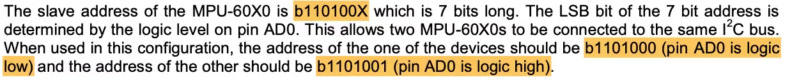
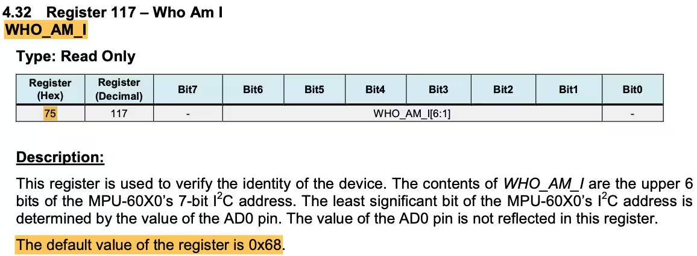
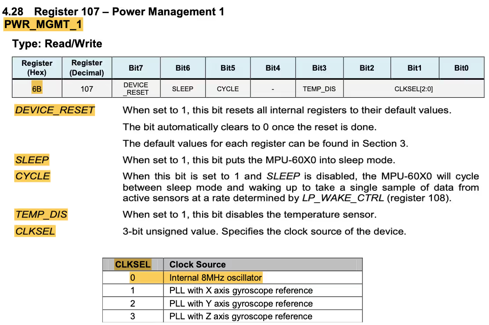
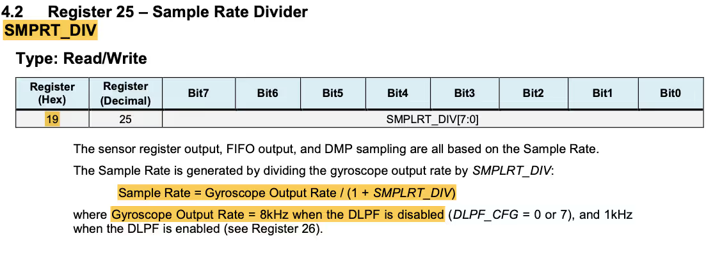
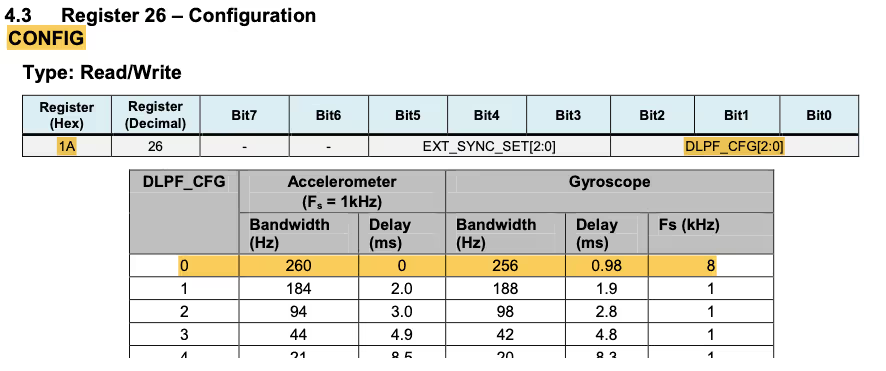
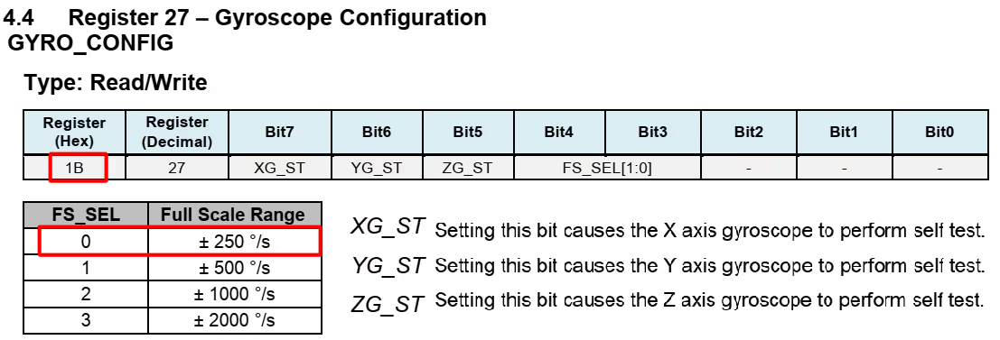
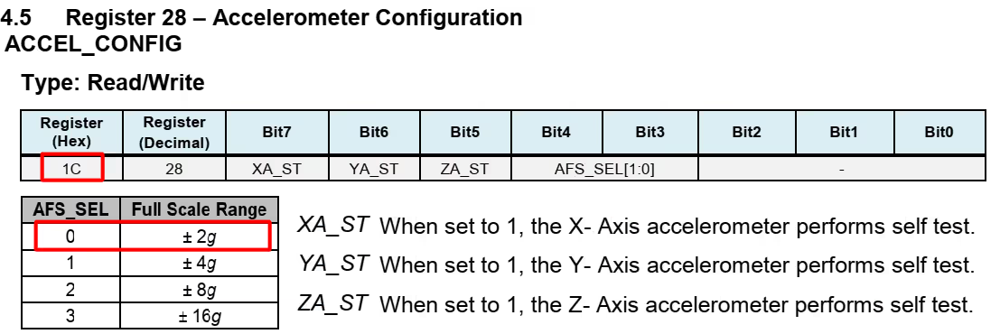
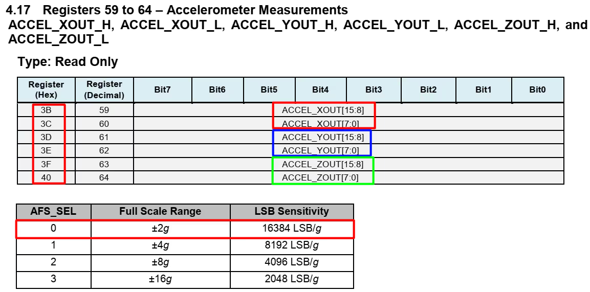
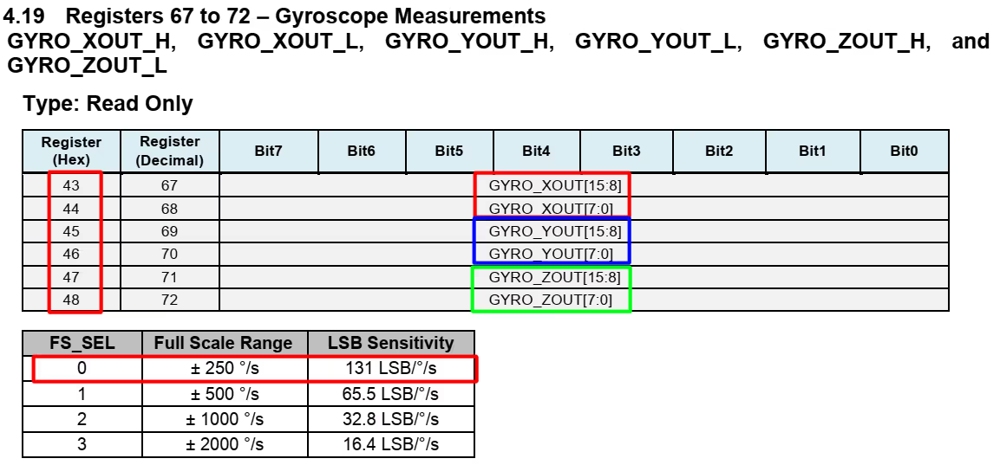

# Bài 6 - I2C

### 1. I2C Software
Bài này sử dụng STM32L476 để giao tiếp với MPU6050 thông qua giao tiếp I2C. Sơ đồ chân kết nối giữa MCU và MPU6050 như sau:
```
STM32L476                MPU6050 (I2C Module)
+-------------+          +-----------------+
|             |          |                 |
|   GPIOB9    +---------->   SDA           |
|   GPIOB8    +---------->   SCL           |
|             |          |                 |
|    GND      +---------->   GND           |
|    VCC      +---------->   VCC           |
+-------------+          +-----------------+
```
I2C là giao thức truyền thông hai chiều và cho phép nhiều thiết bị chia sẻ cùng một bus SDA và SCL. Với cấu hình "open-drain", mỗi thiết bị chỉ kéo đường bus xuống mức thấp (0V) khi cần thiết và để nó "float" (ở trạng thái không kéo xuống mức thấp) trong các trường hợp khác. Do đó, cả hai đường SDA và SCL đều cần pull-up để giữ mức cao khi không có thiết bị nào đang truyền dữ liệu. Nếu các chân GPIO được cấu hình là "push-pull" (push-pull sẽ có cả hai trạng thái cao và thấp), khi hai thiết bị cùng kéo mức điện áp về hai mức khác nhau sẽ dễ gây ra xung đột và hỏng thiết bị. Các điện trở kéo lên (pull-up resistors) sẽ kéo cả hai đường SDA và SCL lên mức logic cao (thường là VCC) khi không có thiết bị nào đang truyền dữ liệu. Các thiết bị sẽ chỉ kéo mức điện áp xuống thấp khi cần.

**Data frame của I2C**
**1. Bắt đầu Khung Dữ liệu (Start Condition)** \
Start Condition: Bắt đầu của mỗi giao dịch trên bus I2C được xác định khi master kéo chân SDA (data line) xuống thấp trong khi SCL (clock line) vẫn ở mức cao. Đây là tín hiệu để báo hiệu bắt đầu một khung truyền dữ liệu mới và giúp đồng bộ các thiết bị I2C trên cùng bus.
**2. Địa chỉ của Slave (Address Byte)**\
- Sau tín hiệu bắt đầu, master sẽ gửi byte địa chỉ (7-bit hoặc 10-bit) của thiết bị slave mà nó muốn giao tiếp.
- 1 bit đọc/ghi (R/W) sẽ đi sau địa chỉ:\
	- 0: Chế độ ghi - master muốn gửi dữ liệu đến slave.\
	- 1: Chế độ đọc - master muốn nhận dữ liệu từ slave.\
- Như vậy, byte địa chỉ luôn gồm 7 (hoặc 10) bit địa chỉ cộng với 1 bit R/W, tổng cộng là 8 bit.
**3. Bit Acknowledge (ACK/NACK)**
- Sau khi nhận byte địa chỉ, thiết bị slave có địa chỉ trùng khớp sẽ phản hồi lại bằng cách kéo chân SDA xuống thấp để gửi ACK (bit xác nhận) khi nhận dữ liệu thành công.
- Nếu không có ACK (thiết bị giữ SDA ở mức cao), master sẽ hiểu rằng không có thiết bị slave nào phản hồi và sẽ dừng hoặc hủy giao dịch.
**4. Byte Dữ liệu (Data Byte)**
- Sau khi master nhận được ACK từ slave, byte dữ liệu đầu tiên sẽ được gửi. Mỗi byte dữ liệu gồm 8 bit và được gửi tuần tự từ bit MSB đến bit LSB.
- Sau mỗi byte dữ liệu, thiết bị nhận (có thể là master hoặc slave, tùy thuộc vào chiều giao tiếp) phải gửi một ACK nếu nhận thành công, hoặc NACK nếu có lỗi trong quá trình nhận dữ liệu hoặc nếu không muốn nhận thêm dữ liệu.
**5. Kết thúc Khung Dữ liệu (Stop Condition)**\
Khi master hoàn tất quá trình truyền dữ liệu, nó sẽ tạo ra Stop Condition bằng cách kéo SDA lên cao trong khi SCL đang ở mức cao. Đây là tín hiệu báo hiệu kết thúc giao dịch I2C trên bus.


#### Cấu hình GPIO
Cấu hình PB6 và PB7 là output với chế độ open-drain và sử dụng chế độ pull-up.
```c
static void MX_GPIO_Init(void)
{
  LL_GPIO_InitTypeDef GPIO_InitStruct = {0};
/* USER CODE BEGIN MX_GPIO_Init_1 */
/* USER CODE END MX_GPIO_Init_1 */

  /* GPIO Ports Clock Enable */
  LL_AHB2_GRP1_EnableClock(LL_AHB2_GRP1_PERIPH_GPIOB);

  /**/
  LL_GPIO_SetOutputPin(GPIOB, LL_GPIO_PIN_8|LL_GPIO_PIN_9);

  /**/
  GPIO_InitStruct.Pin = LL_GPIO_PIN_8|LL_GPIO_PIN_9;
  GPIO_InitStruct.Mode = LL_GPIO_MODE_OUTPUT;
  GPIO_InitStruct.Speed = LL_GPIO_SPEED_FREQ_VERY_HIGH;
  GPIO_InitStruct.OutputType = LL_GPIO_OUTPUT_OPENDRAIN;
  GPIO_InitStruct.Pull = LL_GPIO_PULL_UP;
  LL_GPIO_Init(GPIOB, &GPIO_InitStruct);

/* USER CODE BEGIN MX_GPIO_Init_2 */
/* USER CODE END MX_GPIO_Init_2 */
}
```

#### Cấu hình Timer2
Chúng ta cần tạo delay 1us nên với Internal Clock là 80MHz, Prescaler có thể set thành 8-1 tức là 7. Khi đó, tần số cho mỗi clock tick là:
$${80MHz \over 8}=10MHz$$

Điều này có nghĩa là timer đếm được 10 000 000 tick mỗi giây. Thời gian của mỗi tick sẽ là:
$${1 \over 10MHz}=0.1us$$

Khi đó, với Autoreload bằng 9 có nghĩa là tạo ra 9+1 tick. Với tần số 10 MHz, delay mỗi lần gọi delay_us(1) sẽ là: 
$$Delay=(9+1)×0.1us=1us$$

```c
static void MX_TIM2_Init(void)
{

  /* USER CODE BEGIN TIM2_Init 0 */

  /* USER CODE END TIM2_Init 0 */

  LL_TIM_InitTypeDef TIM_InitStruct = {0};

  /* Peripheral clock enable */
  LL_APB1_GRP1_EnableClock(LL_APB1_GRP1_PERIPH_TIM2);

  /* USER CODE BEGIN TIM2_Init 1 */

  /* USER CODE END TIM2_Init 1 */
  TIM_InitStruct.Prescaler = 7;
  TIM_InitStruct.CounterMode = LL_TIM_COUNTERMODE_UP;
  TIM_InitStruct.Autoreload = 9;
  TIM_InitStruct.ClockDivision = LL_TIM_CLOCKDIVISION_DIV1;
  LL_TIM_Init(TIM2, &TIM_InitStruct);
  LL_TIM_DisableARRPreload(TIM2);
  LL_TIM_SetClockSource(TIM2, LL_TIM_CLOCKSOURCE_INTERNAL);
  LL_TIM_SetTriggerOutput(TIM2, LL_TIM_TRGO_RESET);
  LL_TIM_DisableMasterSlaveMode(TIM2);
  /* USER CODE BEGIN TIM2_Init 2 */
	LL_TIM_EnableCounter(TIM2);
  /* USER CODE END TIM2_Init 2 */

}
```

#### Start và Stop condition của I2C
Đầu tiên, tạo một số macro để tiện set và reset các chân GPIO.
```c
#define WRITE_SDA_0 	LL_GPIO_ResetOutputPin(GPIOB, LL_GPIO_PIN_9)
#define WRITE_SDA_1 	LL_GPIO_SetOutputPin(GPIOB, LL_GPIO_PIN_9)
#define WRITE_SCL_0 	LL_GPIO_ResetOutputPin(GPIOB, LL_GPIO_PIN_8)
#define WRITE_SCL_1 	LL_GPIO_SetOutputPin(GPIOB, LL_GPIO_PIN_8)
#define READ_SDA_VAL 	LL_GPIO_IsInputPinSet(GPIOB, LL_GPIO_PIN_9)
```
Start Condition: Master kéo đường SDA từ mức cao xuống mức thấp trong khi SCL vẫn cao, báo hiệu bắt đầu của quá trình truyền dữ liệu. 
```c
// Bat dau giao tiep I2C
void I2C_Start(void)
{
	WRITE_SCL_1;  	
	//delay_us(5);	
	WRITE_SDA_1;
	delay_us(5);
	WRITE_SDA_0;	//SDA reset to 0 before SCL.
	delay_us(5);
	WRITE_SCL_0;
	//delay_us(5);
}
```
Stop Condition: Master kéo đường SDA từ mức thấp lên mức cao trong khi SCL vẫn cao, báo hiệu kết thúc của quá trình truyền dữ liệu. 
```c
void I2C_Stop(void)
{
	WRITE_SDA_0;
	//delay_us(5);
	WRITE_SCL_1; 	//SCL set to 1 before SDA.
	delay_us(5);
	WRITE_SDA_1;
	//delay_us(5);
}
```

#### Truyền nhận dữ liệu
- Master Phát Địa Chỉ Slave: Sau khi Start Condition, Master gửi địa chỉ 7 bit của Slave lên bus kèm theo một bit đọc/ghi (R/W).
	- Nếu bit R/W là 0, Master yêu cầu ghi (truyền dữ liệu tới Slave).
	- Nếu bit R/W là 1, Master yêu cầu đọc (nhận dữ liệu từ Slave).
- Acknowledge (ACK): Mỗi khi một byte (8 bit) được truyền đi, thiết bị Slave sẽ phản hồi bằng cách kéo đường SDA xuống thấp trong 1 bit thời gian để cho biết nó đã nhận được byte. Đây được gọi là bit ACK.
- Truyền Dữ Liệu:
	- Viết dữ liệu: Master gửi từng byte đến Slave, và Slave sẽ phản hồi lại bằng một bit ACK sau mỗi byte.
	- Đọc dữ liệu: Master đọc từng byte từ Slave, và sau mỗi byte, Master phát lại bit ACK để báo rằng dữ liệu đã được nhận.
- Kết thúc Giao tiếp: Khi quá trình truyền dữ liệu hoàn tất, Master phát Stop Condition để ngắt kết nối với Slave.
```c
// Gui mot byte qua I2C
uint8_t I2C_SendByte(uint8_t u8Data)
{
	uint8_t i;
	uint8_t stRet;
	for(int i=0; i< 8; i++)
	{		//Write byte data.
		if (u8Data & 0x80) 
		{
			WRITE_SDA_1;
		} 
		else 
		{
			WRITE_SDA_0;
		}
		delay_us(3);
		WRITE_SCL_1;
		delay_us(5);
		WRITE_SCL_0;
		delay_us(5);
		u8Data <<= 1;
	}
	WRITE_SDA_1;					
	delay_us(3);
	WRITE_SCL_1;					
	delay_us(3);
	
	if (READ_SDA_VAL) 
	{	
		stRet = E_NOT_OK;				
	} 
	else 
	{
		stRet = E_OK;					
	}

	delay_us(2);
	WRITE_SCL_0;
	delay_us(5);
	
	return stRet;
}
```
```c
// Ham doc 1 byte tu I2C
uint8_t I2C_ReadByte(uint8_t ack)
{
	uint8_t i;						
	uint8_t u8Ret = 0x00;
	WRITE_SDA_1;
	delay_us(3);	
	for (i = 0; i < 8; ++i) 
	{
		u8Ret <<= 1;
		WRITE_SCL_1;
		delay_us(5);
		if (READ_SDA_VAL) 
		{
			u8Ret |= 0x01;
		}
		delay_us(2);
		WRITE_SCL_0;
		delay_us(5);
	}
	if (ack) 
	{	
		WRITE_SDA_0;
	} 
	else 
	{
		WRITE_SDA_1;
	}
	delay_us(3);
	WRITE_SCL_1;
	delay_us(5);
	WRITE_SCL_0;
	delay_us(5);

	return u8Ret;
}
```
### 2. I2C Hardware
Với I2C Hardware, ta chỉ cần khai báo các phần tử trong struct ```LL_I2C_InitTypeDef``` để kích hoạt I2C trong phần cứng của MCU. Dựa theo Reference Manual của STM32L476, chân PB6 và PB7 được nối lần lượt với I2C1_SCL và I2C1_SDA, do đó ta cần khai báo clock cho AHB2 để sử dụng GPIOB và cấu hình ```LL_GPIO_InitTypeDef``` để sử dụng 2 chân này.
```c
  LL_RCC_SetI2CClockSource(LL_RCC_I2C1_CLKSOURCE_PCLK1);

  LL_AHB2_GRP1_EnableClock(LL_AHB2_GRP1_PERIPH_GPIOB);
  /**I2C1 GPIO Configuration
  PB8   ------> I2C1_SCL
  PB9   ------> I2C1_SDA
  */
  GPIO_InitStruct.Pin = LL_GPIO_PIN_8|LL_GPIO_PIN_9;
  GPIO_InitStruct.Mode = LL_GPIO_MODE_ALTERNATE;
  GPIO_InitStruct.Speed = LL_GPIO_SPEED_FREQ_VERY_HIGH;
  GPIO_InitStruct.OutputType = LL_GPIO_OUTPUT_OPENDRAIN;
  GPIO_InitStruct.Pull = LL_GPIO_PULL_UP;
  GPIO_InitStruct.Alternate = LL_GPIO_AF_4;
  LL_GPIO_Init(GPIOB, &GPIO_InitStruct);
```
Trong đó:
- ```GPIO_InitStruct.Mode = LL_GPIO_MODE_ALTERNATE;```: có nghĩa là các chân này sẽ hoạt động ở chế độ chức năng thay thế (alternate function), cho phép chúng thực hiện các chức năng khác ngoài việc chỉ là đầu vào hoặc đầu ra thông thường.
- ```GPIO_InitStruct.Speed = LL_GPIO_SPEED_FREQ_VERY_HIGH;```: cho phép các tín hiệu trên chân GPIO được truyền tải với tốc độ rất cao, điều này là cần thiết cho giao thức I2C.
- ```GPIO_InitStruct.OutputType = LL_GPIO_OUTPUT_OPENDRAIN;```: có nghĩa là chân GPIO sẽ hoạt động như một đầu ra mở (open-drain). Điều này là cần thiết cho giao thức I2C, vì nó cho phép nhiều thiết bị kết nối trên cùng một dây dữ liệu mà không gây ra xung đột. Giao thức I2C cho phép nhiều thiết bị kết nối trên cùng một bus dữ liệu. Khi một thiết bị muốn gửi dữ liệu, nó có thể kéo dây dữ liệu (SDA) xuống mức thấp (logic 0). Tuy nhiên, khi không có thiết bị nào đang gửi dữ liệu, dây dữ liệu cần phải được kéo lên mức cao (logic 1). Chế độ open-drain cho phép nhiều thiết bị cùng chia sẻ một dây mà không gây ra xung đột, vì chỉ có một thiết bị có thể kéo dây xuống mức thấp tại một thời điểm.
- ```GPIO_InitStruct.Alternate = LL_GPIO_AF_4;```: chỉ định chức năng thay thế cho các chân GPIO. LL_GPIO_AF_4 tương ứng với chức năng I2C1 cho các chân PB6 và PB7.

```c
  /* Peripheral clock enable */
  LL_APB1_GRP1_EnableClock(LL_APB1_GRP1_PERIPH_I2C1);

  /* USER CODE BEGIN I2C1_Init 1 */

  /* USER CODE END I2C1_Init 1 */

  /** I2C Initialization
  */
  LL_I2C_EnableAutoEndMode(I2C1);
  LL_I2C_DisableOwnAddress2(I2C1);
  LL_I2C_DisableGeneralCall(I2C1);
  LL_I2C_EnableClockStretching(I2C1);
  I2C_InitStruct.PeripheralMode = LL_I2C_MODE_I2C;
  I2C_InitStruct.Timing = 0x00100D14;
  I2C_InitStruct.AnalogFilter = LL_I2C_ANALOGFILTER_ENABLE;
  I2C_InitStruct.DigitalFilter = 0;
  I2C_InitStruct.OwnAddress1 = 0;
  I2C_InitStruct.TypeAcknowledge = LL_I2C_ACK;
  I2C_InitStruct.OwnAddrSize = LL_I2C_OWNADDRESS1_7BIT;
  LL_I2C_Init(I2C1, &I2C_InitStruct);
  LL_I2C_SetOwnAddress2(I2C1, 0, LL_I2C_OWNADDRESS2_NOMASK);
  /* USER CODE BEGIN I2C1_Init 2 */
	LL_I2C_Enable(I2C1);
  /* USER CODE END I2C1_Init 2 */
```
Sau khi cấu hình xong GPIOB, ta cần khởi tạo I2C để sử dụng I2C trong hardware của MCU.
- ```LL_APB1_GRP1_EnableClock(LL_APB1_GRP1_PERIPH_I2C1);```: kích hoạt clock cho I2C1
- ```LL_I2C_DisableAutoEndMode(I2C1);```: Tắt chế độ tự động kết thúc. Khi chế độ này được bật, I2C sẽ tự động gửi tín hiệu dừng (STOP) sau khi hoàn thành truyền dữ liệu. Tắt chế độ này cho phép chúng ta kiểm soát tốt hơn quá trình truyền.
- ```LL_I2C_DisableOwnAddress2(I2C1);```: Tắt OwnAddress2 của I2C. Địa chỉ này thường được sử dụng cho các thiết bị có thể nhận nhiều địa chỉ. Nếu không cần thiết, ta có thể tắt nó.
- ```LL_I2C_DisableGeneralCall(I2C1);```: Tắt chế độ General Call. Chế độ này cho phép một thiết bị gửi tín hiệu đến tất cả các thiết bị trên bus I2C. Nếu không cần thiết, ta có thể tắt nó.
- ```LL_I2C_EnableClockStretching(I2C1);```: Bật chế độ kéo dài xung nhịp (Clock Stretching). Chế độ này cho phép thiết bị nhận (slave) kéo dài xung nhịp để có thêm thời gian xử lý dữ liệu. Điều này rất hữu ích khi thiết bị nhận cần thêm thời gian để xử lý.
- ```I2C_InitStruct.PeripheralMode = LL_I2C_MODE_I2C;```: Chỉ định chế độ hoạt động của I2C. Ở đây, chế độ được đặt là ```LL_I2C_MODE_I2C```, nghĩa là I2C sẽ hoạt động theo giao thức I2C tiêu chuẩn.
- ```I2C_InitStruct.Timing = 0x00100D14;```: Tham số này cấu hình thời gian cho I2C. Giá trị 0x00100D14 là một giá trị cụ thể cho tốc độ truyền và thời gian trễ giữa các xung nhịp. Giá trị này cần được tính toán dựa trên tần số clock hệ thống và yêu cầu của ứng dụng. Giá trị 0x00100D14 này được tính dựa trên các tham số liên quan đến tốc độ I2C, tần số xung nhịp (clock), và thời gian lên (rise time) và xuống (fall time) của tín hiệu.

Trong STM32, giá trị Timing của I2C được tính toán dựa trên một công thức phức tạp để điều chỉnh thời gian của các xung SCL. Công thức được tóm gọn từ tài liệu RM0351 (Reference Manual của STM32L4), và bao gồm các thành phần sau:

```
I2C_TIMINGR=PRESC | SCLDEL | SDADEL | SCLH | SCLL
```
Các thành phần này được ánh xạ vào thanh ghi I2C_TIMINGR (32-bit) như sau:
- PRESC (4-bit): Bộ chia tiền (prescaler), xác định khoảng thời gian cơ bản cho các xung tín hiệu.
- SCLDEL (4-bit): Khoảng trễ của xung SCL trước khi bắt đầu giao dịch.
- SDADEL (4-bit): Khoảng trễ của xung SDA trước khi bắt đầu nhận/gửi dữ liệu.
- SCLH (8-bit): Thời gian giữ mức cao của xung SCL.
- SCLL (8-bit): Thời gian giữ mức thấp của xung SCL.

Mỗi thành phần này được tính toán dựa trên tần số của xung nhịp I2C, xung nhịp hệ thống, và các thời gian rise/fall (trise và tfall) theo yêu cầu của chuẩn I2C. Các tham số đầu vào trong trường hợp cụ thể:
- Tần số clock của hệ thống (I2CCLK): 4 MHz.
- Tốc độ truyền dữ liệu I2C (I2CSpeed): 100 kHz.
- Thời gian trise: 100 ns.
- Thời gian tfall: 100 ns.

Dựa trên các thông số này, chúng ta có thể ước lượng các giá trị cho các trường PRESC, SCLDEL, SDADEL, SCLH, và SCLL.

PRESC là bộ chia xung, dùng để giảm tần số của clock hệ thống cho phù hợp với các xung I2C. Tần số này cần nhỏ hơn để các xung SCLH và SCLL có thời gian đủ dài. Đối với I2C 100kHz và clock hệ thống là 4MHz, một giá trị hợp lý cho PRESC là 1 (PRESC = 0 do 0-based indexing) để clock sau chia có tần số phù hợp.

SCLL và SCLH lần lượt đại diện cho thời gian giữ mức thấp và mức cao của xung SCL. Cần đảm bảo rằng tổng thời gian của SCLL và SCLH khớp với chu kỳ 100kHz. Với clock hệ thống là 4MHz, mỗi chu kỳ sẽ là
$${1\over4MHz}=250ns$$

Thời gian SCLL cần khoảng một nửa chu kỳ xung cho 100kHz: 5us
$$SCLL={5000ns\over250ns}=20$$

Tương tự, SCLH=20 để đạt tổng chu kỳ SCLL+SCLH=10μs, tương đương với tần số 100kHz.

SDADEL và SCLDEL là các khoảng thời gian trễ, được tính dựa trên trise và tfall (100ns).
- SCLDEL: Đặt khoảng trễ trước khi SCL bắt đầu; thường đặt gấp đôi trise, do đó SCLDEL=4 (1μs).
- SDADEL: Đặt thời gian đủ để SDA ổn định sau khi chuyển trạng thái. Lấy một giá trị vừa đủ cho sự ổn định của tín hiệu, chẳng hạn là SDADEL=13.

Dựa vào các tính toán trên, chúng ta có thể tạo giá trị 32-bit cho I2C_TIMINGR như sau:
- PRESC = 1 (0x1)
- SCLDEL = 4 (0x04)
- SDADEL = 13 (0x0D)
- SCLH = 20 (0x14)
- SCLL = 20 (0x14)

Khi gán các giá trị này vào thanh ghi 32-bit I2C_TIMINGR:
```
TIMINGR=(PRESC<<28)|(SCLDEL<<20)|(SDADEL<<16)|(SCLH<<8)|SCLL
```
```
I2C_TIMINGR=(0x1<<28)|(0x4<<20)|(0xD<<16)|(0x14<<8)|0x14 = 0x00100D14
```

- ```I2C_InitStruct.AnalogFilter = LL_I2C_ANALOGFILTER_ENABLE;```: Bật bộ lọc tương tự (analog filter). Bộ lọc này giúp loại bỏ nhiễu từ tín hiệu I2C.
- ```I2C_InitStruct.DigitalFilter = 0;```: Cấu hình bộ lọc số (digital filter). Ở đây, giá trị được đặt là 0, có nghĩa là không sử dụng bộ lọc số.
- ```I2C_InitStruct.OwnAddress1 = 0;```: Địa chỉ của thiết bị I2C.
- ```I2C_InitStruct.TypeAcknowledge = LL_I2C_ACK;```: Chỉ định kiểu xác nhận. Ở đây, nó được đặt là ```LL_I2C_ACK```, có nghĩa là thiết bị sẽ gửi tín hiệu xác nhận (ACK) khi nhận dữ liệu.
- ```I2C_InitStruct.OwnAddrSize = LL_I2C_OWNADDRESS1_7BIT;```:  Kích thước địa chỉ của thiết bị. Ở đây, nó được đặt là ```LL_I2C_OWNADDRESS1_7BIT```, có nghĩa là địa chỉ sẽ được sử dụng là địa chỉ 7 bit.

Hàm truyền dữ liệu dùng I2C hardware được viết như sau:
```c
uint8_t I2C_WriteByte(uint8_t devAddr, uint8_t regAddr, uint8_t data)
{
    LL_I2C_HandleTransfer(I2C1, devAddr << 1, LL_I2C_ADDRSLAVE_7BIT, 2, LL_I2C_MODE_AUTOEND, LL_I2C_GENERATE_START_WRITE);

    while(!LL_I2C_IsActiveFlag_TXIS(I2C1)); 
    LL_I2C_TransmitData8(I2C1, regAddr);

    while(!LL_I2C_IsActiveFlag_TXIS(I2C1));
    LL_I2C_TransmitData8(I2C1, data);

    while(!LL_I2C_IsActiveFlag_STOP(I2C1));
    LL_I2C_ClearFlag_STOP(I2C1);

    return E_OK;
}
```
Trong đó, tại ```LL_I2C_HandleTransfer``` có các thành phần sau:
- ```devAddr << 1```: Địa chỉ của thiết bị (MPU6050) được dịch sang trái một bit để chuyển từ địa chỉ 7-bit sang 8-bit (bit LSB được sử dụng để chỉ định chế độ đọc/ghi).
- ```LL_I2C_ADDRSLAVE_7BIT```: Chỉ định rằng địa chỉ thiết bị là 7-bit.
- ```2```: Số byte sẽ được gửi (bao gồm địa chỉ thanh ghi và dữ liệu).
- ```LL_I2C_MODE_AUTOEND```: Chế độ tự động kết thúc giao tiếp sau khi gửi xong.
- ```LL_I2C_GENERATE_START_WRITE```: Tạo tín hiệu START để bắt đầu giao tiếp ghi.

```while(!LL_I2C_IsActiveFlag_TXIS(I2C1))```: Vòng lặp while chờ cho đến khi có thể gửi dữ liệu (TXIS flag được thiết lập). TXIS là viết tắt của "Transmit Interrupt Status" trong ngữ cảnh giao tiếp I2C. Cờ này được thiết lập khi bộ truyền dữ liệu (transmitter) đã sẵn sàng để nhận dữ liệu mới để gửi đi. Khi TXIS được thiết lập, điều này có nghĩa là bạn có thể gửi một byte dữ liệu mới mà không gặp phải tình trạng tràn bộ đệm (buffer overflow).
```LL_I2C_TransmitData8(I2C1, regAddr)```: Gửi địa chỉ thanh ghi mà bạn muốn ghi dữ liệu vào.
```c
while(!LL_I2C_IsActiveFlag_STOP(I2C1));
LL_I2C_ClearFlag_STOP(I2C1);
```
Chờ cho đến khi tín hiệu STOP được thiết lập, sau đó xóa cờ STOP để chuẩn bị cho giao tiếp tiếp theo.

Hàm nhận dữ liệu trên I2C hardware được viết như sau:
```c
uint8_t I2C_ReadByte(uint8_t devAddr, uint8_t regAddr, uint8_t *data)
{
    
    LL_I2C_HandleTransfer(I2C1, devAddr << 1, LL_I2C_ADDRSLAVE_7BIT, 1, LL_I2C_MODE_SOFTEND, LL_I2C_GENERATE_START_WRITE);
    while(!LL_I2C_IsActiveFlag_TXIS(I2C1));
    LL_I2C_TransmitData8(I2C1, regAddr);

    LL_I2C_HandleTransfer(I2C1, devAddr << 1, LL_I2C_ADDRSLAVE_7BIT, 1, LL_I2C_MODE_AUTOEND, LL_I2C_GENERATE_START_READ);
    while(!LL_I2C_IsActiveFlag_RXNE(I2C1));
    *data = LL_I2C_ReceiveData8(I2C1);

    while(!LL_I2C_IsActiveFlag_STOP(I2C1));
    LL_I2C_ClearFlag_STOP(I2C1);

    return E_OK;
}
```
- ```LL_I2C_MODE_SOFTEND```: Chế độ kết thúc mềm, cho phép bạn kiểm soát khi nào giao tiếp sẽ kết thúc.
- ```while(!LL_I2C_IsActiveFlag_RXNE(I2C1))```: Vòng lặp này sẽ tiếp tục chạy cho đến khi cờ RXNE được thiết lập, nghĩa là có dữ liệu mới sẵn sàng để đọc.
- ```*data = LL_I2C_ReceiveData8(I2C1)```: Đọc byte dữ liệu từ thiết bị và lưu vào biến data mà bạn đã truyền vào hàm

### 3. Giao tiếp với MPU6050
Địa chỉ 7 bit của MPU6050 là b110100X. Ở đây giá trị của X phụ thuộc vào chân AD0. Chân này có sẵn trên mạch của cảm biến và vì chúng ta không dùng đến nó, chân này có thể được coi là Logic LOW. Điều này có nghĩa là Địa chỉ Slave 7 bit của thiết bị là 0x68. Nhưng chúng ta cần cung cấp địa chỉ 8 bit cho STM32 I2C, do đó chúng ta sẽ dịch chuyển địa chỉ 7 bit này sang trái 1 vị trí, 0x68<<1 = 0xD0.



Để khởi tạo cảm biến, trước tiên chúng ta sẽ kiểm tra xem cảm biến có phản hồi không bằng cách đọc Register “WHO_AM_I (0x75)”. Nếu cảm biến phản hồi bằng 0x68, điều đó có nghĩa là cảm biến đã sẵn sàng và có thể sử dụng.



Với code I2c software, ta có thể làm như sau:
```c
uint8_t MPU6050_Init (void)
{
	I2C_Start();
	
	if (I2C_SendByte(MPU6050_ADDR) == E_NOT_OK)
	{
		I2C_Stop();
		return E_NOT_OK;
	}
	
	if (I2C_SendByte(WHO_AM_I) == E_NOT_OK)
	{
		I2C_Stop();
		return E_NOT_OK;
	}
	
	I2C_Start();
    
  if (I2C_SendByte(MPU6050_ADDR | 0x01) == E_NOT_OK) // G?i d?a ch? v?i bit d?c.
  {
    I2C_Stop();
    return E_NOT_OK;
  }

	
	iAm = I2C_ReadByte(NACK);
	I2C_Stop();
	if (iAm != I_AM)
	{
			
		return E_NOT_OK;
	}
	
	return E_OK;
}
```
- Hàm ```I2C_Start()``` được gọi để bắt đầu một giao tiếp I2C. Điều này sẽ tạo ra một tín hiệu START trên bus I2C, cho phép vi điều khiển bắt đầu gửi dữ liệu đến thiết bị I2C.
- ```I2C_SendByte(MPU6050_ADDR)``` gửi địa chỉ của MPU6050 (được định nghĩa trước đó). Nếu việc gửi địa chỉ không thành công (trả về E_NOT_OK), hàm sẽ gọi ```I2C_Stop()``` để kết thúc giao tiếp và trả về E_NOT_OK.
- Tiếp theo, hàm gửi địa chỉ của thanh ghi WHO_AM_I để yêu cầu thông tin về cảm biến. Nếu không thành công, nó cũng sẽ dừng giao tiếp và trả về E_NOT_OK.
- Một lần nữa, hàm ```I2C_Start()``` được gọi để bắt đầu một giao tiếp I2C mới. Điều này cần thiết vì sau khi gửi dữ liệu, chúng ta cần bắt đầu một giao tiếp mới để đọc dữ liệu từ cảm biến.
- Ở đây, địa chỉ của MPU6050 được gửi với bit đọc (bit LSB được đặt thành 1). Điều này cho phép vi điều khiển biết rằng nó muốn đọc dữ liệu từ cảm biến. Nếu không thành công, hàm sẽ dừng giao tiếp và trả về E_NOT_OK.
- Hàm ```I2C_ReadByte(NACK)``` được gọi để đọc dữ liệu từ thanh ghi WHO_AM_I. Tham số NACK cho biết rằng sau khi đọc byte này, vi điều khiển sẽ không gửi tín hiệu ACK (Acknowledgment) để thông báo rằng nó không muốn đọc thêm byte nào nữa.
- Sau khi đọc xong, hàm ```I2C_Stop()``` được gọi để kết thúc giao tiếp I2C.

Tiếp theo, chúng ta cần cấu hình “PWR_MGMT_1 (0x6B)” Register:



Chúng ta sẽ đặt lại thanh ghi này về 0. Khi thực hiện như vậy, chúng ta sẽ:
- Chọn nguồn xung nhịp bên trong là 8 MHz.
- Cảm biến nhiệt độ sẽ được bật.
- CHU KỲ giữa chế độ ngủ và chế độ thức dậy sẽ được bật.
- Chế độ SLEEP sẽ bị tắt.
- Ngoài ra, chúng ta không thực hiện RESET.

Tiếp theo, chúng ta phải thiết lập Data output Rate hoặc Sample Rate. Điều này có thể được thực hiện bằng cách ghi vào Thanh ghi “SMPLRT_DIV (0x19)”. Thanh ghi này chỉ định bộ chia từ Data output Rate con quay hồi chuyển được sử dụng để tạo Sample Rate cho MPU6050.



Theo công thức:
$$Sample Rate = {Gyroscope Output Rate \over {(1 + SMPLRT\_DIV)}}$$

Chúng ta sẽ giữ DLPF ở trạng thái vô hiệu hóa, do đó Gyroscope Output Rate của con quay hồi chuyển sẽ vẫn là 8KHz. Để có được tỷ lệ mẫu là 1KHz, chúng ta sẽ đặt giá trị SMPLRT_DIV thành 7.

Có thể sử dụng thanh ghi “CONFIG (0x1A)” để cấu hình DLPF. Vì thanh ghi này được đặt lại về 0 theo mặc định, DLPF bị vô hiệu hóa và tốc độ đầu ra của con quay hồi chuyển được đặt thành 8KHz.



Bây giờ chúng ta sẽ cấu hình các thanh ghi Gia tốc kế và Con quay hồi chuyển bằng cách sửa đổi các thanh ghi “GYRO_CONFIG (0x1B)” và “ACCEL_CONFIG (0x1C)”.





Ghi (0x00) vào cả hai thanh ghi này sẽ đặt Full scale range là ± 2g trong ACCEL_CONFIG Register và Full scale range là ± 250 °/giây trong GYRO_CONFIG Register cùng với việc vô hiệu hóa Tự kiểm tra.

**Config MPU6050 với I2C Software**
```c
uint8_t MPU6050_Config (void)
{
	I2C_Start();
	if (I2C_SendByte(MPU6050_ADDR) == E_NOT_OK)
	{
		I2C_Stop();
		return E_NOT_OK;
	}
	
	if (I2C_SendByte(PWR_MGMT_1) == E_NOT_OK)
	{
		I2C_Stop();
		return E_NOT_OK;
	}
	
	if (I2C_SendByte(0x00) == E_NOT_OK) 
	{
      I2C_Stop();
      return E_NOT_OK;
  }
	
	if (I2C_SendByte(SMPLRT_DIV) == E_NOT_OK)
	{
		I2C_Stop();
		return E_NOT_OK;
	}
	
	if (I2C_SendByte(0x00) == E_NOT_OK) 
	{
      I2C_Stop();
      return E_NOT_OK;
  }
	
	if (I2C_SendByte(CONFIG) == E_NOT_OK)
	{
		I2C_Stop();
		return E_NOT_OK;
	}
	
	if (I2C_SendByte(0x00) == E_NOT_OK) 
	{
      I2C_Stop();
      return E_NOT_OK;
  }
	
	if (I2C_SendByte(ACCEL_CONFIG) == E_NOT_OK)
	{
		I2C_Stop();
		return E_NOT_OK;
	}
	
	if (I2C_SendByte(0x00) == E_NOT_OK) 
	{ // ±2g
      I2C_Stop();
      return E_NOT_OK; 
	}
	
	if (I2C_SendByte(GYRO_CONFIG) == E_NOT_OK)
	{
		I2C_Stop();
		return E_NOT_OK;
	}
	
	if (I2C_SendByte(0x08) == E_NOT_OK) 
	{ // ±250°/s
      I2C_Stop();
      return E_NOT_OK;
  }
	
	I2C_Stop();
	return E_OK;
}
```

**Config và Init MPU6050 với I2C Hardware**
```c
uint8_t MPU6050_Init(void)
{
    uint8_t check;
    if (I2C_ReadByte(MPU6050_ADDR, WHO_AM_I, &check) != E_OK || check != I_AM)
    {
        return E_NOT_OK;
    }
    else
    {
        I2C_WriteByte(MPU6050_ADDR, PWR_MGMT_1, 0x00);
		I2C_WriteByte(MPU6050_ADDR, SMPLRT_DIV, 0x00);
		I2C_WriteByte(MPU6050_ADDR, CONFIG, 0x00);
        I2C_WriteByte(MPU6050_ADDR, ACCEL_CONFIG, 0x00);
        I2C_WriteByte(MPU6050_ADDR, GYRO_CONFIG, 0x00);
    }
		return E_OK;
}
```

Chúng ta có thể đọc 1 BYTE từ mỗi thanh ghi riêng biệt hoặc chỉ đọc tất cả 6 BYTE cùng một lúc, tất cả cùng nhau bắt đầu từ thanh ghi ACCEL_XOUT_H(0x3B).



Ở đây chúng ta đang đọc 6 byte dữ liệu, bắt đầu từ thanh ghi 0x3B. Các giá trị này sẽ được lưu trữ trong bộ đệm Rec_Data. Thanh ghi ACCEL_XOUT_H (0x3B) lưu trữ Byte cao hơn cho dữ liệu gia tốc dọc theo Trục X và Byte thấp hơn được lưu trữ trong Thanh ghi ACCEL_XOUT_L. Vì vậy, chúng ta cần kết hợp 2 BYTE này thành một giá trị số nguyên 16 bit. Dưới đây là quy trình để thực hiện điều đó:-

```c
ACCEL_X = (ACCEL_XOUT_H <<8) | ACCEL_XOUT_L
```

Chúng ta đang dịch chuyển 8 bit cao hơn sang bên trái và sau đó cộng kết quả với 8 bit thấp hơn. Tương tự, chúng ta có thể làm tương tự đối với Thanh ghi ACCEL_YOUT và ACCEL_ZOUT. Những giá trị này vẫn sẽ là giá trị RAW và chúng ta vẫn cần phải chuyển đổi chúng sang định dạng ‘g’ thích hợp. Bạn có thể thấy trong hình trên rằng đối với phạm vi Full-Scale là ± 2g, độ nhạy là 16384 LSB/g. Vì vậy, để có được giá trị ‘g‘, chúng ta cần phải chia RAW cho 16384.



Đọc dữ liệu Gyro tương tự như đọc dữ liệu Acceleration. Chúng ta sẽ bắt đầu đọc 6 BYTES dữ liệu bắt đầu từ thanh ghi GYRO_XOUT_H(0x43). Sau đó kết hợp 2 Byte để có được giá trị RAW nguyên 16 bit. Vì chúng tôi đã chọn phạm vi toàn thang đo là ± 250 °/s, trong đó độ nhạy là 131 LSB /°/s, nên chúng ta phải chia các giá trị RAW cho 131,0 để có được các giá trị tính theo dps (°/s).

**Hàm đọc dữ liệu dùng I2C Software**
```c
AllData MPU6050_ReadAll(void)
{
    AllData allData = {0};
    
    // Start communication
    I2C_Start();
    
    // Send device address with write flag
    if (I2C_SendByte(MPU6050_ADDR | 0x00) == E_NOT_OK) {
        I2C_Stop();
        return allData; // Return zeroed data on error
    }
    
    // Send register address to start from GYRO_XOUT_H
    if (I2C_SendByte(ACCEL_XOUT_H) == E_NOT_OK) {
        I2C_Stop();
        return allData; // Return zeroed data on error
    }
    
    // Repeat Start to switch to read mode
    I2C_Start();
    
    // Send device address with read flag
    if (I2C_SendByte(MPU6050_ADDR | 0x01) == E_NOT_OK) {
        I2C_Stop();
        return allData; // Return zeroed data on error
    }
    
    // Read high and low bytes for each axis
    uint8_t accelX_H = I2C_ReadByte(ACK);
    uint8_t accelX_L = I2C_ReadByte(ACK);
    uint8_t accelY_H = I2C_ReadByte(ACK);
    uint8_t accelY_L = I2C_ReadByte(ACK);
    uint8_t accelZ_H = I2C_ReadByte(ACK);
    uint8_t accelZ_L = I2C_ReadByte(ACK);
	uint8_t temp = I2C_ReadByte(ACK);
	uint8_t gyroX_H = I2C_ReadByte(ACK);
    uint8_t gyroX_L = I2C_ReadByte(ACK);
    uint8_t gyroY_H = I2C_ReadByte(ACK);
    uint8_t gyroY_L = I2C_ReadByte(ACK);
    uint8_t gyroZ_H = I2C_ReadByte(ACK);
    uint8_t gyroZ_L = I2C_ReadByte(NACK); // Last byte should be NACK

    // Stop communication
    I2C_Stop();
    
    // Combine high and low bytes to form the 16-bit gyro data for each axis
    allData.ax = (int16_t)((accelX_H << 8) | accelX_L);
    allData.ay = (int16_t)((accelY_H << 8) | accelY_L);
    allData.az = (int16_t)((accelZ_H << 8) | accelZ_L);
	allData.temp = temp;
	allData.gx = (int16_t)((gyroX_H << 8) | gyroX_L);
    allData.gy = (int16_t)((gyroY_H << 8) | gyroY_L);
    allData.gz = (int16_t)((gyroZ_H << 8) | gyroZ_L);
		
	Ax = (float)allData.ax/16384.0;
	Ay = (float)allData.ay/16384.0;
	Az = (float)allData.az/16384.0;
	temperature = (float)((float)((int16_t)allData.temp) / (float)340.0 + (float)36.53);
	Gx = (float)allData.gx/131.0;
	Gy = (float)allData.gy/131.0;
	Gz = (float)allData.gz/131.0;
    
    return allData;
}
```

**Hàm đọc dữ liệu dùng I2C Hardware**
```c 
void MPU6050_ReadAccel(int16_t* accelX, int16_t* accelY, int16_t* accelZ)
{
    uint8_t high, low;

    // Doc Accel X
    I2C_ReadByte(MPU6050_ADDR, ACCEL_XOUT_H, &high);
    I2C_ReadByte(MPU6050_ADDR, ACCEL_XOUT_H + 1, &low);
    *accelX = (int16_t)(high << 8 | low);

    // Doc Accel Y
    I2C_ReadByte(MPU6050_ADDR, ACCEL_XOUT_H + 2, &high);
    I2C_ReadByte(MPU6050_ADDR, ACCEL_XOUT_H + 3, &low);
    *accelY = (int16_t)(high << 8 | low);

    // Doc Accel Z
    I2C_ReadByte(MPU6050_ADDR, ACCEL_XOUT_H + 4, &high);
    I2C_ReadByte(MPU6050_ADDR, ACCEL_XOUT_H + 5, &low);
    *accelZ = (int16_t)(high << 8 | low);
	
	Ax = (float)(*accelX)/16384.0;
	Ay = (float)(*accelY)/16384.0;
	Az = (float)(*accelZ)/16384.0;
}

void MPU6050_ReadGyro(int16_t* gyroX, int16_t* gyroY, int16_t* gyroZ)
{
    uint8_t high, low;

    // Doc Gyro X
    I2C_ReadByte(MPU6050_ADDR, GYRO_XOUT_H, &high);
    I2C_ReadByte(MPU6050_ADDR, GYRO_XOUT_H + 1, &low);
    *gyroX = (int16_t)(high << 8 | low);

    // Doc Gyro Y
    I2C_ReadByte(MPU6050_ADDR, GYRO_XOUT_H + 2, &high);
    I2C_ReadByte(MPU6050_ADDR, GYRO_XOUT_H + 3, &low);
    *gyroY = (int16_t)(high << 8 | low);

    // Doc Gyro Z
    I2C_ReadByte(MPU6050_ADDR, GYRO_XOUT_H + 4, &high);
    I2C_ReadByte(MPU6050_ADDR, GYRO_XOUT_H + 5, &low);
    *gyroZ = (int16_t)(high << 8 | low);
	
	Gx = (float)(*gyroX)/131.0;
	Gy = (float)(*gyroY)/131.0;
	Gz = (float)(*gyroZ)/131.0;
}
```
