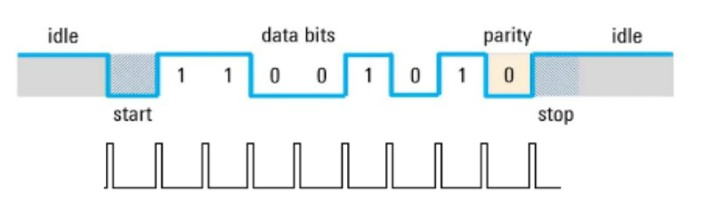
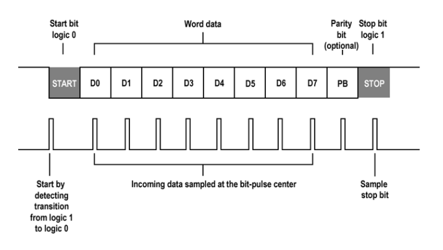
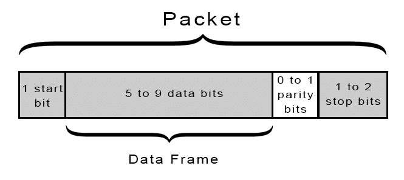

# Bài 7 - UART

Ở bài này chúng ta sử dụng STM32L476 để giao tiếp với ESP32 thông qua UART. 
```
STM32L476                      ESP32
+-------------------+          +----------------------+
|                   |          |                      |
| GPIOA0 (UART4-TX) +---------->   Pin 21 (UART-RX)   |
| GPIOA1 (UART4-RX) <----------+   Pin 19 (UART-TX)   |
|                   |          |                      |
|    GND            +----------+   GND                |
|                   |          |                      |
+-------------------+          +----------------------+
```

### 1. UART Software
Cấu hình UART software trên STM32L476, ta chỉ sử dụng GPIO, do đó ta cấu hình chân TX tức PA0 là output và RX tức chân PA1 là input
```c
static void MX_GPIO_Init(void)
{
  LL_GPIO_InitTypeDef GPIO_InitStruct = {0};
/* USER CODE BEGIN MX_GPIO_Init_1 */
/* USER CODE END MX_GPIO_Init_1 */

  /* GPIO Ports Clock Enable */
  LL_AHB2_GRP1_EnableClock(LL_AHB2_GRP1_PERIPH_GPIOA);

  /**/
  LL_GPIO_SetOutputPin(GPIOA, LL_GPIO_PIN_0);

  /**/
  GPIO_InitStruct.Pin = LL_GPIO_PIN_0;
  GPIO_InitStruct.Mode = LL_GPIO_MODE_OUTPUT;
  GPIO_InitStruct.Speed = LL_GPIO_SPEED_FREQ_VERY_HIGH;
  GPIO_InitStruct.OutputType = LL_GPIO_OUTPUT_PUSHPULL;
  GPIO_InitStruct.Pull = LL_GPIO_PULL_NO;
  LL_GPIO_Init(GPIOA, &GPIO_InitStruct);

  /**/
  GPIO_InitStruct.Pin = LL_GPIO_PIN_1;
  GPIO_InitStruct.Mode = LL_GPIO_MODE_INPUT;
  GPIO_InitStruct.Pull = LL_GPIO_PULL_NO;
  LL_GPIO_Init(GPIOA, &GPIO_InitStruct);

/* USER CODE BEGIN MX_GPIO_Init_2 */
/* USER CODE END MX_GPIO_Init_2 */
}
```
Để mô phỏng UART, ta cần tạo hàm delay để mô phỏng baudrate (tức số bit truyền được trong 1s). Ví dụ với baudrate là 9600, tức là ta cần gửi 9600 bit trong 1s. Trong bài này ta cần tạo delay giữa mỗi bit cần gửi để tạo thành 1 byte, tức là:
$${1000000us \over 9600} = 104us$$

Ta cấu hình tần số cho STM32L476 là 80MHz, ở đây với Prescaler là 79 và Autoreload là 0xFFFF, xung clock cấp cho TIM2 là 80MHz, ta có:
$$f_{timer}={80MHz \over (79+1)}=1MHz$$

Vậy tần số đếm của TIM2 sẽ là 1 MHz, nghĩa là mỗi lần đếm của TIM2 sẽ mất 1 µs. Điều này có nghĩa là timer đếm được 1 000 000 tick mỗi giây. Thời gian của mỗi tick sẽ là:
$${1 \over 1MHz}=1us$$

Khi đó, timer sẽ dựa vào hàm delay để đếm số tick do người dùng nhập vào, nếu đã đủ số tick cần thiết, tức là thời gian delay us cần thiết, thì sẽ dừng timer.
```c
void delay_us(uint32_t timeDelay)
{
    // Dat lai gia tri timer ve 0
    LL_TIM_SetCounter(TIM2, 0);

    // Doi cho den khi dem den delay (tinh bang microsecond)
    while (LL_TIM_GetCounter(TIM2) < timeDelay);
}
```

```c
static void MX_GPIO_Init(void)
{
  LL_GPIO_InitTypeDef GPIO_InitStruct = {0};
/* USER CODE BEGIN MX_GPIO_Init_1 */
/* USER CODE END MX_GPIO_Init_1 */

  /* GPIO Ports Clock Enable */
  LL_AHB2_GRP1_EnableClock(LL_AHB2_GRP1_PERIPH_GPIOA);

  /**/
  LL_GPIO_SetOutputPin(GPIOA, LL_GPIO_PIN_0);

  /**/
  GPIO_InitStruct.Pin = LL_GPIO_PIN_0;
  GPIO_InitStruct.Mode = LL_GPIO_MODE_OUTPUT;
  GPIO_InitStruct.Speed = LL_GPIO_SPEED_FREQ_VERY_HIGH;
  GPIO_InitStruct.OutputType = LL_GPIO_OUTPUT_PUSHPULL;
  GPIO_InitStruct.Pull = LL_GPIO_PULL_NO;
  LL_GPIO_Init(GPIOA, &GPIO_InitStruct);

  /**/
  GPIO_InitStruct.Pin = LL_GPIO_PIN_1;
  GPIO_InitStruct.Mode = LL_GPIO_MODE_INPUT;
  GPIO_InitStruct.Pull = LL_GPIO_PULL_NO;
  LL_GPIO_Init(GPIOA, &GPIO_InitStruct);

/* USER CODE BEGIN MX_GPIO_Init_2 */
/* USER CODE END MX_GPIO_Init_2 */
}
```

Hàm truyền sẽ truyền lần lượt 8 bit trong byte dữ liệu, sau khi tín hiệu start được gửi đi.
- Tạo start, delay 1 period time.
  - Truyền bit dữ liệu. mỗi bit truyền trong 1 period time.
  - Dịch 1 bit.
- Tạo stop, delay tương ứng với số bit stop.



```c
void UART_SendChar(uint8_t ch)
{
    // G?i Start Bit (th?p)
    LL_GPIO_ResetOutputPin(UART_GPIO_PORT, UART_TX_PIN);
    delay_us(BAUD_RATE_DELAY);
		//test = ch;
    // G?i t?ng bit (LSB tru?c)
    for (uint8_t i = 0; i < 8; i++)
    {
        if (ch & (1 << i))
        {
            LL_GPIO_SetOutputPin(UART_GPIO_PORT, UART_TX_PIN); // Bit 1
        }
        else
        {
            LL_GPIO_ResetOutputPin(UART_GPIO_PORT, UART_TX_PIN); // Bit 0
        }
        delay_us(BAUD_RATE_DELAY);
    }

    // G?i Stop Bit (cao)
    LL_GPIO_SetOutputPin(UART_GPIO_PORT, UART_TX_PIN);
    delay_us(BAUD_RATE_DELAY);
}
```

Hàm nhận sẽ nhận lần lượt 8 bit 
- Chờ tín hiệu start từ thiết bị gửi.
- Delay 1,5 period time.
  - Đọc data trên RX, ghi vào biến.
  - Dịch 1 bit.
  - Delay 1 period time.
- Delay 1 period time và đợi stop bit.



```c
uint8_t UART_ReceiveChar(void)
{
    char receivedChar = 0;

    // Ch? Start Bit
    while (LL_GPIO_IsInputPinSet(UART_GPIO_PORT, UART_RX_PIN));

    // Delay d? v?o gi?a Start Bit
    delay_us(BAUD_RATE_DELAY + BAUD_RATE_DELAY/ 2);

    // ??c t?ng bit (LSB tru?c)
    for (uint8_t i = 0; i < 8; i++)
    {
        if (LL_GPIO_IsInputPinSet(UART_GPIO_PORT, UART_RX_PIN))
        {
            receivedChar |= (1 << i); // Set bit n?u RX ? m?c cao
        }
				delay_us(BAUD_RATE_DELAY); // Delay gi?a c?c bit
    }

    // Ch? Stop Bit
    delay_us(BAUD_RATE_DELAY/2);
		if (!LL_GPIO_IsInputPinSet(UART_GPIO_PORT, UART_RX_PIN))
    {
        // N?u Stop Bit không ? m?c cao, có th? d? li?u b? l?i
        return 0; // Ho?c x? lý l?i tùy ch?n
    }
    return receivedChar;
}
```
Bit chẵn/lẻ được thêm vào cuối data. Tùy vào cấu hình parity là chẵn hay lẻ mà thiết bị truyền có thể thêm bit parity là 0 hoặc 1. Phía nhận cấu hình parity giống như phía truyền, sau khi nhận đủ các bit sẽ kiểm tra parity có đúng hay không. Có hai loại kiểm tra chẵn lẻ thường dùng trong UART: Even Parity (chẵn) và Odd Parity (lẻ).
- Even Parity: Parity bit sẽ được thiết lập sao cho tổng số bit 1 (bao gồm cả các bit dữ liệu và parity bit) là một số chẵn.
  - Ví dụ: Nếu dữ liệu là 1010101 (3 bit 1), thì parity bit sẽ là 1 để tổng số bit 1 là 4 (số chẵn).
- Odd Parity: Parity bit sẽ được thiết lập sao cho tổng số bit 1 là một số lẻ.
  - Ví dụ: Nếu dữ liệu là 1010101 (3 bit 1), thì parity bit sẽ là 0 để tổng số bit 1 là 3 (số lẻ).



```c
uint16_t Parity_Generate(uint8_t data, Parity_Mode Mode)
{
	uint8_t count = 0;
	uint8_t data1 = data;
	for(int i = 0; i < 8; i++)
	{
		if(data1 & 0x01)
		{
			count++;
		}
		data1 >>= 1;
	}
	switch(Mode)
	{
		case Parity_Mode_NONE:
			return data; 
			break;
		case Parity_Mode_ODD:
			if((count % 2)==0)
			{
				return ((data << 1) | 1);
			} 
			else 
			{
				return (data<<1);
			}
			break;
		case Parity_Mode_EVEN:
			if((count % 2)!=0)
			{
				return ((data << 1) | 1);
			} else {
				return (data << 1);
			}
			break;
		default:
			return data;
			break;
	}
}

uint8_t Parity_Check(uint8_t data, uint8_t receivedParityBit, Parity_Mode mode) 
{
    uint8_t count = 0;
    
    for (uint8_t i = 0; i < 8; i++) {
        if (data & (1 << i)) {
            count++;
        }
    }

    count += receivedParityBit;

    // Ki?m tra theo ch? d? parity
    switch (mode) {
        case Parity_Mode_NONE:
            return 1; 
        
        case Parity_Mode_ODD:
            if (count % 2 == 0) {
                return 0;  
            }
            return 1; 

        case Parity_Mode_EVEN:
            if (count % 2 != 0) {
                return 0;  
            }
            return 1;  

        default:
            return 0; 
    }
}
```

Với việc sử dụng Parity bit thì chúng ta cần sửa hàm truyền và hàm nhận để thêm parity bit trước khi truyền và kiểm tra parity bit khi nhận được data
```c
void UART_SendChar_WithParity(uint8_t ch, Parity_Mode parityMode) 
{
    uint16_t dataWithParity = Parity_Generate(ch, parityMode);
    
    LL_GPIO_ResetOutputPin(UART_GPIO_PORT, UART_TX_PIN);
    delay_us(BAUD_RATE_DELAY);

    
    for (uint8_t i = 0; i < 8; i++) {  
        if ((dataWithParity>>1) & (1 << i)) {
            LL_GPIO_SetOutputPin(UART_GPIO_PORT, UART_TX_PIN);  // Bit 1
        } else {
            LL_GPIO_ResetOutputPin(UART_GPIO_PORT, UART_TX_PIN);  // Bit 0
        }
        delay_us(BAUD_RATE_DELAY);
    }

    uint8_t parityBit = dataWithParity & 0x01;
    if (parityBit) {
        LL_GPIO_SetOutputPin(UART_GPIO_PORT, UART_TX_PIN);  // Bit parity = 1
    } else {
        LL_GPIO_ResetOutputPin(UART_GPIO_PORT, UART_TX_PIN);  // Bit parity = 0
    }
    delay_us(BAUD_RATE_DELAY);

    // G?i Stop Bit (m?c cao)
    LL_GPIO_SetOutputPin(UART_GPIO_PORT, UART_TX_PIN);
    delay_us(BAUD_RATE_DELAY);
}
void UART_SendString_WithParity(char *str, Parity_Mode parityMode) 
{
    while (*str) 
		{
        UART_SendChar_WithParity(*str++, parityMode);
    }
}

uint8_t UART_ReceiveChar_WithParity(Parity_Mode parityMode) 
{
    uint8_t receivedChar = 0;
    uint8_t parityBit = 0;

    while (LL_GPIO_IsInputPinSet(UART_GPIO_PORT, UART_RX_PIN));

    delay_us(BAUD_RATE_DELAY + BAUD_RATE_DELAY / 2);

    for (uint8_t i = 0; i < 8; i++) {
        if (LL_GPIO_IsInputPinSet(UART_GPIO_PORT, UART_RX_PIN))
				{
            receivedChar |= (1 << i); 
        }
        delay_us(BAUD_RATE_DELAY); 
    }

    // Ð?c bit parity
    parityBit = LL_GPIO_IsInputPinSet(UART_GPIO_PORT, UART_RX_PIN) ? 1 : 0;

    // Ki?m tra Stop Bit
    delay_us(BAUD_RATE_DELAY);
    if (!LL_GPIO_IsInputPinSet(UART_GPIO_PORT, UART_RX_PIN)) 
		{
        return 0;
    }

    // Ki?m tra parity
    if (Parity_Check(receivedChar, parityBit, parityMode) != 1) 
		{
        return 0;
    }

    return receivedChar;
}

void UART_ReceiveString_WithParity(char *buffer, uint8_t maxLength, Parity_Mode parityMode) 
{
    uint8_t index = 0;
    uint8_t receivedChar;

    do {
        receivedChar = UART_ReceiveChar_WithParity(parityMode);
        buffer[index++] = receivedChar;
    } while (receivedChar != '\n' && index < maxLength - 1);  

    buffer[index] = '\0'; 
}
```

### 2. UART Hardware
Cấu hình UART4 trên STM32L476 được thực hiện như sau:
```c
static void MX_UART4_Init(void)
{

  /* USER CODE BEGIN UART4_Init 0 */

  /* USER CODE END UART4_Init 0 */

  LL_USART_InitTypeDef UART_InitStruct = {0};

  LL_GPIO_InitTypeDef GPIO_InitStruct = {0};

  LL_RCC_SetUARTClockSource(LL_RCC_UART4_CLKSOURCE_PCLK1);

  /* Peripheral clock enable */
  LL_APB1_GRP1_EnableClock(LL_APB1_GRP1_PERIPH_UART4);

  LL_AHB2_GRP1_EnableClock(LL_AHB2_GRP1_PERIPH_GPIOA);
  /**UART4 GPIO Configuration
  PA0   ------> UART4_TX
  PA1   ------> UART4_RX
  */
  GPIO_InitStruct.Pin = LL_GPIO_PIN_0|LL_GPIO_PIN_1;
  GPIO_InitStruct.Mode = LL_GPIO_MODE_ALTERNATE;
  GPIO_InitStruct.Speed = LL_GPIO_SPEED_FREQ_VERY_HIGH;
  GPIO_InitStruct.OutputType = LL_GPIO_OUTPUT_PUSHPULL;
  GPIO_InitStruct.Pull = LL_GPIO_PULL_NO;
  GPIO_InitStruct.Alternate = LL_GPIO_AF_8;
  LL_GPIO_Init(GPIOA, &GPIO_InitStruct);

  /* USER CODE BEGIN UART4_Init 1 */

  /* USER CODE END UART4_Init 1 */
  UART_InitStruct.BaudRate = 115200;
  UART_InitStruct.DataWidth = LL_USART_DATAWIDTH_8B;
  UART_InitStruct.StopBits = LL_USART_STOPBITS_1;
  UART_InitStruct.Parity = LL_USART_PARITY_NONE;
  UART_InitStruct.TransferDirection = LL_USART_DIRECTION_TX_RX;
  UART_InitStruct.HardwareFlowControl = LL_USART_HWCONTROL_NONE;
  UART_InitStruct.OverSampling = LL_USART_OVERSAMPLING_16;
  LL_USART_Init(UART4, &UART_InitStruct);
  LL_USART_DisableDMADeactOnRxErr(UART4);
  LL_USART_ConfigAsyncMode(UART4);
  LL_USART_Enable(UART4);
  /* USER CODE BEGIN UART4_Init 2 */

  /* USER CODE END UART4_Init 2 */

}
```
**Cấu hình GPIO**
- ```LL_RCC_SetUARTClockSource(LL_RCC_UART4_CLKSOURCE_PCLK1)```: thiết lập nguồn clock cho UART4 là từ PCLK1 (Peripheral Clock 1), phù hợp với cấu hình của STM32L476.
- ```LL_APB1_GRP1_EnableClock(LL_APB1_GRP1_PERIPH_UART4)```: kích hoạt clock cho UART4 nằm trong bus APB1 (Advanced Peripheral Bus 1), vì UART cần có nguồn xung để hoạt động.
- ```GPIO_InitStruct.Pin = LL_GPIO_PIN_0 | LL_GPIO_PIN_1```: chỉ định các chân PA0 và PA1 cho UART4_TX (chân truyền) và UART4_RX (chân nhận) tương ứng.
- ```GPIO_InitStruct.Mode = LL_GPIO_MODE_ALTERNATE```: cấu hình chế độ alternate để các chân này thực hiện chức năng đặc biệt (UART4) thay vì chức năng GPIO mặc định.
- ```GPIO_InitStruct.Speed = LL_GPIO_SPEED_FREQ_VERY_HIGH```: đặt tốc độ rất cao cho các chân GPIO để đáp ứng được yêu cầu truyền dữ liệu tốc độ cao.
- ```GPIO_InitStruct.OutputType = LL_GPIO_OUTPUT_PUSHPULL``` chọn kiểu đầu ra push-pull, đảm bảo tín hiệu đầu ra mạnh và ổn định.
- ```GPIO_InitStruct.Pull = LL_GPIO_PULL_NO```: không sử dụng điện trở kéo lên (pull-up) hoặc kéo xuống (pull-down) vì UART không cần các điện trở này.
- ```GPIO_InitStruct.Alternate = LL_GPIO_AF_8``` chọn hàm alternate function AF8 để cấu hình các chân này cho chức năng UART4 (theo datasheet).
- ```LL_GPIO_Init(GPIOA, &GPIO_InitStruct)``` khởi tạo GPIOA với các thiết lập ở trên.

**Cấu hình UART**
- ```UART_InitStruct.BaudRate = 115200```: đặt tốc độ truyền dữ liệu cho UART là 115200 baud, đây là tốc độ phổ biến cho truyền nhận dữ liệu. Với tốc độ baud 115200, UART có thể truyền hoặc nhận tối đa 115200 bit trong mỗi giây. Số lượng bit mỗi giây: 115200 bps (bit per second) nghĩa là tốc độ mà các bit (0 và 1) được gửi và nhận. Trong trường hợp UART thông thường với cấu hình 8N1 (8 bit dữ liệu, không có parity, 1 bit stop), một ký tự chiếm khoảng 10 bit tổng cộng (8 bit dữ liệu + 1 bit start + 1 bit stop). Như vậy, tốc độ truyền dữ liệu thực tế sẽ là khoảng 115200 / 10 = 11520 ký tự mỗi giây.
- ```UART_InitStruct.DataWidth = LL_USART_DATAWIDTH_8B```: đặt độ rộng dữ liệu là 8 bit, chuẩn thông dụng cho UART.
- ```UART_InitStruct.StopBits = LL_USART_STOPBITS_1```: đặt số lượng bit dừng là 1, tiêu chuẩn để đánh dấu kết thúc một byte dữ liệu.
- ```UART_InitStruct.Parity = LL_USART_PARITY_NONE```: chọn không dùng bit chẵn lẻ (parity), giúp đơn giản hóa cấu hình và xử lý.
- ```UART_InitStruct.TransferDirection = LL_USART_DIRECTION_TX_RX```: kích hoạt cả hai chiều truyền và nhận.
- ```UART_InitStruct.HardwareFlowControl = LL_USART_HWCONTROL_NONE```: không sử dụng điều khiển luồng (flow control). Điều khiển luồng là kỹ thuật để đảm bảo rằng dữ liệu được truyền mà không bị mất mát, đặc biệt là khi tốc độ truyền dữ liệu của bên gửi và bên nhận không đồng bộ nhau. Nếu tốc độ truyền tải vượt quá khả năng xử lý của bên nhận, điều khiển luồng giúp tránh mất mát dữ liệu hoặc quá tải bộ nhớ đệm của bên nhận.\
Trong UART, có hai kiểu điều khiển luồng chính:\
Điều khiển luồng phần cứng (Hardware Flow Control): Sử dụng các tín hiệu bổ sung để điều khiển luồng dữ liệu. Trong UART, điều khiển luồng phần cứng thường sử dụng các chân RTS (Request To Send) và CTS (Clear To Send). RTS và CTS đảm bảo rằng dữ liệu chỉ được gửi khi cả hai bên đều sẵn sàng. Ví dụ, khi bên nhận cần tạm dừng nhận dữ liệu (do buffer đầy), nó có thể kích hoạt tín hiệu CTS để báo cho bên gửi tạm ngừng truyền. Ưu điểm là Độ tin cậy cao, phù hợp cho truyền dữ liệu liên tục.\
Điều khiển luồng phần mềm (Software Flow Control): Sử dụng các ký tự điều khiển đặc biệt trong dữ liệu, ví dụ như XON/XOFF (ký tự ASCII). Khi bên nhận buffer đầy, nó gửi ký tự XOFF để yêu cầu bên gửi tạm dừng. Khi bên nhận sẵn sàng nhận tiếp, nó gửi XON để báo tiếp tục. Ưu điểm là Không yêu cầu chân tín hiệu bổ sung, đơn giản hơn.

- ```UART_InitStruct.OverSampling = LL_USART_OVERSAMPLING_16```: chọn oversampling 16 để tăng độ chính xác của baud rate. Oversampling là kỹ thuật lấy mẫu tín hiệu nhiều lần trên mỗi bit để tăng độ chính xác khi nhận dữ liệu. Trong UART, khi truyền dữ liệu, tín hiệu có thể bị nhiễu hoặc không ổn định. Để khắc phục điều này, UART có thể sử dụng oversampling bằng cách lấy mẫu tín hiệu nhiều lần cho mỗi bit. Trong hầu hết các vi điều khiển, tỷ lệ oversampling là 16 hoặc 8 lần cho mỗi bit:\
Oversampling 16 lần: Đây là kiểu lấy mẫu mặc định. UART sẽ lấy 16 mẫu trên mỗi bit. Dữ liệu nhận được sẽ chính xác hơn và ít bị ảnh hưởng bởi nhiễu. Tuy nhiên, nó tiêu tốn tài nguyên nhiều hơn.\
Oversampling 8 lần: Giảm số lần lấy mẫu, phù hợp khi cần tiết kiệm tài nguyên hoặc khi tốc độ truyền dữ liệu cao hơn. Tuy nhiên, độ chính xác có thể giảm so với oversampling 16 lần.
- ```LL_USART_Init(UART4, &UART_InitStruct)```: khởi tạo UART4 với các thông số đã được cài đặt trong UART_InitStruct.
- ```LL_USART_DisableDMADeactOnRxErr(UART4)```: vô hiệu hóa tính năng dừng DMA khi có lỗi nhận (RX Error), giúp quá trình nhận không bị gián đoạn.
- ```LL_USART_ConfigAsyncMode(UART4)```: cấu hình UART ở chế độ bất đồng bộ (asynchronous) để sử dụng trong truyền nhận cơ bản.
- ```LL_USART_Enable(UART4)```: kích hoạt UART4, giúp thiết bị sẵn sàng truyền và nhận dữ liệu.

**Hàm truyền nhận dữ liệu dùng UART hardware**
```c
void UART_SendChar(uint8_t ch) 
{
    // Đợi cho đến khi thanh ghi truyền dữ liệu trống
    while (!LL_USART_IsActiveFlag_TXE(UART4));
    
    // Gửi byte qua UART
    LL_USART_TransmitData8(UART4, ch);
    
    // Đợi cho đến khi quá trình truyền hoàn tất
    while (!LL_USART_IsActiveFlag_TC(UART4));
}
```
- ```while (!LL_USART_IsActiveFlag_TXE(UART4))```: Đoạn code này sử dụng TXE (Transmit Data Register Empty Flag) để chờ thanh ghi truyền dữ liệu trống. Nghĩa là UART chỉ tiếp tục khi đã sẵn sàng để nhận dữ liệu mới. Điều này đảm bảo dữ liệu không bị ghi đè và được truyền theo thứ tự đúng.
- ```LL_USART_TransmitData8(UART4, ch)```: Dòng này ghi giá trị của ch vào thanh ghi truyền của UART4, thực hiện gửi dữ liệu (ký tự) qua UART.
- ```while (!LL_USART_IsActiveFlag_TC(UART4))```: Sử dụng TC (Transmission Complete Flag) để đảm bảo quá trình truyền ký tự hoàn tất trước khi tiếp tục. Điều này giúp đảm bảo dữ liệu đã được gửi xong trước khi hàm kết thúc.
```c
uint8_t UART_ReceiveChar(void) 
{
    // Đợi cho đến khi dữ liệu được nhận
    while (!LL_USART_IsActiveFlag_RXNE(UART4));
    
    // Đọc byte nhận được
    return LL_USART_ReceiveData8(UART4);
}
```
- ```while (!LL_USART_IsActiveFlag_RXNE(UART4))```: Sử dụng cờ RXNE (Receive Data Register Not Empty Flag) để đợi dữ liệu đến từ UART. Khi RXNE bật, dữ liệu đã sẵn sàng để đọc.
- ``` return LL_USART_ReceiveData8(UART4)```: Đọc dữ liệu từ thanh ghi nhận của UART4. Hàm này trả về ký tự nhận được để xử lý tiếp.

```c
void UART_SendString(char *str) 
{
    while (*str) {
        UART_SendChar(*str++);
    }
}
```
- ``while (*str) { UART_SendChar(*str++); }```: Hàm này duyệt qua từng ký tự trong chuỗi str và gọi UART_SendChar để gửi từng ký tự một qua UART cho đến khi gặp ký tự NULL (\0) - ký tự đánh dấu kết thúc chuỗi trong C.
- ```UART_SendChar(*str++)```: Gửi ký tự hiện tại và sau đó chuyển đến ký tự tiếp theo của chuỗi. Điều này giúp đảm bảo cả chuỗi được gửi theo thứ tự.
```c
void UART_ReceiveString(char *buffer, uint8_t maxLength) 
{
    uint8_t index = 0;
    char receivedChar;

    // Nhận từng ký tự cho đến khi gặp ký tự '\n' hoặc đạt đến chiều dài tối đa
    do {
        receivedChar = UART_ReceiveChar();
        buffer[index++] = receivedChar;
    } while (receivedChar != '\n' && index < maxLength - 1);

    buffer[index] = '\0'; // Kết thúc chuỗi nhận được bằng ký tự NULL
}
```

- ``` do { receivedChar = UART_ReceiveChar(); buffer[index++] = receivedChar; }```: Vòng do-while đọc từng ký tự từ UART và lưu vào buffer cho đến khi gặp ký tự xuống dòng ('\n') hoặc đạt đến giới hạn chiều dài maxLength.
- ```receivedChar = UART_ReceiveChar()```: Gọi hàm UART_ReceiveChar để nhận một ký tự.
- ```buffer[index++] = receivedChar```: Lưu ký tự nhận được vào buffer và tăng index để chuẩn bị cho ký tự tiếp theo.
- ```buffer[index] = '\0'```: Thêm ký tự NULL (\0) vào cuối buffer để đánh dấu kết thúc chuỗi.
