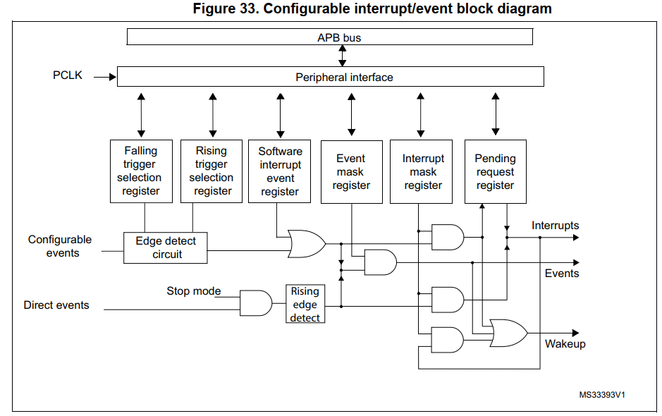
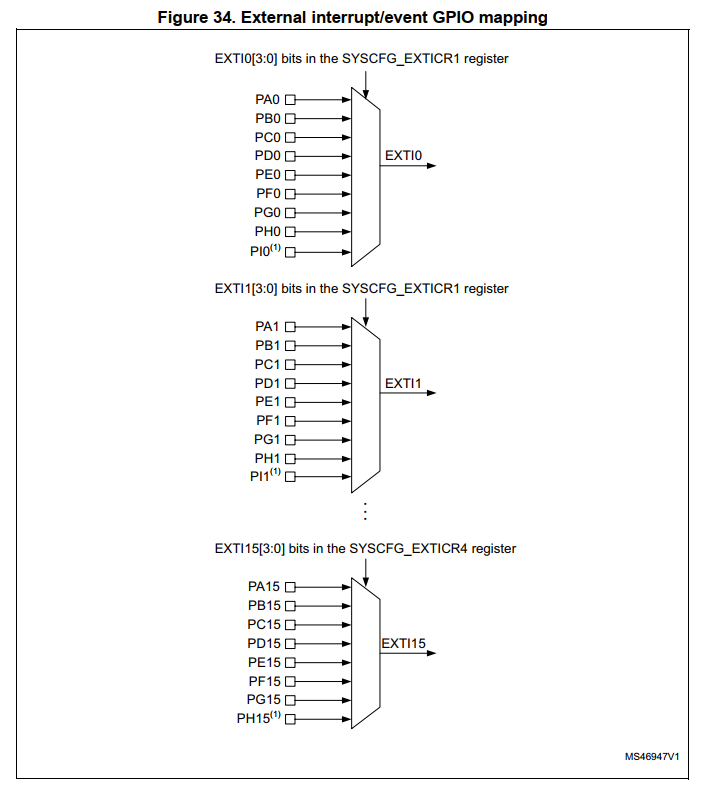
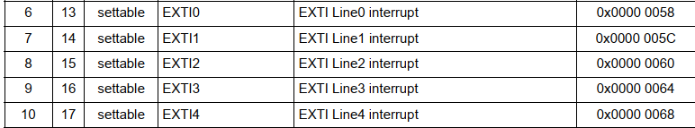
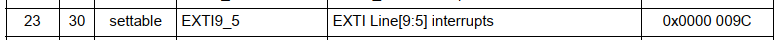
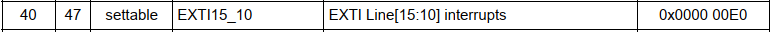
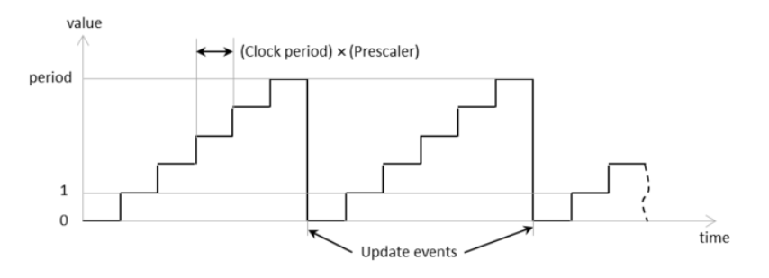

# Bài 8 - Interrupt

### 1. Ngắt ngoài
EXTI (EXternal Interrupt/Event Controller) là một thành phần phần cứng trong STM32L476 dùng để quản lý các ngắt hoặc sự kiện từ các nguồn bên ngoài, chẳng hạn như khi một nút nhấn được kích hoạt hoặc một cảm biến tạo ra tín hiệu. EXTI rất hữu ích trong việc phản hồi các tín hiệu nhanh và hiệu quả mà không cần CPU liên tục kiểm tra trạng thái của các chân GPIO.

Trên STM32L476, EXTI có đến 40 dòng (lines), mỗi dòng có thể liên kết với một chân GPIO để phát hiện các thay đổi tín hiệu. Các dòng này có thể được cấu hình độc lập để tạo ra:
- **Ngắt (Interrupt)**: Khi một sự kiện xảy ra, CPU sẽ được thông báo ngay lập tức thông qua một ngắt.
- **Sự kiện (Event)**: Dùng để kích hoạt một sự kiện khác mà không cần tạo ngắt.

**Sơ đồ khối của EXTI trên STM32L47x**



Ở đây chúng ta có thể thấy chip STM32L47x gồm có 16 Line ngắt riêng biệt.

**Ngắt ngoài của chip STM32L47x bao gồm có 16 line**



Từ sư đồ trên, ta có thể thấy:
- EXTI0 sẽ chung cho tất cả chân Px0 ở tất cả các Port, với x là tên của Port A, B…
- EXTI0 nếu chúng ta đã chọn chân PA0 (chân 0 ở port A) làm chân ngắt thì tất cả các chân 0 ở các Port khác không được khai báo làm chân ngắt ngoài nữa
- EXTI1 nếu chúng ta chọn chân PB1 là chân ngắt thì tất cả chân 1 ở các Port khác không được khai báo làm chân ngắt nữa.

Tiếp theo các Line ngắt sẽ được phân vào các Vector ngắt tương ứng. Các Line ngắt của chip STM32F103 được phân bố vào các vector ngắt như sau:





NVIC, viết tắt của Nested Vector Interrupt Controller (Bộ điều khiển ngắt vector lồng nhau), là một phần của lõi xử lý ARM Cortex-M được tích hợp trong các vi điều khiển STM32. NVIC chịu trách nhiệm quản lý các ngắt (interrupt) và ngoại lệ (exception) trong hệ thống, cho phép xử lý các sự kiện bên ngoài và bên trong một cách hiệu quả. Các chứng năng chính của NVIC bao gồm:
- Quản lý và Ưu tiên Ngắt: NVIC hỗ trợ việc thiết lập ưu tiên cho các ngắt. Điều này cho phép xác định ngắt nào quan trọng hơn và cần được xử lý trước khi có nhiều ngắt xảy ra cùng một lúc.
- Nested: Các ngắt có thể được lồng vào nhau (nested). Điều này có nghĩa là một ngắt có ưu tiên cao hơn có thể làm gián đoạn một ngắt có ưu tiên thấp hơn đang được xử lý.
- Kích hoạt và Vô hiệu hóa Ngắt: NVIC cho phép bật hoặc tắt ngắt từ các thiết bị ngoại vi cụ thể, giúp kiểm soát dòng ngắt hiệu quả.

NVIC hỗ trợ nhiều mức ưu tiên, được chia thành "ưu tiên tiền xử lý" (pre-emption priority) và "ưu tiên con" (subpriority). Số lượng mức ưu tiên phụ thuộc vào lõi ARM Cortex-M của vi điều khiển (ví dụ: Cortex-M4 có thể hỗ trợ đến 256 mức ưu tiên). Khi có nhiều ngắt xảy ra đồng thời, NVIC sẽ so sánh mức ưu tiên và chọn ngắt có ưu tiên cao nhất để xử lý trước.
- Mặc định thì ngắt nào có Preemtion Priority cao hơn thì sẽ được thực hiện trước.
- Khi nào 2 ngắt có cùng một mức Preemption Priority thì ngắt nào có Sub Priority cao hơn thì ngắt đó được thực hiện trước.
- Còn trường hợp 2 ngắt có cùng mức Preemption và Sub Priority luôn thì ngắt nào đến trước được thực hiện trước.

Để cấu hình EXTI cho GPIO, ta thực hiện các bước sau:
```c
static void MX_GPIO_Init(void)
{
  LL_EXTI_InitTypeDef EXTI_InitStruct = {0};
  LL_GPIO_InitTypeDef GPIO_InitStruct = {0};
/* USER CODE BEGIN MX_GPIO_Init_1 */
/* USER CODE END MX_GPIO_Init_1 */

  /* GPIO Ports Clock Enable */
  LL_AHB2_GRP1_EnableClock(LL_AHB2_GRP1_PERIPH_GPIOC);
  LL_AHB2_GRP1_EnableClock(LL_AHB2_GRP1_PERIPH_GPIOA);

  /**/
  LL_GPIO_ResetOutputPin(GPIOA, LL_GPIO_PIN_5);

  /**/
  LL_SYSCFG_SetEXTISource(LL_SYSCFG_EXTI_PORTC, LL_SYSCFG_EXTI_LINE13);

  /**/
  EXTI_InitStruct.Line_0_31 = LL_EXTI_LINE_13;
  EXTI_InitStruct.Line_32_63 = LL_EXTI_LINE_NONE;
  EXTI_InitStruct.LineCommand = ENABLE;
  EXTI_InitStruct.Mode = LL_EXTI_MODE_IT;
  EXTI_InitStruct.Trigger = LL_EXTI_TRIGGER_FALLING;
  LL_EXTI_Init(&EXTI_InitStruct);

  /**/
  LL_GPIO_SetPinPull(GPIOC, LL_GPIO_PIN_13, LL_GPIO_PULL_UP);

  /**/
  LL_GPIO_SetPinMode(GPIOC, LL_GPIO_PIN_13, LL_GPIO_MODE_INPUT);

  /**/
  GPIO_InitStruct.Pin = LL_GPIO_PIN_5;
  GPIO_InitStruct.Mode = LL_GPIO_MODE_OUTPUT;
  GPIO_InitStruct.Speed = LL_GPIO_SPEED_FREQ_LOW;
  GPIO_InitStruct.OutputType = LL_GPIO_OUTPUT_PUSHPULL;
  GPIO_InitStruct.Pull = LL_GPIO_PULL_NO;
  LL_GPIO_Init(GPIOA, &GPIO_InitStruct);

  /* EXTI interrupt init*/
  NVIC_SetPriority(EXTI15_10_IRQn, NVIC_EncodePriority(NVIC_GetPriorityGrouping(),0, 0));
  NVIC_EnableIRQ(EXTI15_10_IRQn);

/* USER CODE BEGIN MX_GPIO_Init_2 */
/* USER CODE END MX_GPIO_Init_2 */
}
```

Chân PC13 tương ứng với nút bấm sẽ được cấu hình như sau:
- ```LL_AHB2_GRP1_EnableClock(LL_AHB2_GRP1_PERIPH_GPIOC)```: Cấp xung clock cho GPIOC
- ```LL_GPIO_SetPinPull(GPIOC, LL_GPIO_PIN_13, LL_GPIO_PULL_UP)```: Cấu hình PC13 sử dụng pull up
- ```LL_GPIO_SetPinMode(GPIOC, LL_GPIO_PIN_13, LL_GPIO_MODE_INPUT)```: Set PC13 là input

Sau đó, tiến hình cấu hình EXTI cho PC13:
- ```EXTI_InitStruct.Line_0_31 = LL_EXTI_LINE_13```: Chọn "dòng ngắt" EXTI cụ thể. STM32 có nhiều dòng ngắt EXTI, và LL_EXTI_LINE_13 đại diện cho chân EXTI 13. Trong trường hợp này, nó có nghĩa là cấu hình để xử lý ngắt từ chân 13 của cổng GPIO (GPIOC_PIN_13). Khi chân 13 thay đổi trạng thái (như từ mức cao xuống thấp), nó sẽ kích hoạt ngắt EXTI.
- ```EXTI_InitStruct.Line_32_63 = LL_EXTI_LINE_NONE```: Dòng này chỉ định rằng không có dòng ngắt nào trong phạm vi từ 32 đến 63 được kích hoạt. STM32L476 có thể có các dòng ngắt cao hơn nếu cần, nhưng trong trường hợp này, không cần cấu hình thêm.
- ```EXTI_InitStruct.LineCommand = ENABLE```: Ngắt từ dòng này được bật và sẵn sàng để sử dụng.
- ```EXTI_InitStruct.Mode = LL_EXTI_MODE_IT```: Cấu hình chế độ ngắt. Ở đây LL_EXTI_MODE_IT có nghĩa là dòng này sẽ kích hoạt một "ngắt" khi có sự kiện. Hệ thống sẽ xử lý ngắt này bằng cách nhảy đến một handler khi sự kiện xảy ra.
- ```EXTI_InitStruct.Trigger = LL_EXTI_TRIGGER_FALLING```: Xác định kiểu kích hoạt ngắt. ```LL_EXTI_TRIGGER_FALLING``` có nghĩa là ngắt sẽ được kích hoạt khi có một xung giảm (tín hiệu chuyển từ mức cao xuống mức thấp). Dùng để phát hiện sự thay đổi trạng thái, ví dụ như khi nhấn nút.

Cấu hình NVIC để thiết lập ưu tiên ngắt:
- ```NVIC_SetPriority(EXTI15_10_IRQn, NVIC_EncodePriority(NVIC_GetPriorityGrouping(), 0, 0))```: Đây là hàm để cấu hình độ ưu tiên của ngắt. Nó xác định thứ tự ưu tiên mà ngắt sẽ được xử lý. 
  - ```EXTI15_10_IRQn``` là định danh cho ngắt EXTI từ 10 đến 15. Trong trường hợp này, ta đang cấu hình độ ưu tiên cho ngắt của các tín hiệu bên ngoài từ chân 10 đến chân 15. 
  - ```NVIC_GetPriorityGrouping()```lấy nhóm ưu tiên hiện tại (priority grouping) mà ta đã thiết lập trong hệ thống. Điều này cho phép ta xác định cách phân chia giữa ưu tiên ngắt và ưu tiên sub-priority. 
  - ```NVIC_EncodePriority(..., 0, 0)``` là hàm mã hóa độ ưu tiên. Trong trường hợp này, ta đang thiết lập độ ưu tiên chính là 0 và sub-priority cũng là 0. Điều này có nghĩa là ngắt này sẽ có độ ưu tiên cao nhất trong nhóm.
- ```NVIC_EnableIRQ(EXTI15_10_IRQn)```:  kích hoạt ngắt EXTI từ chân 10 đến chân 15, cho phép nó được xử lý khi có sự kiện xảy ra (ví dụ: khi một tín hiệu bên ngoài thay đổi trạng thái).

Tiếp đến chúng ta cần viết hàm xử lí ngắt. Đây là hàm xử lý ngắt cho EXTI từ chân 10 đến chân 15. Khi có sự kiện trên các chân này, hàm này sẽ được gọi tự động.
```c
void EXTI15_10_IRQHandler(void)
{
  /* USER CODE BEGIN EXTI15_10_IRQn 0 */

  /* USER CODE END EXTI15_10_IRQn 0 */
  if (LL_EXTI_IsActiveFlag_0_31(LL_EXTI_LINE_13) != RESET)
  {
    LL_EXTI_ClearFlag_0_31(LL_EXTI_LINE_13);
    /* USER CODE BEGIN LL_EXTI_LINE_13 */
    LL_GPIO_TogglePin(GPIOA, LL_GPIO_PIN_5);  
    count++;
    /* USER CODE END LL_EXTI_LINE_13 */
  }
}
```
- ```if (LL_EXTI_IsActiveFlag_0_31(LL_EXTI_LINE_13) != RESET)```:
  - ```LL_EXTI_IsActiveFlag_0_31(LL_EXTI_LINE_13)```: Hàm này kiểm tra xem cờ ngắt cho dòng 13 của EXTI có đang hoạt động hay không. Dòng 13 thường liên quan đến chân ```GPIOC_PIN_13``` (hoặc chân tương ứng) mà bạn đã cấu hình để tạo ngắt.
  - ```!= RESET```: Điều này có nghĩa là nếu cờ ngắt đang hoạt động (được thiết lập), đoạn mã trong khối lệnh sẽ được thực thi.
- ```LL_EXTI_ClearFlag_0_31(LL_EXTI_LINE_13)```: Nếu cờ ngắt đang hoạt động, hàm này sẽ xóa cờ ngắt để chuẩn bị cho lần ngắt tiếp theo. Điều này cần thiết để đảm bảo rằng ngắt sẽ không bị xử lý lại liên tục.
- ```LL_GPIO_TogglePin(GPIOA, LL_GPIO_PIN_5)```: Dòng lệnh này sẽ chuyển đổi trạng thái (toggle) của pin GPIOA_PIN_5. Nếu pin đang ở trạng thái HIGH, nó sẽ được chuyển thành LOW và ngược lại. Đây có thể được sử dụng để điều khiển một đèn LED hoặc một thiết bị nào đó.
- ```count++```: Dòng lệnh này sẽ tăng biến count lên 1 mỗi khi ngắt xảy ra. Đây có thể được dùng để đếm số lần ngắt xảy ra.

### 2. Ngắt Timer
Ngắt timer là một tính năng trong vi điều khiển, cho phép CPU thực hiện một hành động cụ thể (như chạy một đoạn mã, cập nhật giá trị, hoặc thay đổi trạng thái) sau một khoảng thời gian xác định. Nó hoạt động bằng cách sử dụng các bộ đếm (timers) để tạo ra các sự kiện ngắt theo chu kỳ, giúp cho vi điều khiển có thể thực hiện nhiều tác vụ một cách đồng thời và hiệu quả.



Để sử dụng ngắt timer, bạn cần thực hiện các bước sau:
- Chọn Timer: STM32 có nhiều timer khác nhau (TIM1, TIM2, ...). Bạn cần chọn timer phù hợp với nhu cầu của mình.
- Cấu Hình Tham Số: Thiết lập các tham số như:
  - Prescaler: Chia tần số của đồng hồ hệ thống để giảm tốc độ đếm. Ví dụ, nếu hệ thống hoạt động ở 4 MHz và bạn đặt prescaler là 3999, timer sẽ đếm ở tần số 1 kHz.
  - Autoreload: Xác định giá trị mà timer sẽ đếm tới trước khi tạo ra một ngắt. Nếu bạn đặt autoreload là 3999, timer sẽ tạo ngắt sau mỗi giây (1 kHz x 4000).
- Bật Ngắt: Đảm bảo rằng ngắt được kích hoạt trong phần mềm. Điều này thường được thực hiện bằng cách sử dụng các hàm như ```LL_TIM_EnableIT_UPDATE()```.
- Xử Lý Ngắt: Viết hàm xử lý ngắt (Interrupt Service Routine - ISR) để thực hiện hành động bạn muốn mỗi khi ngắt xảy ra. Mỗi khi timer đạt đến giá trị autoreload, nó sẽ tạo ra một ngắt, và ISR sẽ được gọi.

```c
static void MX_TIM1_Init(void)
{

  /* USER CODE BEGIN TIM1_Init 0 */

  /* USER CODE END TIM1_Init 0 */

  LL_TIM_InitTypeDef TIM_InitStruct = {0};

  /* Peripheral clock enable */
  LL_APB2_GRP1_EnableClock(LL_APB2_GRP1_PERIPH_TIM1);

  /* TIM1 interrupt Init */
  NVIC_SetPriority(TIM1_UP_TIM16_IRQn, NVIC_EncodePriority(NVIC_GetPriorityGrouping(),0, 0));
  NVIC_EnableIRQ(TIM1_UP_TIM16_IRQn);

  /* USER CODE BEGIN TIM1_Init 1 */

  /* USER CODE END TIM1_Init 1 */
  TIM_InitStruct.Prescaler = 3999;
  TIM_InitStruct.CounterMode = LL_TIM_COUNTERMODE_UP;
  TIM_InitStruct.Autoreload = 999;
  TIM_InitStruct.ClockDivision = LL_TIM_CLOCKDIVISION_DIV1;
  TIM_InitStruct.RepetitionCounter = 0;
  LL_TIM_Init(TIM1, &TIM_InitStruct);
  LL_TIM_DisableARRPreload(TIM1);
  LL_TIM_SetClockSource(TIM1, LL_TIM_CLOCKSOURCE_INTERNAL);
  LL_TIM_SetTriggerOutput(TIM1, LL_TIM_TRGO_RESET);
  LL_TIM_SetTriggerOutput2(TIM1, LL_TIM_TRGO2_RESET);
  LL_TIM_DisableMasterSlaveMode(TIM1);
  /* USER CODE BEGIN TIM1_Init 2 */
	LL_TIM_EnableCounter(TIM1);
	LL_TIM_EnableIT_UPDATE(TIM1);
  /* USER CODE END TIM1_Init 2 */

}
```
- ```NVIC_SetPriority(TIM1_UP_TIM16_IRQn, NVIC_EncodePriority(NVIC_GetPriorityGrouping(),0, 0))```: Thiết lập độ ưu tiên cho ngắt ```TIM1_UP_TIM16_IRQn```. Độ ưu tiên thấp hơn có số nhỏ hơn. Trong trường hợp này, độ ưu tiên được đặt là 0 (cao nhất).
- ```NVIC_EnableIRQ(TIM1_UP_TIM16_IRQn)```: Kích hoạt ngắt ```TIM1_UP_TIM16_IRQn```, cho phép ngắt này có thể được xử lý khi nó xảy ra. Hàm này được sử dụng để kích hoạt ngắt cho một nguồn ngắt cụ thể (trong trường hợp này là ngắt từ TIM1). Khi ngắt này được kích hoạt, NVIC sẽ sẵn sàng để xử lý tín hiệu ngắt từ Timer. Kích hoạt ngắt trong NVIC cho phép vi xử lý dừng thực hiện công việc hiện tại và chuyển sang thực thi hàm xử lý ngắt (Interrupt Service Routine - ISR) tương ứng khi ngắt xảy ra. Nếu không gọi hàm này, không có bất kỳ nguồn ngắt nào trong NVIC cho phép xử lý tín hiệu ngắt, ngay cả khi TIM đã gửi tín hiệu.
- ```LL_TIM_EnableCounter(TIM1)```: Bật đếm cho TIM1, cho phép timer bắt đầu đếm.
- ```LL_TIM_EnableIT_UPDATE(TIM1)```: Hàm này được sử dụng để kích hoạt ngắt cập nhật cho Timer. Khi timer đếm đến giá trị autoreload (trong trường hợp này là 999), nó sẽ tạo ra một sự kiện ngắt, thông báo cho vi xử lý rằng đã đến lúc xử lý ngắt. Kích hoạt ngắt cho phép Timer gửi tín hiệu đến NVIC (Nested Vectored Interrupt Controller) mỗi khi có sự kiện cập nhật. Nếu không gọi hàm này, mặc dù đã kích hoạt ngắt trong NVIC, nhưng TIM sẽ không gửi bất kỳ tín hiệu ngắt nào, và do đó, hàm xử lý ngắt sẽ không bao giờ được gọi.

Ở đây với Prescaler là 3999 và Autoreload là 999, xung clock mặc định cấp cho TIM1 là 4MHz, ta có:
$${4MHz \over (3999+1)}=1kHz$$

Điều này có nghĩa là timer đếm được 1000 tick mỗi giây. Thời gian của mỗi tick sẽ là:
$${1 \over 1kHz}=1ms$$

Khi đó, với Autoreload bằng 999 có nghĩa là timer sẽ đếm từ 0 đến 999, tức là tạo ra 1000 ticks. Với tần số 1kHz, delay mỗi lần gọi delay_ms(1) sẽ là: 
$$Delay=(999+1)×1ms=1s$$

```c
void TIM1_UP_TIM16_IRQHandler(void)
{
  /* USER CODE BEGIN TIM1_UP_TIM16_IRQn 0 */
	if (LL_TIM_IsActiveFlag_UPDATE(TIM1) == 1)
	{
		LL_TIM_ClearFlag_UPDATE(TIM1);
		count++;
		LL_GPIO_TogglePin(GPIOA, LL_GPIO_PIN_5);
	}
  /* USER CODE END TIM1_UP_TIM16_IRQn 0 */

  /* USER CODE BEGIN TIM1_UP_TIM16_IRQn 1 */

  /* USER CODE END TIM1_UP_TIM16_IRQn 1 */
}
```
Hàm ```TIM1_UP_TIM16_IRQHandler``` là hàm xử lý ngắt (Interrupt Service Routine - ISR) cho ngắt cập nhật của Timer 1 (TIM1) trên STM32
- ```LL_TIM_IsActiveFlag_UPDATE(TIM1)```: Dòng lệnh này kiểm tra xem có cờ ngắt cập nhật nào đang được đặt cho TIM1 hay không. Nếu cờ này được đặt (nghĩa là timer đã đạt đến giá trị tự động nạp lại), hàm sẽ tiến hành xử lý.
- ```LL_TIM_ClearFlag_UPDATE(TIM1)```: Nếu cờ ngắt đang được đặt, dòng lệnh này sẽ xóa cờ ngắt. Việc xóa cờ ngắt là rất quan trọng để ngăn ngừa việc hàm xử lý ngắt này được gọi lại ngay lập tức do cùng một cờ ngắt đang hoạt động.

### 3. Ngắt truyền thông
