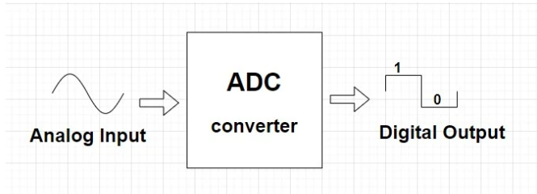
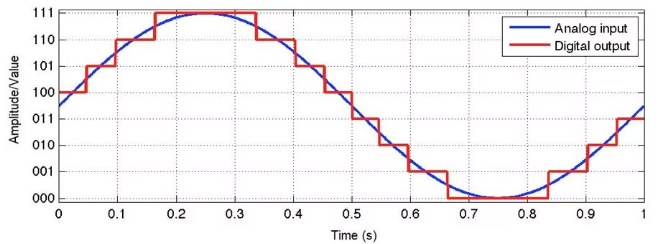
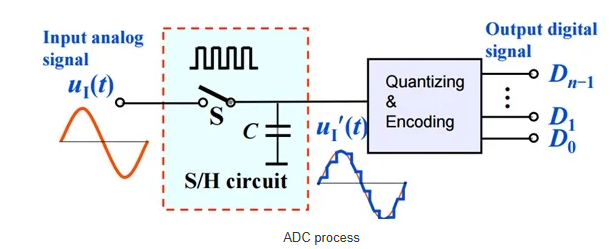
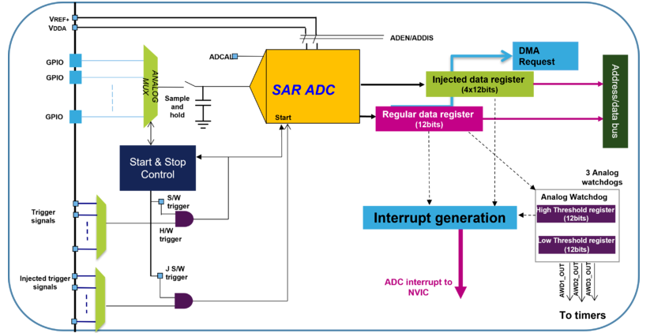

# Bài 9 - ADC

### 1. Khái niệm
ADC (Bộ Chuyển Đổi Tín Hiệu Tương Tự Sang Kỹ Thuật Số) là một mạch điện tử hoặc một thiết bị dùng để chuyển đổi tín hiệu tương tự (analog) thành tín hiệu kỹ thuật số (digital).
- Tín hiệu Tương Tự (Analog): Là loại tín hiệu có thể nhận giá trị liên tục trong một khoảng nhất định. Ví dụ như điện áp, nhiệt độ, ánh sáng, âm thanh...
- Tín hiệu Kỹ Thuật Số (Digital): Là loại tín hiệu chỉ có thể nhận các giá trị rời rạc (discrete values). Chúng được biểu diễn bằng các số nhị phân (0 và 1).

Trong nhiều ứng dụng, các thông tin từ thế giới thực như nhiệt độ, áp suất, ánh sáng cần phải được chuyển đổi thành dạng mà vi điều khiển (hoặc máy tính) có thể xử lý. ADC cho phép chuyển đổi các giá trị liên tục này thành các số mà vi điều khiển có thể hiểu và làm việc.



Về cơ bản, ADC hoạt động theo cách chia mức tín hiệu tương tự thành nhiều mức khác nhau. Các mức được biểu diễn bằng các bit nhị phân. Bằng việc so sánh giá trị điện áp mỗi lần lấy mẫu với 1 mức nhất định, ADC chuyển đổi tín hiệu tương tự và mã hóa các giá trị về giá trị nhị phân tương ứng.



### 2. Cơ chế hoạt động
Quá trình chuyển đổi tín hiệu tương tự sang tín hiệu kỹ thuật số thường được thực hiện qua các bước sau:
- Mẫu (Sampling): Tín hiệu tương tự được lấy mẫu tại một khoảng thời gian nhất định. Việc lấy mẫu này quyết định độ chính xác của quá trình chuyển đổi. Tần suất lấy mẫu thường phải lớn hơn ít nhất gấp đôi tần số của tín hiệu để tránh hiện tượng “Aliasing”.
- Lượng Giác (Quantization): Mỗi giá trị mẫu được làm tròn tới giá trị gần nhất trong một số lượng hữu hạn các mức giá trị. Số mức giá trị này được xác định bởi độ phân giải của ADC, thường được đo bằng bit (ví dụ: 8-bit, 10-bit, 12-bit).
- Mã Hóa (Encoding): Giá trị tương tự được mã hóa thành dạng nhị phân để lưu trữ và xử lý. Mỗi mức giá trị tương ứng với một mã nhị phân duy nhất.



### 3. Các thành phần chính của ADC
- Mạch Lấy Mẫu: Lấy mẫu tín hiệu tương tự tại các khoảng thời gian nhất định.
- Mạch Lượng Giác: Xử lý để làm tròn các giá trị tín hiệu mẫu tới các mức giá trị rời rạc.
- Bộ Mã Hóa: Chuyển đổi các mức giá trị lượng giác thành mã nhị phân.

### 4. Tính chất của ADC
- Độ Phân Giải (Resolution): Được đo bằng số bit, xác định số mức giá trị mà ADC có thể nhận diện. Ví dụ, một ADC 8-bit có thể nhận diện 256 mức (từ 0 đến 255).
- Tốc Độ Chuyển Đổi (Sampling Rate): Tốc độ mà ADC có thể lấy mẫu tín hiệu tương tự. Được đo bằng số mẫu trên giây (samples per second).
- Sai Số (Error): Mỗi loại ADC sẽ có độ chính xác và sai số khác nhau, ảnh hưởng đến tính chính xác của tín hiệu đầu ra.

### 5. ADC trên STM32L476
- Số Kênh: STM32L476 có thể có tới 16 kênh đầu vào ADC, cho phép bạn đọc giá trị từ nhiều cảm biến khác nhau.
- Độ Phân Giải: ADC của STM32L476 có độ phân giải tối đa là 12-bit, cho phép nhận diện 4096 mức giá trị khác nhau (từ 0 đến 4095).
- Tốc Độ Chuyển Đổi: Tốc độ chuyển đổi của ADC trên STM32L476 có thể lên đến 1 MHz, cho phép thực hiện nhiều phép đo nhanh chóng.

| Thông số                   | Mô tả                                                  |
|----------------------------|--------------------------------------------------------|
| **Đơn vị ADC**             | Tối đa 3 mô-đun                                       |
| **Kênh đầu vào**           | Tối đa 24 kênh ngoài (GPIOs), đơn/khác biệt          |
| **Công nghệ**              | Phân giải 12-bit với phương pháp xấp xỉ liên tiếp    |
| **Thời gian chuyển đổi**   | 188 nS, 5.33 Msamples/s (khi fADC_CLK = 80 MHz)      |
| **Chế độ hoạt động**       | Đơn, Liên tục, Quét, Không liên tục, hoặc Tiêm        |
| **Kích hoạt**              | Kích hoạt bằng phần mềm hoặc kích hoạt bên ngoài (đối với Timer & IOs) |
| **Chức năng đặc biệt**     | Quá mẫu phần cứng, giám sát analog                   |
| **Xử lý dữ liệu**         | Tạo ngắt, yêu cầu DMA                                  |
| **Chế độ tiết kiệm năng lượng** | Chế độ tắt nguồn sâu, chuyển đổi tự động, mức tiêu thụ điện phụ thuộc vào tốc độ |

**Tính năng hiệu suất cao**
- Hỗ trợ tới 5.33 triệu mẫu mỗi giây cho quá trình chuyển đổi, có thể mở rộng lên tới 10Msamples/s (các thiết bị với ADC kép).
- Bao gồm phần cứng quá mẫu, tích lũy dữ liệu và sau đó chia mà không cần CPU.
- Bộ lập trình linh hoạt
- Tự động hiệu chỉnh để giảm sai số

**Tính năng tiết kiệm năng lượng**
- Chế độ tắt nguồn sâu
- Chuyển đổi tự động bị trễ
- Mức tiêu thụ điện phụ thuộc vào thời gian lấy mẫu

**Tốc độ chuyển đổi**
- ADC cần tối thiểu 2.5ADC_CLK cho thời gian lấy mẫu và 12.5ADC_CLK cho quá trình chuyển đổi (12-bit).
- Tối đa đồng hồ 80 MHz với 15 chu kỳ cho kết quả là 5.33 Msamples/s
- Tăng tốc bằng cách giảm độ phân giải
- Thời gian lấy mẫu có thể lập trình
- Lựa chọn đồng hồ linh hoạt



### 6. Đọc tiến hiệu từ biến trở sử dụng ADC
Cấu hình Init cho ADC1 Channel 1 như sau:
```c
static void MX_ADC1_Init(void)
{

  /* USER CODE BEGIN ADC1_Init 0 */

  /* USER CODE END ADC1_Init 0 */

  LL_ADC_InitTypeDef ADC_InitStruct = {0};
  LL_ADC_REG_InitTypeDef ADC_REG_InitStruct = {0};
  LL_ADC_CommonInitTypeDef ADC_CommonInitStruct = {0};

  LL_GPIO_InitTypeDef GPIO_InitStruct = {0};

  LL_RCC_SetADCClockSource(LL_RCC_ADC_CLKSOURCE_PLLSAI1);

  /* Peripheral clock enable */
  LL_AHB2_GRP1_EnableClock(LL_AHB2_GRP1_PERIPH_ADC);

  LL_AHB2_GRP1_EnableClock(LL_AHB2_GRP1_PERIPH_GPIOC);
  /**ADC1 GPIO Configuration
  PC0   ------> ADC1_IN1
  */
  GPIO_InitStruct.Pin = LL_GPIO_PIN_0;
  GPIO_InitStruct.Mode = LL_GPIO_MODE_ANALOG;
  GPIO_InitStruct.Pull = LL_GPIO_PULL_NO;
  LL_GPIO_Init(GPIOC, &GPIO_InitStruct);

  LL_GPIO_EnablePinAnalogControl(GPIOC, LL_GPIO_PIN_0);

  /* USER CODE BEGIN ADC1_Init 1 */

  /* USER CODE END ADC1_Init 1 */

  /** Common config
  */
  ADC_InitStruct.Resolution = LL_ADC_RESOLUTION_12B;
  ADC_InitStruct.DataAlignment = LL_ADC_DATA_ALIGN_RIGHT;
  ADC_InitStruct.LowPowerMode = LL_ADC_LP_MODE_NONE;
  LL_ADC_Init(ADC1, &ADC_InitStruct);
  ADC_REG_InitStruct.TriggerSource = LL_ADC_REG_TRIG_SOFTWARE;
  ADC_REG_InitStruct.SequencerLength = LL_ADC_REG_SEQ_SCAN_DISABLE;
  ADC_REG_InitStruct.SequencerDiscont = LL_ADC_REG_SEQ_DISCONT_DISABLE;
  ADC_REG_InitStruct.ContinuousMode = LL_ADC_REG_CONV_CONTINUOUS;
  ADC_REG_InitStruct.DMATransfer = LL_ADC_REG_DMA_TRANSFER_NONE;
  ADC_REG_InitStruct.Overrun = LL_ADC_REG_OVR_DATA_OVERWRITTEN;
  LL_ADC_REG_Init(ADC1, &ADC_REG_InitStruct);
  LL_ADC_SetOverSamplingScope(ADC1, LL_ADC_OVS_DISABLE);
  ADC_CommonInitStruct.CommonClock = LL_ADC_CLOCK_ASYNC_DIV1;
  ADC_CommonInitStruct.Multimode = LL_ADC_MULTI_INDEPENDENT;
  LL_ADC_CommonInit(__LL_ADC_COMMON_INSTANCE(ADC1), &ADC_CommonInitStruct);
  LL_ADC_SetCommonPathInternalCh(__LL_ADC_COMMON_INSTANCE(ADC1), LL_ADC_PATH_INTERNAL_NONE);

  /* Disable ADC deep power down (enabled by default after reset state) */
  LL_ADC_DisableDeepPowerDown(ADC1);
  /* Enable ADC internal voltage regulator */
  LL_ADC_EnableInternalRegulator(ADC1);
  /* Delay for ADC internal voltage regulator stabilization. */
  /* Compute number of CPU cycles to wait for, from delay in us. */
  /* Note: Variable divided by 2 to compensate partially */
  /* CPU processing cycles (depends on compilation optimization). */
  /* Note: If system core clock frequency is below 200kHz, wait time */
  /* is only a few CPU processing cycles. */
  uint32_t wait_loop_index;
  wait_loop_index = ((LL_ADC_DELAY_INTERNAL_REGUL_STAB_US * (SystemCoreClock / (100000 * 2))) / 10);
  while(wait_loop_index != 0)
  {
    wait_loop_index--;
  }

  /** Configure Regular Channel
  */
  LL_ADC_REG_SetSequencerRanks(ADC1, LL_ADC_REG_RANK_1, LL_ADC_CHANNEL_1);
  LL_ADC_SetChannelSamplingTime(ADC1, LL_ADC_CHANNEL_1, LL_ADC_SAMPLINGTIME_92CYCLES_5);
  LL_ADC_SetChannelSingleDiff(ADC1, LL_ADC_CHANNEL_1, LL_ADC_SINGLE_ENDED);
  /* USER CODE BEGIN ADC1_Init 2 */
	LL_ADC_StartCalibration(ADC1, LL_ADC_SINGLE_ENDED);
	while (LL_ADC_IsCalibrationOnGoing(ADC1) != 0){}
	LL_ADC_Enable(ADC1);
  while (!LL_ADC_IsEnabled(ADC1));
	while (LL_ADC_IsActiveFlag_ADRDY(ADC1) == 0){}
  /* USER CODE END ADC1_Init 2 */

}
```
**Khai báo và khởi tạo các cấu trúc dữ liệu cho các thông số của ADC.**
- ```ADC_InitStruct```: Cấu trúc chứa thông tin về độ phân giải, căn chỉnh dữ liệu, và chế độ tiết kiệm năng lượng.
- ```ADC_REG_InitStruct```: Cấu trúc chứa thông tin về cài đặt kênh chính quy, chẳng hạn như nguồn kích hoạt và chế độ liên tục.
- ```ADC_CommonInitStruct```: Cấu trúc chứa các cài đặt chung cho ADC, như xung clock và chế độ đa ADC.

**Cấu hình xung clock**
- ```LL_RCC_SetADCClockSource(LL_RCC_ADC_CLKSOURCE_PLLSAI1)```: Cài đặt nguồn xung clock cho ADC từ bộ PLLSAI1 (Phase-Locked Loop). Điều này cho phép ADC hoạt động với tần số chính xác, phù hợp cho quá trình lấy mẫu tín hiệu.
- ```LL_AHB2_GRP1_EnableClock(LL_AHB2_GRP1_PERIPH_ADC)```: Kích hoạt xung clock cho khối ngoại vi ADC trên bus AHB2, để ADC có thể hoạt động.
- ```LL_AHB2_GRP1_EnableClock(LL_AHB2_GRP1_PERIPH_GPIOC)```: Kích hoạt xung clock cho GPIOC, vì các chân cần cấu hình cho ADC sẽ nằm trên cổng GPIOC.

**Cấu hình các thông số cơ bản cho ADC**
- ```ADC_InitStruct.Resolution = LL_ADC_RESOLUTION_12B```: Độ phân giải 12 bit cho kết quả chuyển đổi ADC. Cho phép chuyển đổi tín hiệu tương tự thành giá trị số trong khoảng từ 0 đến 4095. Điều này giúp có độ chính xác cao hơn khi đo tín hiệu.
- ```ADC_InitStruct.DataAlignment = LL_ADC_DATA_ALIGN_RIGHT```: Căn chỉnh dữ liệu sang phải. Khi đọc dữ liệu, điều này giúp xử lý dữ liệu dễ dàng hơn nếu dùng bộ nhớ hoặc thanh ghi số nguyên. Dữ liệu 12-bit được đặt vào 12 bit thấp của thanh ghi. Các bit cao còn lại (4 bit) sẽ được đặt thành 0. Ví dụ, nếu kết quả ADC là 0x0A3 (101000011 trong nhị phân), nó sẽ được lưu thành 0000 1010 0011 trong thanh ghi 16-bit.
- ```ADC_InitStruct.LowPowerMode = LL_ADC_LP_MODE_NONE```: Không sử dụng chế độ tiết kiệm năng lượng. Nếu ADC cần hoạt động liên tục, việc tiết kiệm năng lượng không cần thiết, đặc biệt khi ứng dụng yêu cầu hiệu suất cao.

**Cấu hình kênh chuyển đổi ADC**
- ```ADC_REG_InitStruct.TriggerSource = LL_ADC_REG_TRIG_SOFTWARE```: Dùng kích hoạt chuyển đổi bằng phần mềm. Giúp lập trình viên dễ dàng điều khiển và kiểm soát khi nào ADC thực hiện chuyển đổi.
- ```ADC_REG_InitStruct.SequencerLength = LL_ADC_REG_SEQ_SCAN_DISABLE```: Không quét nhiều kênh. Vì chỉ đọc một kênh (PC0), không cần quét nhiều kênh.
- ```ADC_REG_InitStruct.ContinuousMode = LL_ADC_REG_CONV_CONTINUOUS```: Chế độ chuyển đổi liên tục. ADC tự động tiếp tục lấy mẫu mà không cần kích hoạt lại, thích hợp cho các ứng dụng cần giám sát tín hiệu liên tục.
- ```ADC_REG_InitStruct.DMATransfer = LL_ADC_REG_DMA_TRANSFER_NONE```: Nếu ứng dụng không cần truyền dữ liệu tốc độ cao, DMA không cần thiết.
- ```ADC_REG_InitStruct.Overrun = LL_ADC_REG_OVR_DATA_OVERWRITTEN```: Nếu dữ liệu cũ không được đọc kịp, dữ liệu mới sẽ ghi đè, giúp tránh treo chương trình.

```c
LL_ADC_SetOverSamplingScope(ADC1, LL_ADC_OVS_DISABLE);
ADC_CommonInitStruct.CommonClock = LL_ADC_CLOCK_ASYNC_DIV1;
ADC_CommonInitStruct.Multimode = LL_ADC_MULTI_INDEPENDENT;
LL_ADC_CommonInit(__LL_ADC_COMMON_INSTANCE(ADC1), &ADC_CommonInitStruct);
```
Tắt oversampling và đặt xung clock không chia, vì oversampling không cần thiết nếu tín hiệu không yêu cầu độ mượt mà hoặc giảm nhiễu. Đặt ADC hoạt động ở chế độ độc lập (không kết hợp với ADC khác) vì hệ thống chỉ có một ADC hoạt động riêng lẻ.

```c
LL_ADC_DisableDeepPowerDown(ADC1);
LL_ADC_EnableInternalRegulator(ADC1);
```
Tắt chế độ tiết kiệm năng lượng sâu vì ở trạng thái reset, ADC tắt hoàn toàn để tiết kiệm năng lượng nên cần tắt chế độ này để ADC hoạt động. Bật ổn áp nội bộ để cung cấp điện áp ổn định bên trong ADC, cần cho quá trình chuyển đổi tín hiệu chính xác.

```c
uint32_t wait_loop_index;
wait_loop_index = ((LL_ADC_DELAY_INTERNAL_REGUL_STAB_US * (SystemCoreClock / (100000 * 2))) / 10);
while(wait_loop_index != 0)
{
  wait_loop_index--;
}
```
Tạo độ trễ để ổn áp nội bộ của ADC ổn định. Ổn áp nội bộ cần thời gian để đạt trạng thái ổn định trước khi ADC có thể thực hiện chính xác các phép đo. Nếu không chờ, kết quả có thể không chính xác.

- ```LL_ADC_REG_SetSequencerRanks(ADC1, LL_ADC_REG_RANK_1, LL_ADC_CHANNEL_1)```: Dòng này cấu hình thứ tự kênh ADC cho bộ chuyển đổi thường (Regular Channel) của ADC1.
Khi ADC thực hiện chuyển đổi, nó sẽ lấy mẫu và chuyển đổi dữ liệu từ kênh ADC_CHANNEL_1 đầu tiên. "RANK_1" có nghĩa là đây là kênh đầu tiên trong trình tự chuyển đổi. Nếu có nhiều kênh trong một chuỗi, bạn có thể cấu hình thứ tự khác.
- ```LL_ADC_SetChannelSamplingTime(ADC1, LL_ADC_CHANNEL_1, LL_ADC_SAMPLINGTIME_92CYCLES_5)```: Cài đặt thời gian lấy mẫu là 92.5 chu kỳ. ```LL_ADC_SAMPLINGTIME_92CYCLES_5``` chỉ định rằng ADC sẽ lấy mẫu tín hiệu trong 92.5 chu kỳ xung nhịp ADC trước khi bắt đầu chuyển đổi. Thời gian lấy mẫu ảnh hưởng đến độ chính xác của kết quả. Thời gian lấy mẫu lâu hơn thường mang lại kết quả chính xác hơn, đặc biệt khi tín hiệu đầu vào có trở kháng cao.\
Thời gian lấy mẫu (Sampling Time) là khoảng thời gian mà ADC sử dụng để lấy mẫu tín hiệu tương tự từ chân đầu vào trước khi thực hiện chuyển đổi sang giá trị số. Đây là thời gian mà ADC giữ tín hiệu đầu vào để đảm bảo rằng nó đã ổn định và có thể chuyển đổi chính xác. Khi tín hiệu tương tự được lấy mẫu, thời gian lấy mẫu càng dài thì tín hiệu có thể ổn định hơn, đặc biệt khi tín hiệu đầu vào có biến đổi lớn hoặc có trở kháng cao. Một thời gian lấy mẫu ngắn có thể dẫn đến việc không đủ thời gian để tín hiệu ổn định, gây sai số trong kết quả chuyển đổi. Nếu tín hiệu đầu vào là một điện áp có thay đổi nhanh chóng, việc lấy mẫu không đủ thời gian có thể làm ADC lấy mẫu ở các giá trị không đại diện cho tín hiệu thực tế. Thời gian lấy mẫu lâu hơn cho phép ADC "nghe" tín hiệu lâu hơn và do đó phản ánh chính xác hơn.\
Xung nhịp của ADC được xác định bởi tần số của xung clock mà ADC sử dụng. Nếu xung clock ADC là 4MHz (thời gian mỗi chu kỳ là 0.25 micro giây), thì 92.5 chu kỳ sẽ tương ứng với khoảng 23.125 micro giây. Điều này có nghĩa là ADC sẽ giữ tín hiệu ở chân đầu vào trong khoảng thời gian này trước khi bắt đầu quá trình chuyển đổi.\
Để tính thời gian lấy mẫu (Sampling Time) của ADC (Bộ chuyển đổi tương tự sang số), bạn cần biết tần số xung nhịp của ADC, thường được ký hiệu là f_ADC. Từ tần số này, bạn có thể tính thời gian cho mỗi chu kỳ xung nhịp, ký hiệu là T_ADC, bằng công thức:
$$T_{ADC} = {1 \over f_{ADC}}$$
Thời gian lấy mẫu được tính bằng:
$$T_{sample}= T_{ADC}×N$$
Trong đó:\
T_sample là thời gian lấy mẫu\
N là số chu kỳ xung nhịp mà ADC sẽ lấy mẫu (được chỉ định trong cấu hình).

Giả sử tần số xung nhịp của ADC là 
$$f_{ADC}= 4MHz = 4 \times 10^6 Hz$$

Bây giờ, tính thời gian cho mỗi chu kỳ:
$$T_{ADC} = \frac{1}{f_{ADC}} = \frac{1}{4 \times 10^6} = 0.25 \, \mu s$$
Giả sử bạn đã cấu hình ADC với N=92.5 chu kỳ (điều này có thể được làm tròn thành 92 hoặc 93 tùy vào cấu hình ADC, nhưng để tính toán, chúng ta sử dụng giá trị chính xác 92.5):
$$T_{sample} = T_{ADC} \times N$$
$$T_{sample} = 0.25 \, \mu s \times 92.5$$
$$T_{sample} = 23.125 \, \mu s$$

Thời gian lấy mẫu (Sampling Time) là 23.125 micro giây (µs) khi sử dụng cấu hình 92.5 chu kỳ với tần số xung nhịp ADC là 4 MHz.

- ```LL_ADC_SetChannelSingleDiff(ADC1, LL_ADC_CHANNEL_1, LL_ADC_SINGLE_ENDED)```: Đặt kênh ở chế độ đầu vào đơn (single-ended). Đầu vào analog của ADC chỉ cần một tín hiệu và nối đất, phù hợp với hầu hết các cảm biến.
- ```LL_ADC_StartCalibration(ADC1, LL_ADC_SINGLE_ENDED)```: Bắt đầu quá trình hiệu chuẩn ADC ở chế độ "single-ended". Hiệu chuẩn giúp giảm sai số trong kết quả chuyển đổi ADC bằng cách điều chỉnh các thông số bên trong của ADC để phù hợp với điều kiện cụ thể (như nhiệt độ hoặc điện áp nguồn). Hiệu chuẩn là cần thiết để đảm bảo độ chính xác của ADC.
- ```while (LL_ADC_IsCalibrationOnGoing(ADC1) != 0){}```:  Chờ cho quá trình hiệu chuẩn hoàn thành. Vòng lặp này giữ CPU chờ đến khi hiệu chuẩn xong. Chỉ sau khi hiệu chuẩn hoàn tất, ADC mới có thể được sử dụng chính xác.
- ```LL_ADC_Enable(ADC1)```: Kích hoạt ADC1. Sau khi hiệu chuẩn, ADC được kích hoạt để chuẩn bị cho việc chuyển đổi tín hiệu từ tương tự sang số. Lúc này ADC sẵn sàng để thực hiện các thao tác chuyển đổi.
- ```while (!LL_ADC_IsEnabled(ADC1)){}```: Chờ cho ADC được kích hoạt hoàn toàn. Đảm bảo rằng ADC đã sẵn sàng để hoạt động. Vòng lặp này kiểm tra trạng thái của ADC cho đến khi nó thực sự được kích hoạt.
- ```while (LL_ADC_IsActiveFlag_ADRDY(ADC1) == 0){}```: Chờ cho đến khi cờ ADRDY (ADC Ready) được kích hoạt. ```ADRDY``` là cờ báo hiệu ADC đã sẵn sàng để bắt đầu quá trình chuyển đổi. Vòng lặp này đảm bảo rằng ADC hoàn toàn sẵn sàng trước khi tiếp tục thực hiện các thao tác khác.

**Đọc ADC trên biến trở**\
Kết nối biến trở với chân PC0.
```c
int main(void)
{

  /* USER CODE BEGIN 1 */

  /* USER CODE END 1 */

  /* MCU Configuration--------------------------------------------------------*/

  /* Reset of all peripherals, Initializes the Flash interface and the Systick. */
  LL_APB2_GRP1_EnableClock(LL_APB2_GRP1_PERIPH_SYSCFG);
  LL_APB1_GRP1_EnableClock(LL_APB1_GRP1_PERIPH_PWR);

  /* System interrupt init*/
  NVIC_SetPriorityGrouping(NVIC_PRIORITYGROUP_4);

  /* SysTick_IRQn interrupt configuration */
  NVIC_SetPriority(SysTick_IRQn, NVIC_EncodePriority(NVIC_GetPriorityGrouping(),15, 0));

  /* USER CODE BEGIN Init */

  /* USER CODE END Init */

  /* Configure the system clock */
  SystemClock_Config();

  /* Configure the peripherals common clocks */
  PeriphCommonClock_Config();

  /* USER CODE BEGIN SysInit */

  /* USER CODE END SysInit */

  /* Initialize all configured peripherals */
  MX_GPIO_Init();
  MX_ADC1_Init();
  /* USER CODE BEGIN 2 */
	SimpleKalmanFilter(0.1, 0.01, 1);
	LL_ADC_REG_StartConversion(ADC1);
	while (!LL_ADC_IsActiveFlag_EOC(ADC1)){}
	LL_ADC_ClearFlag_EOC(ADC1);	
	adcValue = LL_ADC_REG_ReadConversionData12(ADC1);
	adcFinal = (uint16_t)updateEstimate(adcValue);
  /* USER CODE END 2 */

  /* Infinite loop */
  /* USER CODE BEGIN WHILE */
  while (1)
  {
    /* USER CODE END WHILE */

    /* USER CODE BEGIN 3 */
		//LL_ADC_REG_StartConversion(ADC1);
		//while (!LL_ADC_IsActiveFlag_EOC(ADC1)){}
		adcValue = LL_ADC_REG_ReadConversionData12(ADC1);
		adcFinal = (uint16_t)updateEstimate(adcValue);
		//LL_ADC_ClearFlag_EOC(ADC1);

  }
  /* USER CODE END 3 */
}
```
- ```LL_ADC_REG_StartConversion(ADC1)```: Bắt đầu quá trình chuyển đổi ADC.
- ```while (!LL_ADC_IsActiveFlag_EOC(ADC1)){}```: Chờ cho đến khi có dữ liệu được chuyển đổi hoàn tất (EOC: End Of Conversion).
- ```LL_ADC_ClearFlag_EOC(ADC1)```: Xóa cờ EOC để sẵn sàng cho lần chuyển đổi tiếp theo.
- ```adcValue = LL_ADC_REG_ReadConversionData12(ADC1)```: Đọc dữ liệu chuyển đổi từ ADC.
- ```adcFinal = (uint16_t)updateEstimate(adcValue)```: Cập nhật giá trị cuối cùng bằng cách áp dụng bộ lọc Kalman lên giá trị đọc được từ ADC.

Trong vòng lặp while(1), ADC sẽ liên tục đọc dữ liệu mới và cập nhật giá trị thông qua bộ lọc Kalman.
