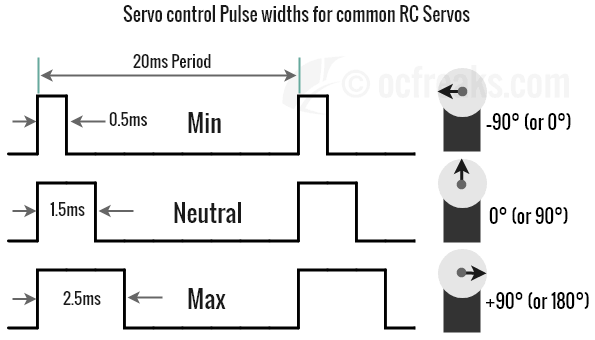

# Giải thích bài tập lớn

### 1. Timer 1 và hàm delay_ms
Timer 1 trên STM32L476 được sử dụng để viết hàm delay_ms. Biết xung clock được sử dụng cho project này là 27MHz. Timer hoạt động theo công thức sau để tính thời gian cần để đếm từ 0 đến giá trị ARR (auto-reload register):
```
Timer_period = (Prescaler + 1) × (ARR + 1) ÷ Clock_frequency
```
- Clock_frequency: Tần số xung nhịp hệ thống, ở đây là 27 MHz.
- Prescaler: Giá trị chia xung clock để giảm tần số vào bộ đếm. Ở đây, Prescaler = 26.
- ARR (auto-reload register): Giá trị tối đa mà bộ đếm đếm đến trước khi tràn. Ở đây, ARR = 65535.
- Timer_period: Thời gian cần để Timer đếm từ 0 đến giá trị ARR (giây).

Tần số sau khi chia bởi Prescaler (tần số đếm của Timer):
```
Timer_frequency = Clock_frequency ÷ (Prescaler + 1)
Timer_frequency = 27,000,000 ÷ (26 + 1) = 27,000,000 ÷ 27 = 1,000,000 Hz (1 MHz)
```
Timer sẽ đếm 1 triệu lần mỗi giây, tức là 1 tick = 1 µs.

Thời gian để Timer đếm từ 0 đến giá trị ARR:
```
Timer_period = (ARR + 1) × (1 ÷ Timer_frequency)
Timer_period = (65535 + 1) × (1 ÷ 1,000,000)
Timer_period = 65536 × 1 µs = 65.536 ms
```
Vậy mỗi lần bộ đếm tràn, nó sẽ mất 65.536 ms.

- Prescaler = 26: Giúp giảm tần số 27 MHz xuống còn 1 MHz, nghĩa là mỗi tick của bộ đếm tương ứng với 1 µs (rất tiện lợi cho các tính toán thời gian ngắn).
- ARR = 65535: Giá trị lớn nhất mà bộ đếm 16-bit có thể đếm được. Điều này cho phép Timer đếm được thời gian lớn nhất là 65.536 ms trước khi tràn.
```c
static void MX_TIM1_Init(void)
{

  /* USER CODE BEGIN TIM1_Init 0 */

  /* USER CODE END TIM1_Init 0 */

  LL_TIM_InitTypeDef TIM_InitStruct = {0};

  /* Peripheral clock enable */
  LL_APB2_GRP1_EnableClock(LL_APB2_GRP1_PERIPH_TIM1);

  /* USER CODE BEGIN TIM1_Init 1 */

  /* USER CODE END TIM1_Init 1 */
  TIM_InitStruct.Prescaler = 26;
  TIM_InitStruct.CounterMode = LL_TIM_COUNTERMODE_UP;
  TIM_InitStruct.Autoreload = 65535;
  TIM_InitStruct.ClockDivision = LL_TIM_CLOCKDIVISION_DIV1;
  TIM_InitStruct.RepetitionCounter = 0;
  LL_TIM_Init(TIM1, &TIM_InitStruct);
  LL_TIM_DisableARRPreload(TIM1);
  LL_TIM_SetClockSource(TIM1, LL_TIM_CLOCKSOURCE_INTERNAL);
  LL_TIM_SetTriggerOutput(TIM1, LL_TIM_TRGO_RESET);
  LL_TIM_SetTriggerOutput2(TIM1, LL_TIM_TRGO2_RESET);
  LL_TIM_DisableMasterSlaveMode(TIM1);
  /* USER CODE BEGIN TIM1_Init 2 */
	LL_TIM_EnableCounter(TIM1);
  /* USER CODE END TIM1_Init 2 */

}
```

Từ thông số trên, hàm delay millisecond sẽ được viết như sau:
```c
uint32_t full_overflows = ms / 65; // Số chu kỳ 65 ms đầy đủ
uint32_t remaining_ticks = (ms % 65) * 1000; // Ticks còn lại (tính bằng microsecond)
```
- ms / 65: Tính số lần Timer cần tràn đầy để đạt được phần lớn nhất của khoảng thời gian trễ. Ví dụ: Nếu ms = 150 ms, ta cần ```150 / 65.536 = 2``` chu kỳ tràn đầy.
- ms % 65: Phần dư còn lại sau khi trừ đi các chu kỳ tràn đầy. Với ví dụ trên, ```150 mod 65.536 = 19.464 ms```
- ```remaining_ticks = (ms % 65) * 1000```: Đổi phần dư từ mili-giây sang microsecond vì Timer đếm theo đơn vị 1us

```c
LL_TIM_SetCounter(TIM1, 0); // Đặt giá trị đếm về 0
LL_TIM_EnableCounter(TIM1); // Bật Timer1
```
Reset Timer để bắt đầu đếm lại từ 0.

```c
for (uint32_t i = 0; i < full_overflows; i++) {
    while (LL_TIM_GetCounter(TIM1) < 65535); // Chờ Timer đếm đến giá trị tràn
    LL_TIM_SetCounter(TIM1, 0); // Đặt lại Timer về 0
}
```
- Vòng lặp chạy full_overflows lần.
- Trong mỗi lần lặp:
	- LL_TIM_GetCounter đọc giá trị hiện tại của Timer.
	- Chờ Timer đếm từ 0 đến 65535 (hết một chu kỳ tràn đầy).
	- Khi Timer tràn, đặt lại giá trị đếm về 0 để chuẩn bị cho lần tràn tiếp theo.

```c
if (remaining_ticks > 0) {
    LL_TIM_SetCounter(TIM1, 0);
    while (LL_TIM_GetCounter(TIM1) < remaining_ticks);
}
```
- Nếu còn ticks dư cần xử lý:
	- Đặt lại Timer về 0.
	- Chờ Timer đếm đến giá trị remaining_ticks (tương ứng với phần thời gian dư).

Như vậy:
- Vòng lặp for chạy 2 lần để xử lý 2×65.536ms.
- Sau đó, Timer được đặt lại và chờ thêm 19464μs để hoàn tất tổng thời gian trễ 150ms.

### 2. Timer 2 và xuất xung PWM
Timer 2 được sử dụng để tạo xung PWM điều khiển servo. Servo thường yêu cầu xung PWM có chu kỳ 20ms (50Hz) và độ rộng xung từ 1ms đến 2ms để quay góc từ 0° đến 180°.



Ta có các công thức sau:

Tần số Timer
$$f_{\text{Timer}} = \frac{f_{\text{SYSCLK}}}{\text{Prescaler} + 1} = \frac{27MHz}{26 + 1} = 1MHz$$

Timer đếm với chu kỳ:
$$T_{\text{tick}} = \frac{1}{f_{\text{Timer}}} = 1us$$

Thời gian chu kỳ Timer (ARR)
$$T_{\text{cycle}} = (\text{ARR} + 1) \times T_{\text{tick}} = {9999+1} \times 1us = 10ms$$

Độ rộng xung (CompareValue)
$$\text{CompareValue} = \text{Thời gian xung HIGH (ms)} \times f_{\text{Timer}}$$

- Thời gian xung HIGH (s): Là khoảng thời gian xung cần duy trì ở mức HIGH (ví dụ: 1 ms, 1.5 ms hoặc 2 ms).
- f_Timer: Là tần số của bộ đếm Timer, được tính từ SYSCLK, Prescaler, và ARR.

Với f_Timer = 1 000 000 Hz (1us/tick)
- Góc 0 độ:
$$\text{CompareValue} = \text{1 (ms)} \times {\text{1 000 000}} = 1000 ticks$$
- Góc 90 độ:
$$\text{CompareValue} = \text{1.5 (ms)} \times {\text{1 000 000}} = 1500 ticks$$
- Góc 180 độ:
$$\text{CompareValue} = \text{2 (ms)} \times {\text{1 000 000}} = 2000 ticks$$

Chu kỳ PWM hoàn chỉnh
$$\text{Tổng thời gian PWM} = T_{\text{cycle}} \times \text{Số lần lặp Timer}$$

Cấu hình Timer 2 để điều khiển Servo:
- Chu kỳ PWM: 
$$T_{\text{PWM}} = 20 \, \text{ms}$$
$$T_{\text{cycle}} = 10 \, \text{ms}$$ 

→ Timer cần 2 lần lặp để tạo 1 chu kỳ PWM.

| Góc servo    | Thời gian xung HIGH (ms) | CompareValue |
|--------------|---------------------------|--------------|
| 0°           | 1 ms                      | 1000         |
| 90°          | 1.5 ms                    | 1500         |
| 180°         | 2 ms                      | 2000         |

```c
static void MX_TIM2_Init(void)
{

  /* USER CODE BEGIN TIM2_Init 0 */

  /* USER CODE END TIM2_Init 0 */

  LL_TIM_InitTypeDef TIM_InitStruct = {0};
  LL_TIM_OC_InitTypeDef TIM_OC_InitStruct = {0};

  LL_GPIO_InitTypeDef GPIO_InitStruct = {0};

  /* Peripheral clock enable */
  LL_APB1_GRP1_EnableClock(LL_APB1_GRP1_PERIPH_TIM2);

  /* TIM2 interrupt Init */
  NVIC_SetPriority(TIM2_IRQn, NVIC_EncodePriority(NVIC_GetPriorityGrouping(),0, 0));
  NVIC_EnableIRQ(TIM2_IRQn);

  /* USER CODE BEGIN TIM2_Init 1 */

  /* USER CODE END TIM2_Init 1 */
  TIM_InitStruct.Prescaler = 26;
  TIM_InitStruct.CounterMode = LL_TIM_COUNTERMODE_UP;
  TIM_InitStruct.Autoreload = 9999;
  TIM_InitStruct.ClockDivision = LL_TIM_CLOCKDIVISION_DIV1;
  LL_TIM_Init(TIM2, &TIM_InitStruct);
  LL_TIM_DisableARRPreload(TIM2);
  LL_TIM_OC_EnablePreload(TIM2, LL_TIM_CHANNEL_CH1);
  TIM_OC_InitStruct.OCMode = LL_TIM_OCMODE_PWM1;
  TIM_OC_InitStruct.OCState = LL_TIM_OCSTATE_DISABLE;
  TIM_OC_InitStruct.OCNState = LL_TIM_OCSTATE_DISABLE;
  TIM_OC_InitStruct.CompareValue = 500;
  TIM_OC_InitStruct.OCPolarity = LL_TIM_OCPOLARITY_HIGH;
  LL_TIM_OC_Init(TIM2, LL_TIM_CHANNEL_CH1, &TIM_OC_InitStruct);
  LL_TIM_OC_DisableFast(TIM2, LL_TIM_CHANNEL_CH1);
  LL_TIM_SetOCRefClearInputSource(TIM2, LL_TIM_OCREF_CLR_INT_NC);
  LL_TIM_DisableExternalClock(TIM2);
  LL_TIM_ConfigETR(TIM2, LL_TIM_ETR_POLARITY_NONINVERTED, LL_TIM_ETR_PRESCALER_DIV1, LL_TIM_ETR_FILTER_FDIV1);
  LL_TIM_SetTriggerOutput(TIM2, LL_TIM_TRGO_RESET);
  LL_TIM_DisableMasterSlaveMode(TIM2);
  /* USER CODE BEGIN TIM2_Init 2 */
	LL_TIM_EnableCounter(TIM2);
  LL_TIM_CC_EnableChannel(TIM2, LL_TIM_CHANNEL_CH1);
  LL_TIM_GenerateEvent_UPDATE(TIM2);
  /* USER CODE END TIM2_Init 2 */
  LL_AHB2_GRP1_EnableClock(LL_AHB2_GRP1_PERIPH_GPIOA);
  /**TIM2 GPIO Configuration
  PA15 (JTDI)   ------> TIM2_CH1
  */
  GPIO_InitStruct.Pin = LL_GPIO_PIN_15;
  GPIO_InitStruct.Mode = LL_GPIO_MODE_ALTERNATE;
  GPIO_InitStruct.Speed = LL_GPIO_SPEED_FREQ_LOW;
  GPIO_InitStruct.OutputType = LL_GPIO_OUTPUT_PUSHPULL;
  GPIO_InitStruct.Pull = LL_GPIO_PULL_NO;
  GPIO_InitStruct.Alternate = LL_GPIO_AF_1;
  LL_GPIO_Init(GPIOA, &GPIO_InitStruct);

}
```

Interrupt từ Timer 2 được dùng để điều khiển servo và nháy LED. Timer 2 được cấu hình để tạo ra một tín hiệu PWM cho servo và để kích hoạt ngắt sau mỗi 10ms. Timer 2 sẽ đếm từ 0 đến 9999 (tức 10ms), và sau mỗi chu kỳ này, một ngắt được tạo ra, gọi hàm TIM2_IRQHandler để xử lý.

Mỗi khi Timer 2 hoàn thành một chu kỳ (10ms), hàm TIM2_IRQHandler được gọi để xử lý. Trong hàm này, việc điều khiển servo được thực hiện thông qua việc thay đổi độ rộng xung PWM (servo_pulse), dựa vào các giá trị compare register của Timer 2. Các giá trị PWM được cập nhật trong ISR và điều khiển quá trình di chuyển của servo (tăng dần từ 0 đến 90 độ và ngược lại). LED được điều khiển để nhấp nháy trong suốt quá trình di chuyển.

```c
void TIM2_IRQHandler(void)
{
  /* USER CODE BEGIN TIM2_IRQn 0 */
	if (LL_TIM_IsActiveFlag_UPDATE(TIM2))
    {
        LL_TIM_ClearFlag_UPDATE(TIM2);

        if (flag_servo == 1) // Start servo movement
        {
            if (direction == 1) // Moving from 0 to 90 degrees
            {
                if (steps < 50) // 50 steps in 0.5 seconds
                {
                    servo_pulse += 20; // Increment pulse width
                    steps++;
                }
                else // Hold at 90 degrees for 5 seconds
                {
                    direction = 2;
                    steps = 0;
                }
            }
            else if (direction == 2) // Holding at 90 degrees
            {
                hold_counter++;
                if (hold_counter >= 500) // 500 * 10ms = 5 seconds
                {
                    direction = 3; // Start moving back to 0 degrees
                    hold_counter = 0;
                }
            }
            else if (direction == 3) // Moving from 90 to 0 degrees
            {
                if (steps < 50) // 50 steps in 0.5 seconds
                {
                    servo_pulse -= 20; // Decrement pulse width
                    steps++;
                }
                else // Stop movement
                {
                    direction = 1;
                    flag_servo = 0; // Reset flag
										steps = 0;
                    LL_GPIO_ResetOutputPin(GPIOA, LL_GPIO_PIN_5); // Turn off LED
                }
            }

            // Update PWM pulse
            LL_TIM_OC_SetCompareCH1(TIM2, servo_pulse);

            // Handle LED state
						led_toggle_counter++;
            if (direction == 1 || direction == 3) // Blinking during movement
            {
							if (led_toggle_counter >= 5) // Toggle LED every 50ms (5 * 10ms)
							{
                led_state = !led_state;
                if (led_state)
                    LL_GPIO_SetOutputPin(GPIOA, LL_GPIO_PIN_5);
                else
                    LL_GPIO_ResetOutputPin(GPIOA, LL_GPIO_PIN_5);
								led_toggle_counter = 0; // Reset counter after toggle
							}
            }
            else if (direction == 2) // Turn off LED during hold
            {
                LL_GPIO_ResetOutputPin(GPIOA, LL_GPIO_PIN_5);
            }
        }
    }
  /* USER CODE END TIM2_IRQn 0 */
  /* USER CODE BEGIN TIM2_IRQn 1 */

  /* USER CODE END TIM2_IRQn 1 */
}
```
